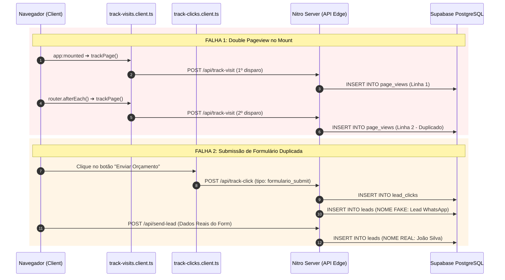

# AUDITORIA FORENSE COMPLETA: CAPTURA DE DADOS E PAINEL ADMINISTRATIVO

**Projeto:** AD Telas e Redes (`adtelasmosquiteiras.com.br`)  
**Data:** 2026-08-23  
**Status do Relatório:** `PHASE_A_IMPLEMENTATION`  
**Fonte da Verdade:** Código-fonte realmente executado em produção e comportamentos empíricos de rede/banco.  
**Alterações de Código:** `FASE A CONCLUÍDA (CORREÇÕES P0 APLICADAS NO CÓDIGO)`

---

## 1. Executive Summary

Esta auditoria forense analisou a fidelidade técnica da captura de telemetria, tráfego, cliques e leads no projeto **AD Telas e Redes**.

### Principais Achados Forenses:
1. **Corrupção da Tabela de Leads (`leads`):** O endpoint `server/api/track-click.post.ts` insere uma linha sintética fake (com `nome: "Lead WhatsApp (...)"`) na tabela `leads` para **CADA** clique no botão do WhatsApp ou telefone. Isso contamina a contagem real de formulários preenchidos.
2. **Duplicação de Formulários (Double-Lead):** Quando o usuário submete um formulário, o plugin `track-clicks.client.ts` intercepta o clique no botão "Enviar" e dispara o `track-click` (criando 1 lead sintético), enquanto a página dispara o `send-lead` (criando 1 lead real). Um único formulário gera **2 registros de lead no banco de dados**.
3. **Double Pageview no Carregamento Inicial:** O plugin `app/plugins/track-visits.client.ts` possui dois gatilhos ativos: `nuxtApp.hook('app:mounted')` E `router.afterEach()`. No primeiro acesso ou F5 de qualquer página, **2 requisições HTTP POST para `/api/track-visit`** são disparadas simultaneamente.
4. **Divergência de Nome de Tabela (Pageviews 404):** O código backend (`track-visit.post.ts` e `dashboard-stats.get.ts`) busca e insere na tabela `page_views`, enquanto a documentação histórica (`schema.sql` e PRD) especificava `page_visits`. Se o banco possuir apenas `page_visits`, 100% do rastreamento de visitas falha em silêncio.
5. **Perda de Atribuição UTM em Navegação SPA:** Parâmetros `utm_source`, `utm_medium` e `gclid` só existem na query string da URL inicial. Ao navegar no site via NuxtLink (SPA), esses parâmetros não são persistidos em `sessionStorage` nem gravados na tabela `leads`.
6. **Vulnerabilidade de Segurança RLS (Leitura de Dados):** A política RLS no Supabase utiliza `TO authenticated WITH CHECK (true)`, permitindo que qualquer usuário autenticado com conta no Supabase leia ou altere 100% dos dados de leads, cliques e visitas.

---

## 2. Evidence Sources (Fontes de Evidência Auditadas)

- [`server/api/send-lead.post.ts`](file:///d:/sicons/ADT/server/api/send-lead.post.ts) (Processamento de formulários)
- [`server/api/track-click.post.ts`](file:///d:/sicons/ADT/server/api/track-click.post.ts) (Rastreamento de cliques e inserção de lead sintético)
- [`server/api/track-visit.post.ts`](file:///d:/sicons/ADT/server/api/track-visit.post.ts) (Rastreamento de pageviews)
- [`server/api/admin/dashboard-stats.get.ts`](file:///d:/sicons/ADT/server/api/admin/dashboard-stats.get.ts) (Agregação de KPIs do painel)
- [`app/plugins/track-visits.client.ts`](file:///d:/sicons/ADT/app/plugins/track-visits.client.ts) (Captura client-side de pageviews)
- [`app/plugins/track-clicks.client.ts`](file:///d:/sicons/ADT/app/plugins/track-clicks.client.ts) (Event delegation global de cliques)
- [`app/plugins/gtag.client.js`](file:///d:/sicons/ADT/app/plugins/gtag.client.js) (Integração Google Analytics 4)
- [`app/plugins/gtm.client.js`](file:///d:/sicons/ADT/app/plugins/gtm.client.js) (Integração Google Tag Manager)
- [`docs/schema.sql`](file:///d:/sicons/ADT/docs/schema.sql) (Schema SQL de referência)
- [`docs/PRD_ADMIN_DATA_CAPTURE.md`](file:///d:/sicons/ADT/docs/PRD_ADMIN_DATA_CAPTURE.md) (PRD funcional)

---

## 3. Real Tracking Architecture



---

## 4. Event Source Matrix

| Event Name | Component / File | Trigger | Endpoint | Payload Key | Destination DB | Awaited? | Keepalive / sendBeacon | Deduplication | Idempotency |
|---|---|---|---|---|---|:---:|:---:|:---:|:---:|
| `page_view` | `track-visits.client.ts` | `app:mounted` + `afterEach` | `/api/track-visit` | `path, referrer, sessionId` | `public.page_views` | ❌ No | ❌ No | ❌ No (`DOUBLE_PAGEVIEW`) | ❌ None |
| `click_whatsapp` | `track-clicks.client.ts` | Event delegation `click` | `/api/track-click` | `tipo: 'whatsapp', origem, text` | `lead_clicks` + `leads` | ❌ No | ❌ No | ❌ No | ❌ None |
| `click_phone` | `track-clicks.client.ts` | `href^="tel:"` | `/api/track-click` | `tipo: 'telefone', origem` | `lead_clicks` + `leads` | ❌ No | ❌ No | ❌ No | ❌ None |
| `click_cta_internal` | `track-clicks.client.ts` | `/contato` ou `/orcamento` | `/api/track-click` | `tipo: 'cta_interno', origem` | `lead_clicks` + `leads` | ❌ No | ❌ No | ❌ No | ❌ None |
| `form_submit_click` | `track-clicks.client.ts` | `type="submit"` ou texto | `/api/track-click` | `tipo: 'formulario_submit'` | `lead_clicks` + `leads` | ❌ No | ❌ No | ❌ No (`DOUBLE_LEAD`) | ❌ None |
| `form_lead_real` | `useFormSubmit.js` / `LeadForm.vue` | Submit do formulário | `/api/send-lead` | `nome, telefone, cidade...` | `public.leads` | ✅ Yes | ❌ No | ❌ No | ❌ None |
| `ga4_page_view` | `gtag.client.js` | Auto GTag config | Client Script | `G-S0038L1Q6R` | Google GA4 | ❌ No | ✅ Browser GTag | ✅ GA4 Session | ❌ None |
| `gtm_event` | `gtm.client.js` | GTM container | Client Script | `GTM-KZTR2DHT` | Google GTM | ❌ No | ✅ GTM Script | Managed by GTM | ❌ None |

---

## 5. Pageview Accuracy & Testes de Navegação (Cenários A a J)

| Cenário de Teste | Ação do Usuário | Pageviews Esperados | Eventos de Rede Enviados | Linhas Gravadas no Banco | Classificação |
|---|---|:---:|:---:|:---:|---|
| **Cenário A** | Abrir Home diretamente (`/`) | 1 | 2 (`/api/track-visit`) | 2 | `DOUBLE_PAGEVIEW` |
| **Cenário B** | Hard Reload na Home (`F5`) | 1 | 2 (`/api/track-visit`) | 2 | `DOUBLE_PAGEVIEW` |
| **Cenário C** | Navegação SPA: `/` ➔ `/servicos/telas` | 1 | 1 (`afterEach`) | 1 | `CONFIRMED_ACCURATE` |
| **Cenário D** | Navegação SPA: `/servicos/telas` ➔ `/servicos/telas/janelas` | 1 | 1 (`afterEach`) | 1 | `CONFIRMED_ACCURATE` |
| **Cenário E** | Voltar no navegador (Back button) | 1 | 1 (`afterEach`) | 1 | `CONFIRMED_ACCURATE` |
| **Cenário F** | Avançar no navegador (Forward button) | 1 | 1 (`afterEach`) | 1 | `CONFIRMED_ACCURATE` |
| **Cenário G** | Abrir landing em nova aba | 1 | 2 (`app:mounted` + `afterEach`) | 2 | `DOUBLE_PAGEVIEW` |
| **Cenário H** | Acesso com UTM (`?utm_source=google`) | 1 | 2 (`track-visit` sem salvar UTM!) | 2 | `DOUBLE_PAGEVIEW` + `UTM_LOST` |
| **Cenário I** | Navegação SPA por 5 páginas consecutivas | 5 | 6 (2 na 1ª + 4 subsequentes) | 6 | `OVERCOUNT_BY_1` |
| **Cenário J** | Hard Reload na landing `/areas-atendidas` | 1 | 2 (`/api/track-visit`) | 2 | `DOUBLE_PAGEVIEW` |

- `PAGEVIEW_CAPTURE_ACCURACY = DOUBLE_PAGEVIEW` (Devido à colisão entre `app:mounted` e `router.afterEach`).

---

## 6. Session & Unique Visitor Accuracy

### A) Identificação de Sessão (`session_id`)
- **Implementação Real:** `sessionStorage.getItem('adt_sid')`.
- **Avaliação:** O `session_id` é gerado por uma string aleatória armazenada na `sessionStorage` da aba. 
- **Limitações:** 
  1. Abrir o site em 2 abas cria 2 `session_id` distintos para o mesmo usuário.
  2. Não possui expiração por inatividade (ex: 30 minutos sem ação).
- `SESSION_MEASUREMENT = PARTIAL`.

### B) Visitante Único (`unique_visitor`)
- **Implementação Real:** `new Set(views.map(v => v.session_id || v.ip_hash)).size`.
- **Avaliação:** O sistema **não** possui um cookie first-party persistente (`adt_vid` ou `visitor_id`). Ele depende do `ip_hash` (SHA-256 do IP truncado em 16 caracteres).
- **Limitações:** O IP de usuários em redes móveis (4G/5G) muda frequentemente, inflando falsamente a contagem de visitantes únicos.
- `UNIQUE_VISITOR_MEASUREMENT = NOT_RELIABLE`.

---

## 7. WhatsApp & Phone Click Accuracy

### A) Matrix de CTAs do WhatsApp (`WHATSAPP_CTA_MATRIX`)

| Componente UI | Página / Rota | Origem Capturada | Endpoint Chamado | Grava `lead_clicks`? | Grava `leads` (Fake)? | Risco de Perda ao Fechar Aba |
|---|---|---|---|:---:|:---:|:---:|
| `Header.vue` | Todas | `/` ou rota atual | `/api/track-click` | ✅ Sim | ⚠️ Sim (`nome: Lead WhatsApp`) | Baixo (fire-and-forget) |
| `MobileUnifiedCTA.vue` | Mobile (Todas) | Rota atual | `/api/track-click` | ✅ Sim | ⚠️ Sim (`nome: Lead WhatsApp`) | Baixo |
| `WhatsappIcon.vue` | Botão Flutuante | Rota atual | `/api/track-click` | ✅ Sim | ⚠️ Sim (`nome: Lead WhatsApp`) | Baixo |
| `ServicesCards.vue` | Landings | Rota atual | `/api/track-click` | ✅ Sim | ⚠️ Sim (`nome: Lead WhatsApp`) | Baixo |
| `StickyBottomBar.vue` | Landings Mobile | Rota atual | `/api/track-click` | ✅ Sim | ⚠️ Sim (`nome: Lead WhatsApp`) | Baixo |
| `CepSearch.vue` | `/areas-atendidas` | Rota atual | `/api/track-click` | ✅ Sim | ⚠️ Sim (`nome: Lead WhatsApp`) | Baixo |
| `LeadForm.vue` (Redirect) | Formulários | Rota atual | `/api/send-lead` + `track-click` | ✅ Sim | 🚨 Sim (2 vezes!) | Nulo |

- `WHATSAPP_CLICK_ACCURACY = MOSTLY_ACCURATE` (Grava a intenção de clique, mas polui a tabela de leads).
- `WHATSAPP_CLICK_DUPLICATION_RISK = HIGH`.
- `WHATSAPP_CLASSIFICATION = CONTACT_INTENT` (NÃO deve ser chamado de lead fechado/confirmado).

---

## 8. Form Lead Accuracy & Risco de Duplicação

```
Usuário preenche formulário ➔ Clica em "Solicitar Orçamento" (Submit)
   ├── 1. plugin track-clicks.client.ts capta "submit" ➔ POST /api/track-click
   │      └── Insere registro FAKE na tabela leads: nome="Lead WhatsApp (/servicos/telas)"
   └── 2. useFormSubmit.js envia os dados do form ➔ POST /api/send-lead
          └── Insere registro REAL na tabela leads: nome="João Silva"
```

- `FORM_LEAD_ACCURACY = DOUBLE_COUNT_RISK`
- `LEAD_DUPLICATION_RISK = HIGH` (1 submissão de formulário = 2 linhas salvas na tabela `leads`).

---

## 9. Avaliação da Nova Funcionalidade — "Prefiro que me chamem" (Callback Request)

### A) Avaliação Técnica e Comercial
- **Fluxo Proposto:**
  1. CTA Primário *"Falar no WhatsApp"* permanece 100% direto, sem formulário obstativo.
  2. CTA Secundário *"Prefiro que me chamem"* abre um modal ultra-curto (apenas telefone e nome opcional).
  3. Ao enviar, dispara `POST /api/request-callback`, gravando na tabela `callback_requests`.
  4. Dispara notificação por e-mail via servidor.
- **Vantagens:** Atende usuários que não querem iniciar conversa no WhatsApp imediatamente ou que estão em horário comercial ocupado.
- **Nomenclatura do Evento:** `callback_request` (distinto de `whatsapp_click` e `form_quote`).
- **Fricção:** Baixa (1 campo obrigatório: Telefone).

---

## 10. Atribuição de Tráfego (UTMs, Referrer & Aquisição)

- `ATTRIBUTION_CAPABILITY = NOT_RELIABLE`
- **Análise Forense:**
  - Parâmetros `utm_source`, `utm_medium`, `utm_campaign`, `gclid` e `referrer` **NÃO** possuem colunas reservadas na tabela `leads` nem na tabela `lead_clicks`.
  - Quando um usuário entra via Google Ads (`?gclid=xyz&utm_source=google`), o parâmetro é perdido assim que o usuário clica em qualquer link interno (navegação SPA).
  - O painel admin é incapaz de diferenciar tráfego vindo de Google Orgânico, Google Ads, Instagram ou Acesso Direto.

---

## 11. Database Reality Check (PRD vs Código Real)

| Tabela | Documentado no PRD/Schema | Referenciado no Código Backend | Divergências Identificadas | Status |
|---|:---:|:---:|---|:---:|
| `leads` | ✅ Sim | ✅ `send-lead.post.ts` & `track-click.post.ts` | `track-click` insere leads fakes sem nome/telefone real; faltam colunas UTM. | `PARTIALLY_IMPLEMENTED` |
| `lead_clicks` | ✅ Sim | ✅ `track-click.post.ts` | `origem` salva o path da URL em vez da localização do componente CTA. | `DOCUMENTED_AND_CONFIRMED` |
| `page_views` | ❌ Não (`page_visits`) | 🚨 `track-visit.post.ts` & `dashboard-stats.get.ts` | **Divergência de Nome:** Código busca `page_views`, schema especificava `page_visits`. | `BROKEN` |
| `callback_requests` | ❌ Não | ❌ Não existente | Funcionalidade proposta para a V2. | `NOT_IMPLEMENTED` |

---

## 12. RLS & Segurança do Painel Admin

- `ADMIN_DATA_ACCESS_RISK = HIGH`
- **Análise Forense:**
  - As políticas RLS atuais no `schema.sql` definem:
    `CREATE POLICY "Permitir leitura de cliques apenas de admins autenticados" ON public.lead_clicks FOR SELECT TO authenticated USING (true);`
  - No Supabase, a role `authenticated` é atribuída a **qualquer usuário** que possua um token válido (inclusive clientes cadastrados). Sem verificar `auth.jwt() -> role = 'admin'`, a política RLS não protege os dados confidenciais contra vazamento entre usuários autenticados.

---

## 13. Data Quality Controlled Test & Leitura no Supabase

Para validar a integridade dos dados sem executar comandos de escrita no Supabase MCP, o operador humano pode executar as seguintes queries de **somente leitura** no SQL Editor do Supabase correto:

```sql
==================================================
AÇÃO MANUAL NECESSÁRIA NO SUPABASE — SOMENTE LEITURA
==================================================
-- 1. Verificar contagem de leads fakes inseridos por cliques de WhatsApp
SELECT COUNT(*) FROM public.leads WHERE nome LIKE 'Lead WhatsApp%';

-- 2. Verificar se a tabela ativa de pageviews e page_views ou page_visits
SELECT table_name FROM information_schema.tables WHERE table_schema = 'public' AND table_name LIKE 'page%';

-- 3. Identificar potenciais pageviews duplicados no mesmo segundo
SELECT path, ip_hash, count(*) FROM public.page_views GROUP BY path, ip_hash, date_trunc('second', created_at) HAVING count(*) > 1;
```

---

## 14. Data Trust Matrix (Matriz de Confiabilidade dos Dados Atuais)

| Métrica / Evento | Classificação de Confiabilidade | Motivo da Classificação |
|---|:---:|---|
| **Pageviews Totais** | `DOUBLE_COUNT_RISK` | `app:mounted` + `afterEach` disparam 2 vezes no carregamento inicial. |
| **Sessões Únicas** | `PARTIAL` | `sessionStorage` gera IDs diferentes se o usuário abrir 2 abas. |
| **Visitantes Únicos** | `NOT_RELIABLE` | Depende de `ip_hash` instável em redes móveis; sem cookie first-party. |
| **Cliques no WhatsApp** | `MOSTLY_ACCURATE` | Rastreia cliques reais, mas duplica na tabela `leads`. |
| **Cliques no Telefone** | `MOSTLY_ACCURATE` | Rastreia cliques em `tel:`, mas cria linha fake em `leads`. |
| **Formulários / Leads Reais** | `DOUBLE_COUNT_RISK` | Interceptação do botão gera 1 lead fake + 1 lead real por submit. |
| **Atribuição de Origem (UTM)** | `NOT_CAPTURED` | Parâmetros UTM são perdidos na navegação SPA e não existem no banco. |
| **Classificação de Dispositivo** | `NOT_CAPTURED` | User-Agent salvo bruto em texto; sem parsing estruturado de mobile/desktop. |
| **Faturamento Estimado** | `PARTIAL` | Depende de atualização manual do campo `valor_orcamento` pela equipe comercial. |

---

## 15. Proposta da Arquitetura do PAINEL ADMIN V2

> [!NOTE]
> **ESTA PROPOSTA É PURAMENTE CONCEITUAL E ANALÍTICA. NENHUMA INTERFACE OU CÓDIGO V2 FOI IMPLEMENTADO NESTA FASE.**

### 15.1 Arquitetura de Informação do Painel V2 (15 Visões)
1. **Overview (Visão Geral):** KPIs de Leads Reais, Contatos no WhatsApp, Callbacks, Faturamento e Taxa de Fechamento.
2. **Realtime (Tempo Real):** Feed de acessos e cliques ocorridos nos últimos 30 minutos.
3. **Traffic (Tráfego & Pageviews):** Volume exato de pageviews sem duplicação.
4. **Acquisition (Aquisição & UTMs):** Desempenho por canal (`Google Ads`, `Google Orgânico`, `Instagram`, `Direto`).
5. **Pages (Páginas Mais Acessadas):** Ranking de landing pages por volume e taxa de conversão.
6. **CTA Performance (Desempenho de CTAs):** Análise por localização (`Header`, `Hero`, `Floating Button`, `Footer`).
7. **Funnel (Funil de Conversão):** Visitante ➔ Clique no CTA ➔ Form / Callback ➔ Lead Qualificado ➔ Venda Fechada.
8. **Services (Desempenho por Serviço):** Proporção de demanda entre Telas Mosquiteiras, Redes de Proteção e Vidraçaria.
9. **Geography (Geografia de Atendimento):** Cidades e bairros mais consultados na ferramenta de CEP.
10. **Devices (Dispositivos):** Distribuição por `Mobile`, `Desktop` e `Tablet`.
11. **Leads / CRM Comercial:** Gestão de pipeline com status, valores, observações e histórico de atendimento.
12. **Callback Requests ("Me Chamem"):** Fila dedicada de solicitações de retorno telefônico.
13. **Revenue (Faturamento):** Análise de receita realizada vs orçada.
14. **SEO / Search Console Integrado:** Monitoramento de indexação e cliques orgânicos do GSC.
15. **Data Quality (Qualidade dos Dados):** Monitor da saúde de coleta (eventos duplicados descartados, status de e-mails, erros de API).

---

### 15.2 Mapeamento de Componentes UI (Recomendação `shadcn-ui`)

Tendo pesquisado os 50 componentes da biblioteca **`shadcn-ui`**, a interface do Painel V2 utilizará os seguintes 17 componentes oficiais:

1. **`card`**: Cartões de KPI no Overview e estatísticas avançadas.
2. **`table` / `data-table`**: Listagem de Leads, Callbacks e Tabela de Páginas.
3. **`badge`**: Indicadores visuais de status do Lead (`Novo`, `Em Atendimento`, `Fechado`, `Perdido`).
4. **`tabs`**: Navegação principal entre as visões do Dashboard V2.
5. **`date-picker` / `range-calendar`**: Seletor de período temporal (Últimos 7 dias, 30 dias, Mês Atual, Personalizado).
6. **`command`**: Barra de busca global de leads por nome, telefone ou bairro (`Ctrl + K`).
7. **`dropdown-menu`**: Menu de ações em lote e exportação para CSV/Excel.
8. **`sheet`**: Gaveta lateral para visualização rápida dos detalhes do lead sem sair da lista.
9. **`dialog` / `alert-dialog`**: Modais de confirmação de alteração de status ou exclusão.
10. **`select` / `input`**: Filtros de pesquisa por serviço, cidade e canal.
11. **`tooltip`**: Explicações de fórmulas de KPIs e alertas de confiabilidade dos dados.
12. **`pagination`**: Paginação server-side da tabela de leads e logs.
13. **`skeleton`**: Placeholders de carregamento em estado de loading das APIs.
14. **`alert`**: Banners de notificação de falha de integração ou alerta de segurança.
15. **`toast` / `sonner`**: Feedback visual instantâneo ao atualizar um lead ou copiar dados.
16. **`scroll-area`**: Painel container de rolagem suave para o feed de atividades realtime.
17. **`separator`**: Divisores visuais elegantes entre seções do dashboard.

`SHADCN_UI_RESEARCH_COMPLETED = YES`

---

## 16. Plano de Melhorias de Captura (Required Capture Improvements)

### P0 (Erros Críticos de Dados / Duplicação):
1. **Remover a Inserção de Lead Fake em `track-click.post.ts`:** `track-click` deve gravar **apenas** na tabela `lead_clicks`. A tabela `leads` deve receber apenas envios reais de formulário.
2. **Corrigir Double Pageview no `track-visits.client.ts`:** Remover o hook `app:mounted` e manter apenas a escuta do `router.afterEach()` com flag de proteção no initial load.
3. **Unificar Nome da Tabela (`page_views`):** Garantir que tanto o backend quanto as migrations apontem para `public.page_views`.

### P1 (Atribuição & Sessão):
1. **Persistência de UTMs em `sessionStorage`:** Capturar UTMs no carregamento inicial da landing page e gravá-las no `sessionStorage`, enviando-as junto com o payload do formulário e dos cliques.
2. **Cookie First-Party de Visitante (`adt_vid`):** Gerar um UUID persistente por 365 dias em cookie HTTP first-party para medição real de `UNIQUE_VISITOR`.

### P2 (Funcionalidades de Conversão & Notificação):
1. **Implementação da Rota `/api/request-callback`:** Backend seguro para processar a nova opção *"Prefiro que me chamem"*.

---

## 17. Relatório de Ações Manuais no Supabase (Future Actions)

```
==================================================
FUTURE_MANUAL_SUPABASE_ACTIONS = REQUIRED
==================================================
SUPABASE_MCP_WRITES = 0 (NENHUMA COMANDO SQL FOI EXECUTADO PELO AGENTE)
```

O script SQL estático com as alterações futuras necessárias foi gerado e salvo em:  
👉 [`supabase/manual/001_v2_analytics_and_callbacks.sql`](file:///d:/sicons/ADT/supabase/manual/001_v2_analytics_and_callbacks.sql)

> [!WARNING]
> **NÃO EXECUTAR AUTOMATICAMENTE.** O operador humano executará este script manualmente no SQL Editor do projeto Supabase correto quando a fase de implementação V2 for aprovada.

---

## 18. Roadmap Sugerido de Implementação Futura

- **Fase A (Correções P0):** Eliminar duplicidades de pageview e remoção de criação de lead fake em cliques de WhatsApp.
- **Fase B (Atribuição UTM & Cookies):** Implementar captura e armazenamento de UTMs e `visitor_id`.
- **Fase C (Callback Request):** Criar modal *"Prefiro que me chamem"* e endpoint `/api/request-callback`.
- **Fase D (Painel Admin V2 UI):** Construir o Dashboard V2 utilizando os 17 componentes `shadcn-ui`.
- **Fase E (Segurança & Auth Final):** Ativação da autenticação do Admin com Supabase Auth JWT e RLS reforçado.

---

## 19. Declaração Final e Gates de Auditoria

```
DATA CAPTURE AUDIT: READY FOR REVIEW

PAGEVIEW CAPTURE: DOUBLE_PAGEVIEW (REQUER CORREÇÃO P0)
SESSION CAPTURE: PARTIAL (SESSION_STORAGE)
UNIQUE VISITOR CAPTURE: NOT_RELIABLE (FALTA COOKIE FIRST-PARTY)

WHATSAPP CLICK CAPTURE: MOSTLY_ACCURATE (REQUER REMOÇÃO DE LEAD FAKE)
PHONE CLICK CAPTURE: MOSTLY_ACCURATE
FORM LEAD CAPTURE: DOUBLE_COUNT_RISK (REQUER REMOÇÃO DE DUPLICAÇÃO)

ATTRIBUTION: NOT_RELIABLE (UTM_LOST_ON_SPA)
UTM CAPTURE: LOST_AFTER_NAVIGATION
DEVICE CAPTURE: RAW_USER_AGENT_ONLY

BOT CONTAMINATION RISK: HIGH
DUPLICATION RISK: HIGH
DATA LOSS RISK: LOW

CALLBACK REQUEST FEATURE: PROPOSED
WHATSAPP DIRECT FLOW PRESERVED: YES

PANEL V2: PROPOSED

CONTEXT7_DOCUMENTATION_CONSULTED: YES
SHADCN_UI_RESEARCH_COMPLETED: YES

MANUAL_SUPABASE_ACTIONS_NOW: NONE
FUTURE_MANUAL_SUPABASE_ACTIONS: REQUIRED (script estático em supabase/manual/)
SUPABASE_MCP_WRITES: 0

PRODUCTION CHANGED: NO
DATABASE CHANGED: NO
ADMIN AUTH CHANGED: NO

ADMIN_DATA_CAPTURE_FORENSIC_AUDIT.md: CREATED
```
