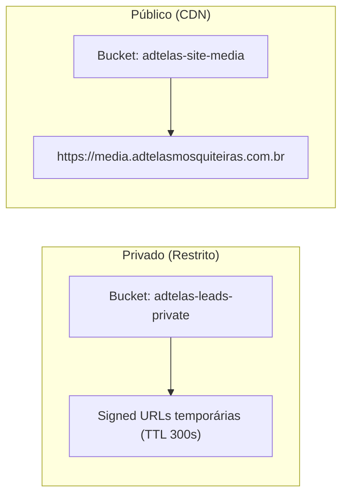

# 01 — AUDITORIA DE ARQUITETURA E INFRAESTRUTURA DO PROJETO

**Status:** CONFIRMADO  
**Data da Auditoria:** 26 de Agosto de 2026  
**Escopo:** Stack tecnológico, runtime, frameworks, bibliotecas e infraestrutura base para o futuro módulo CRM.  
**Arquivos Analisados:**
- [`package.json`](file:///d:/sicons/ADT/package.json)
- [`nuxt.config.ts`](file:///d:/sicons/ADT/nuxt.config.ts)
- [`server/utils/r2Storage.ts`](file:///d:/sicons/ADT/server/utils/r2Storage.ts)
- [`server/utils/r2SiteStorage.ts`](file:///d:/sicons/ADT/server/utils/r2SiteStorage.ts)
- [`server/utils/adminAuth.ts`](file:///d:/sicons/ADT/server/utils/adminAuth.ts)
- [`server/utils/emailService.ts`](file:///d:/sicons/ADT/server/utils/emailService.ts)

---

## 1. Stack Tecnológico Confirmado e Versões Reais

| Componente / Camada | Tecnologia / Biblioteca | Versão Confirmada | Arquivo de Origem |
|---|---|---|---|
| **Framework Fullstack** | Nuxt | `^4.2.2` | `package.json` |
| **Engine de Servidor** | Nitro | `2.13.0` | Build Log / Nuxt 4 |
| **Bundler & Build Tool** | Vite | `7.3.1` | Build Log / Nuxt 4 |
| **Biblioteca de UI** | Vue | `^3.5.26` | `package.json` |
| **Roteador** | vue-router | `^4.6.4` | `package.json` |
| **Componentes Base** | Radix Vue | `^1.9.17` | `package.json` |
| **Estilização** | TailwindCSS (`@nuxtjs/tailwindcss`) | `^6.14.0` | `package.json` |
| **Utilidades de Estilo** | `clsx`, `cva`, `tailwind-merge` | `2.1.1` / `0.7.1` / `3.6.0` | `package.json` |
| **Ícones** | `@nuxt/icon` + `@iconify-json/lucide` | `2.2.1` / `1.2.126` | `package.json` |
| **Armazenamento de Objetos** | Cloudflare R2 (`@aws-sdk/client-s3`) | `^3.1117.0` | `package.json` |
| **Disparo de E-mails** | Nodemailer (Gmail SMTP) | `^9.0.5` | `package.json` |
| **Provedor Alternativo Email**| Resend SDK | `^6.9.4` | `package.json` (Presente mas secundário) |
| **Banco de Dados** | Supabase PostgreSQL + RLS | REST API Server-Side | `nuxt.config.ts` |
| **Manipulação de Datas** | JavaScript Nativo (`Date`, `Intl`) | ECMAScript 2024 | Código do Projeto |

---

## 2. Padrão Arquitetural: Backend-for-Frontend (BFF) com Nitro

O projeto adota rigorosamente o padrão **BFF (Backend-for-Frontend)** com as seguintes regras confirmadas:

1. **Zero Comunicação Direta Browser ↔ Supabase:**
   - O cliente web (navegador) nunca instancia clientes Supabase com chaves públicas anônimas para mutações de dados críticos.
   - Todas as requisições do frontend passam por endpoints intermediários em `server/api/admin/*` ou `server/api/*`.
2. **Uso Exclusivo de `service_role` no Servidor:**
   - As rotas Nitro executam no ambiente seguro do servidor e utilizam a chave `SUPABASE_SERVICE_ROLE_KEY` para leitura e gravação no Supabase, ignorando RLS onde aplicável ou aplicando RLS programática via guards de autenticação.
3. **Módulos Compartilhados (`server/shared/`):**
   - O projeto utiliza uma camada desacoplada de lógica pura em arquivos `.mjs` em `server/shared/` (`adminAuthCore.mjs`, `leadEmailCore.mjs`, `r2StorageCore.mjs`, `siteMediaCore.mjs`, `adminAnalyticsCore.mjs`), permitindo testes unitários diretos em Node.js sem dependência do runtime do Nuxt.

---

## 3. Isolamento de Ambientes de Armazenamento (Cloudflare R2)

O projeto possui **2 buckets físicos distintos** no Cloudflare R2 com propósitos rigorosamente segregados:

- **Bucket Privado (`adtelas-leads-private`):** Armazena fotos e vídeos enviados por clientes no formulário de lead. Acesso restrito a administradores autenticados via URLs assinadas temporárias (`POST /api/admin/media/signed-url`).
- **Bucket Público (`adtelas-site-media`):** Armazena mídias de instalações para exibição na galeria pública do site, entregues pelo domínio customizado Cloudflare CDN (`https://media.adtelasmosquiteiras.com.br`).

> [!IMPORTANT]
> **Regra Arquitetural para o CRM:**
> As futuras fotos e vídeos de serviços/ordens de serviço, vãos e relatórios técnicos pertencem exclusivamente ao ecossistema **PRIVADO**. Jamais serão expostas publicamente ou armazenadas no bucket público sem ação explícita e cópia autorizada pelo administrador.

---

## 4. Variáveis de Ambiente e Runtime Config

As variáveis de ambiente estão registradas em `nuxt.config.ts` e `.env.example`:

### 4.1. Variáveis Privadas (Server-Only)
- `SUPABASE_URL`: Endpoint REST do projeto Supabase.
- `SUPABASE_SERVICE_ROLE_KEY`: Chave mestre para operações seguras do backend Nitro.
- `GMAIL_EMAIL` & `GMAIL_APP_PASSWORD`: Credenciais para envio de e-mails via Nodemailer.
- `LEAD_NOTIFICATION_EMAIL`: Destinatário principal das notificações administrativas.
- `RESEND_API_KEY`: Chave de API Resend (registrada no runtimeConfig).
- `R2_ACCOUNT_ID`, `R2_ACCESS_KEY_ID`, `R2_SECRET_ACCESS_KEY`, `R2_LEADS_BUCKET_NAME`: Credenciais do bucket privado de leads.
- `MEDIA_UPLOAD_SIGNING_SECRET`: Segredo HMAC para emissão de tokens temporários de upload.
- `R2_SITE_MEDIA_ACCOUNT_ID`, `R2_SITE_MEDIA_ACCESS_KEY_ID`, `R2_SITE_MEDIA_SECRET_ACCESS_KEY`, `R2_SITE_MEDIA_BUCKET_NAME`, `R2_SITE_MEDIA_ENDPOINT`: Credenciais do bucket público do site.

### 4.2. Variáveis Públicas (Client & Server)
- `public.gaMeasurementId`: ID de mensuração do Google Analytics (`G-S0038L1Q6R`).
- `public.r2SiteMediaPublicBaseUrl`: URL base do CDN público (`https://media.adtelasmosquiteiras.com.br`).

---

## 5. Avaliação de Reutilização para o Módulo CRM

| Recurso | Status Atual | Grau de Reuso para CRM | Justificativa Técnica |
|---|---|---|---|
| **Nitro Backend Routes** | CONFIRMADO | **Alto (100%)** | Padrão `server/api/admin/crm/*` segue perfeitamente a convenção existente. |
| **Supabase REST API** | CONFIRMADO | **Alto (100%)** | Permite CRUD de clientes, OS e agendamentos via headers `service_role`. |
| **Admin Layout (`admin.vue`)** | CONFIRMADO | **Alto (100%)** | Sidebar responsiva pronta para receber novas rotas operacionais. |
| **Nodemailer SMTP** | CONFIRMADO | **Alto (90%)** | Transporter pronto para novos templates de alertas, garantias e agenda. |
| **Cloudflare R2 Privado** | CONFIRMADO | **Alto (100%)** | Pipeline de upload presigned e signed download já estabelecido. |
| **Mecanismo de Cron / Sched** | NÃO ENCONTRADO | **Zero (Gap)** | Não há agendador automático em execução contínua. Requer integração. |
