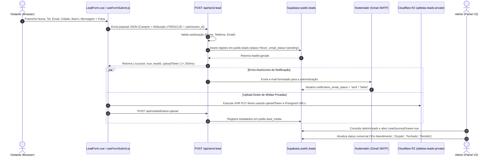
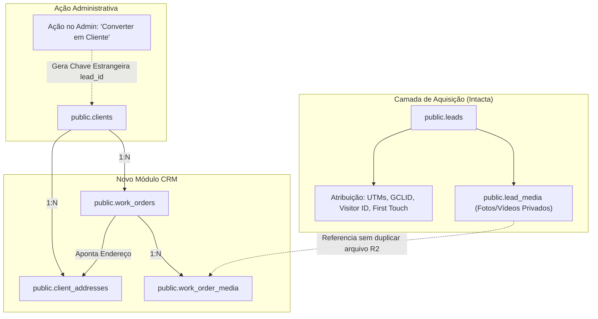

# 03 — AUDITORIA DO FLUXO DE LEADS E ESTRATÉGIA DE CONVERSÃO EM CLIENTE

**Status:** CONFIRMADO / PROPOSTA CONCEITUAL  
**Data da Auditoria:** 26 de Agosto de 2026  
**Escopo:** Ciclo de vida completo do Lead no sistema atual e modelo arquitetural seguro para transição Lead → Cliente → Ordem de Serviço.  
**Arquivos Analisados:**
- [`app/components/LeadForm.vue`](file:///d:/sicons/ADT/app/components/LeadForm.vue)
- [`app/composables/useFormSubmit.js`](file:///d:/sicons/ADT/app/composables/useFormSubmit.js)
- [`server/api/send-lead.post.ts`](file:///d:/sicons/ADT/server/api/send-lead.post.ts)
- [`server/utils/emailService.ts`](file:///d:/sicons/ADT/server/utils/emailService.ts)
- [`server/api/media/authorize-upload.post.ts`](file:///d:/sicons/ADT/server/api/media/authorize-upload.post.ts)
- [`server/api/media/finalize-upload.post.ts`](file:///d:/sicons/ADT/server/api/media/finalize-upload.post.ts)
- [`app/pages/admin/leads.vue`](file:///d:/sicons/ADT/app/pages/admin/leads.vue)
- [`app/components/admin/LeadJourneyDrawer.vue`](file:///d:/sicons/ADT/app/components/admin/LeadJourneyDrawer.vue)

---

## 1. Mapeamento do Fluxo Atual de Criação do Lead (Ponta a Ponta)

---

## 2. Campos e Metadados do Lead

### 2.1. Campos Informados pelo Visitante
- `nome` (**Obrigatório**): Validado com mínimo de 2 caracteres (`validateLeadName`).
- `telefone` (**Obrigatório**): Validado e normalizado para padrão BR com DDD (`validateLeadPhone`).
- `email` (*Opcional*): Validado se fornecido (`validateLeadEmail`).
- `cidade` (*Opcional*): Padrão `'São Paulo'` se omitido.
- `bairro` (*Opcional*): Texto livre do bairro informado.
- `servico` (*Opcional*): Nome do serviço (`'Telas Mosquiteiras'`, `'Redes de Proteção'`, etc.).
- `mensagem` (*Opcional*): Texto livre (truncado no servidor em 2.000 caracteres).
- `origem` (*Automático*): Identificador do formulário (`'formulario_geral'`, `'modal_orcamento'`, etc.).

### 2.2. Atribuição e Rastreamento (Idempotência e Tracking)
- `submission_id`: UUID único gerado no navegador antes do submit. Impede envios duplicados por duplo clique através do índice `unq_leads_submission_id`.
- `visitor_id`: ID persistente de visitante (armazenado em cookie com 1 ano de validade).
- `session_id`: ID de sessão da navegação.
- `landing_path` & `conversion_path`: Página de entrada e página onde converteu.
- `session_channel` & `first_touch_channel`: Canal de aquisição (`google_ads`, `organic`, `direct`, `referral`).
- Parâmetros UTM e Click IDs: `utm_source`, `utm_medium`, `utm_campaign`, `utm_content`, `utm_term`, `gclid`, `gbraid`, `wbraid`, `fbclid`, `msclkid`.

---

## 3. Gestão Atual de Status e Observações

Atualmente, a gestão do lead no painel administrativo (`app/pages/admin/leads.vue`) opera diretamente sobre colunas da tabela `public.leads`:

1. **Status Comercial (`leads.status`):**
   - Valores permitidos: `Novo`, `Em Atendimento`, `Orçado`, `Fechado`, `Perdido`.
   - Modificado via `POST /api/admin/update-lead`.
2. **Valor Comercial (`leads.valor_orcamento`):**
   - Campo numérico representativo do orçamento (`NUMERIC(10,2)`).
3. **Observações Internas (`leads.observacoes`):**
   - Bloco textual único onde o atendente insere notas.

> [!WARNING]
> **Limitação do Modelo Atual:**
> No modelo atual não existe histórico granular de mudanças de status (`lead_status_history`) nem notas com autor e timestamp segregados (`lead_notes`). Toda alteração sobrescreve o campo `observacoes` ou atualiza o campo `status`.

---

## 4. Arquitetura Conceitual para "Converter em Cliente" (Lead → Cliente → OS)

Para suportar o novo CRM sem perda de histórico, duplicação ou quebra de analytics, a conversão deve seguir o seguinte protocolo arquitetural:

### 4.1. Princípios Fundamentais da Conversão
1. **O Lead NUNCA é Apagado:**
   - O registro em `public.leads` permanece íntegro no banco de dados.
   - O status do lead é atualizado para `Fechado` (ou novo status comercial específico `Convertido em Cliente`).
2. **Preservação Total de Atribuição e Origem:**
   - Todos os dados de `first_touch`, `session_channel`, `gclid` e `utm_*` permanecem no lead original.
   - A tabela `public.clients` recebe uma chave estrangeira opcional `lead_id UUID REFERENCES public.leads(id)`, permitindo rastrear qual lead deu origem àquele cliente.
3. **Criação Automática do Primeiro Endereço:**
   - Os campos `cidade` e `bairro` do lead são usados para inicializar o primeiro registro em `public.client_addresses` do cliente.
4. **Criação da Primeira Ordem de Serviço (OS):**
   - O campo `servico` e `valor_orcamento` do lead são transportados para a primeira OS vinculada ao cliente recém-criado.
5. **Reaproveitamento de Mídias Privadas Sem Duplicação no R2:**
   - As fotos enviadas pelo lead em `public.lead_media` são referenciadas na primeira OS (via ponte de metadados no banco), sem necessidade de fazer download/upload ou duplicar o arquivo binário no Cloudflare R2.
6. **Zero Impacto em Google Ads e GA4:**
   - A conversão de Lead → Cliente ocorre 100% no servidor administrativo e **NÃO** dispara nenhum evento de conversão público do Google Ads.
