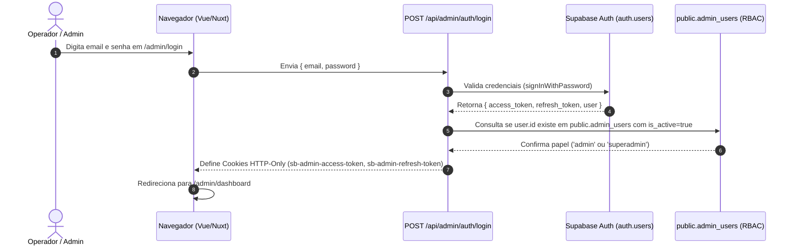

# 04 — AUTENTICAÇÃO, AUTORIZAÇÃO E SEGURANÇA ADMINISTRATIVA

**Status:** CONFIRMADO  
**Data da Auditoria:** 26 de Agosto de 2026  
**Escopo:** Mecanismo de autenticação, controle de acesso baseado em papéis (RBAC), proteção de rotas no cliente e servidor, cookies HTTP-only, CSRF e conformidade LGPD.  
**Arquivos Analisados:**
- [`server/utils/adminAuth.ts`](file:///d:/sicons/ADT/server/utils/adminAuth.ts)
- [`server/shared/adminAuthCore.mjs`](file:///d:/sicons/ADT/server/shared/adminAuthCore.mjs)
- [`app/middleware/admin-auth.global.ts`](file:///d:/sicons/ADT/app/middleware/admin-auth.global.ts)
- [`app/composables/useAdminAuth.ts`](file:///d:/sicons/ADT/app/composables/useAdminAuth.ts)
- [`server/api/admin/auth/login.post.ts`](file:///d:/sicons/ADT/server/api/admin/auth/login.post.ts)
- [`server/api/admin/auth/session.get.ts`](file:///d:/sicons/ADT/server/api/admin/auth/session.get.ts)
- [`server/api/admin/auth/logout.post.ts`](file:///d:/sicons/ADT/server/api/admin/auth/logout.post.ts)
- [`supabase/manual/008_admin_auth.sql`](file:///d:/sicons/ADT/supabase/manual/008_admin_auth.sql)

---

## 1. Arquitetura de Autenticação e Sessão

O painel administrativo utiliza uma arquitetura de sessão híbrida baseada em **Supabase Auth + Cookies HTTP-Only Seguros + Tabela de Autorização RBAC**:



---

## 2. Configuração e Ciclo de Vida dos Cookies de Sessão

| Propriedade | Cookie de Acesso (`sb-admin-access-token`) | Cookie de Refresh (`sb-admin-refresh-token`) |
|---|---|---|
| **Nome** | `sb-admin-access-token` | `sb-admin-refresh-token` |
| **HttpOnly** | `true` (Inacessível via JavaScript do navegador) | `true` |
| **Secure** | `true` em produção (`NODE_ENV === 'production'`) | `true` em produção |
| **SameSite** | `lax` | `lax` |
| **Path** | `/` | `/` |
| **TTL / MaxAge**| 7 dias (`604.800s`) | 30 dias (`2.592.000s`) |

---

## 3. Proteção e Guards em Camadas

### 3.1. Proteção no Servidor (`server/utils/adminAuth.ts`)
Todo endpoint administrativo em `server/api/admin/*` executa obrigatoriamente a função guard:
```typescript
export async function requireActiveAdmin(event: H3Event): Promise<AdminIdentity>
```
Passos executados em cada requisição:
1. **CSRF Same-Origin Enforce:** Para métodos de mutação (`POST`, `PATCH`, `PUT`, `DELETE`), valida os headers `Origin`, `Referer` e `Host`.
2. **Extração de Token:** Lê o token do cookie `sb-admin-access-token` ou header `Authorization: Bearer <token>`.
3. **Validação JWT contra Supabase Auth:** Verifica a assinatura e validade do token.
4. **Verificação de Autorização em `public.admin_users`:**
   - O `user_id` deve constar na tabela `public.admin_users`.
   - `is_active` deve ser estritamente `true`.
   - `role` deve ser `'admin'` ou `'superadmin'` (operadores comuns têm acesso restrito).

### 3.2. Proteção no Cliente (`app/middleware/admin-auth.global.ts`)
Middleware global que intercepta todas as navegações iniciadas com `/admin`:
- Se a rota for `/admin/login` e o usuário já estiver autenticado → redireciona para `/admin/dashboard`.
- Se a rota for qualquer outra página `/admin/*` e o usuário não estiver autenticado → redireciona para `/admin/login?redirect=...`.

---

## 4. Padrões de CRUD e Estrutura de Interface Existentes

| Padrão de Interface | Implementação Atual | Reutilização no Futuro CRM |
|---|---|---|
| **Layout Base** | [`app/layouts/admin.vue`](file:///d:/sicons/ADT/app/layouts/admin.vue) | 100% reutilizável. O menu lateral receberá as novas rotas. |
| **Listagem / Tabelas** | [`Table.vue`](file:///d:/sicons/ADT/app/components/ui/table/Table.vue) + Paginação / Filtros | Padrão pronto em `app/pages/admin/leads.vue`. |
| **Filtro de Período** | [`AdminDateFilter.vue`](file:///d:/sicons/ADT/app/components/admin/AdminDateFilter.vue) | Global com presets (`Hoje`, `Ontem`, `Últimos 7d`, `Este mês`, etc.). |
| **Cards de Métricas** | [`AdminKpiCard.vue`](file:///d:/sicons/ADT/app/components/admin/AdminKpiCard.vue) | Reutilizável para KPIs de clientes, OSs abertas e garantias. |
| **Drawer de Detalhes** | [`LeadJourneyDrawer.vue`](file:///d:/sicons/ADT/app/components/admin/LeadJourneyDrawer.vue) | Modelo para criação do `ClientJourneyDrawer` e `WorkOrderDrawer`. |
| **Lightbox de Fotos** | [`MediaLightbox.vue`](file:///d:/sicons/ADT/app/components/admin/MediaLightbox.vue) | Zoom (1x-5x), pan, touch e navegação pronto para fotos de OS. |

---

## 5. Padrão de Rotas Administrativas Recomendado para o CRM

Para manter a consistência com as rotas existentes (`/admin/dashboard`, `/admin/leads`, `/admin/galeria`), as novas páginas devem ser criadas em:

- `/admin/clientes` — Listagem geral de clientes, busca por nome/telefone/CPF, filtros de status.
- `/admin/clientes/[id]` — Ficha 360° do cliente, múltiplos endereços, histórico de OSs e timeline.
- `/admin/servicos` ou `/admin/ordens-servico` — Gestão de Ordens de Serviço (em aberto, em andamento, concluídas).
- `/admin/servicos/[id]` — Detalhes da OS, vãos/medidas, fotos privadas antes/depois, valores.
- `/admin/agenda` — Calendário visual e lista de visitas técnicas e instalações agendadas.
- `/admin/garantias` — Painel operacional de garantias ativas, a vencer (30d, 15d, 7d) e vencidas.
- `/admin/notificacoes` — Painel de configuração de regras de envio automático de e-mail e logs.

---

## 6. Segurança e Conformidade com a LGPD

O CRM armazenará dados pessoais e sensíveis (nome, CPF/CNPJ, endereços residenciais, telefones, fotos de residências). As seguintes salvaguardas são obrigatórias:

1. **Privacidade de Mídias:**
   - Nenhuma foto de vão ou residência de cliente pode ter URL pública permanente.
   - As imagens devem ser visualizadas exclusivamente através de URLs assinadas temporárias (TTL máximo de 5 minutos).
2. **Prevenção de Vazamento em Analytics / Logs:**
   - CPF, telefone, e-mail e endereços **NUNCA** devem ser enviados para Google Analytics, GTM, PostHog ou parâmetros de URL (`GET query`).
3. **Isolamento de Políticas RLS no Supabase:**
   - As tabelas de clientes e ordens de serviço devem ter RLS ativada com `REVOKE ALL FROM anon, authenticated` e concessão exclusiva a `service_role`.
