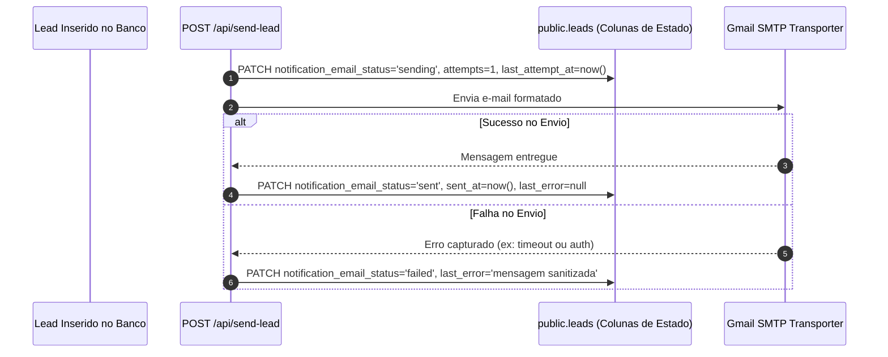

# 05 — AUDITORIA DA INFRAESTRUTURA DE DISPARO DE E-MAIL (SMTP)

**Status:** CONFIRMADO  
**Data da Auditoria:** 26 de Agosto de 2026  
**Escopo:** Mapeamento do serviço de e-mails existente, transporters, templates, timeouts, controle de falhas e análise de reuso para o CRM.  
**Arquivos Analisados:**
- [`server/utils/emailService.ts`](file:///d:/sicons/ADT/server/utils/emailService.ts)
- [`server/shared/leadEmailCore.mjs`](file:///d:/sicons/ADT/server/shared/leadEmailCore.mjs)
- [`server/api/send-lead.post.ts`](file:///d:/sicons/ADT/server/api/send-lead.post.ts)
- [`supabase/manual/006_lead_email_delivery_state.sql`](file:///d:/sicons/ADT/supabase/manual/006_lead_email_delivery_state.sql)
- [`nuxt.config.ts`](file:///d:/sicons/ADT/nuxt.config.ts)

---

## 1. Stack e Provedores de E-mail Confirmados

1. **Biblioteca Principal em Uso:** `nodemailer` (`^9.0.5`).
2. **Provedor SMTP Ativo:** Gmail SMTP (`service: 'gmail'`).
3. **Provedor Alternativo Registrado:** `resend` (`^6.9.4` presente nas dependências do `package.json` e com `resendApiKey` no `runtimeConfig`, porém o pipeline ativo de produção utiliza Nodemailer/Gmail).
4. **Variáveis de Ambiente Utilizadas (Sem Exposição de Valores):**
   - `GMAIL_EMAIL`: Endereço de envio/autenticação SMTP.
   - `GMAIL_APP_PASSWORD`: Senha de aplicativo Google (App Password).
   - `LEAD_NOTIFICATION_EMAIL`: Destinatário das notificações administrativas.
   - `RESEND_API_KEY`: Chave de API da plataforma Resend (disponível para contingência).

---

## 2. Configuração do Transporter e Timeouts

O transporter é instanciado em [`server/utils/emailService.ts`](file:///d:/sicons/ADT/server/utils/emailService.ts) com as seguintes configurações estritas:

```typescript
cachedTransporter = nodemailer.createTransport({
  service: 'gmail',
  auth: {
    user: config.gmailEmail,
    pass: config.gmailAppPassword
  },
  connectionTimeout: 10000, // 10 segundos
  greetingTimeout: 10000,   // 10 segundos
  socketTimeout: 15000      // 15 segundos
})
```

- **Pooling / Caching:** O objeto `cachedTransporter` é mantido em memória no processo Node.js para reutilizar conexões abertas e diminuir latência de handshake.
- **Fail-Fast & Timeouts:** Timeouts configurados para evitar bloqueio indefinido da thread do servidor em caso de oscilação do Gmail.

---

## 3. Arquitetura de Disparo e Estado Durável

O projeto adota uma estratégia de **notificação assíncrona desacoplada com persistência de estado no banco**:



### 3.1. Rastreamento no Banco de Dados (`public.leads`)
Conforme a migração `006_lead_email_delivery_state.sql`, o status de envio é persistido nas colunas:
- `notification_email_status`: `'pending'`, `'sending'`, `'sent'`, `'failed'`.
- `notification_email_sent_at`: Timestamp UTC da entrega.
- `notification_email_attempts`: Contador de tentativas (`INT >= 0`).
- `notification_email_last_attempt_at`: Timestamp da última tentativa.
- `notification_email_last_error`: Mensagem sanitizada (sem senhas ou tokens).

---

## 4. Templates de E-mail Existentes

O módulo [`server/shared/leadEmailCore.mjs`](file:///d:/sicons/ADT/server/shared/leadEmailCore.mjs) contém geradores funcionais puros:

1. **`generateEmailSubject(lead)`:**
   - Gera assuntos contextuais como: `Novo Pedido de Orçamento — [Serviço] — [Nome] — [Bairro/Cidade]`.
2. **`generateEmailHTML(lead)`:**
   - Layout responsivo inline CSS profissional.
   - Header com logo oficial da marca via anexo inline CID (`cid:brand-logo-icon`).
   - Tabela de dados do cliente (Nome, Telefone com link para WhatsApp direto, E-mail, Localização).
   - Caixa destacada com o serviço solicitado e mensagem do cliente.
   - Sumário de mídias anexadas (quantidade de fotos e vídeos selecionados).
   - Metadados técnicos no rodapé (Canal de aquisição, UTM Campaign, GCLID, Horário SP).
3. **`generateEmailText(lead)`:**
   - Versão alternativa em texto puro (Plain Text) para clientes de e-mail que desabilitam HTML.

---

## 5. Avaliação de Reutilização para o Módulo CRM

A infraestrutura atual de e-mails é **100% reutilizável e expansível** para as necessidades do novo CRM:

| Nova Necessidade CRM | Viabilidade de Reuso | O que precisa ser construído |
|---|---|---|
| **Resumo Diário da Agenda (09:00)** | ALTA | Novo template HTML consolidando as visitas e instalações do dia. |
| **Resumo Semanal da Agenda** | ALTA | Novo template agrupando a programação de segunda a sábado. |
| **Lembrete de Visita / Instalação (1 dia antes)** | ALTA | Template de confirmação para a equipe operacional / técnico. |
| **Aviso de Vencimento de Garantia (30d / 15d / 7d / 0d)** | ALTA | Template de pós-venda para a equipe entrar em contato ou notificar cliente. |
| **Pesquisa de Pós-Venda / Satisfação** | ALTA | Template automático enviado após conclusão de OS (`Fechada`). |

> [!TIP]
> **Recomendação Arquitetural:**
> Criar uma camada de templates especializados (`server/shared/crmEmailTemplates.mjs`) consumindo o mesmo transporter unificado de `server/utils/emailService.ts`.
