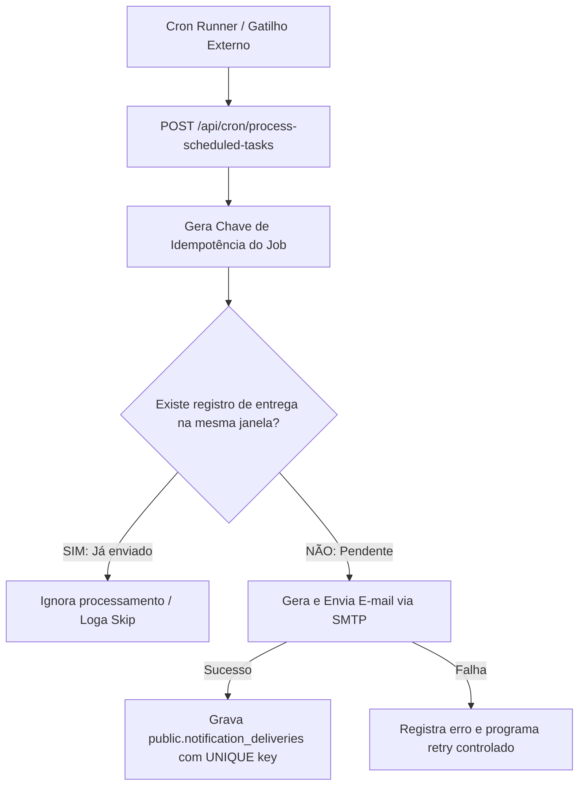

# 06 — AUDITORIA DE AGENDAMENTO, CRON, TIMEZONE E IDEMPOTÊNCIA

**Status:** AUDITADO (GAPS IDENTIFICADOS E ARQUITETURA CONCEITUAL DEFINIDA)  
**Data da Auditoria:** 26 de Agosto de 2026  
**Escopo:** Avaliação da infraestrutura atual de tarefas agendadas, tratamento de fuso horário (`America/Sao_Paulo`), prevenção de envios duplicados e modelo conceitual de agendador para o CRM.  
**Arquivos Analisados:**
- [`server/api/cron-tick.post.ts`](file:///d:/sicons/ADT/server/api/cron-tick.post.ts)
- [`send-cron-tick.ps1`](file:///d:/sicons/ADT/send-cron-tick.ps1)
- [`server/shared/adminAnalyticsCore.mjs`](file:///d:/sicons/ADT/server/shared/adminAnalyticsCore.mjs)
- [`supabase/export/schema_full.sql`](file:///d:/sicons/ADT/supabase/export/schema_full.sql)

---

## 1. Estado Atual da Infraestrutura de Cron (O que Existe Hoje)

Após varredura completa no projeto, constatou-se que a infraestrutura de cron existente é **rudimentar e experimental**:

1. **Tabela `public.cron_ticks`:**
   - Possui apenas 3 colunas: `id` (UUID), `created_at` (TIMESTAMPTZ), `valor` (INT DEFAULT 1).
   - Serviu apenas como teste de conectividade manual para registrar "batimentos" vindos de scripts externos.
2. **Endpoint `server/api/cron-tick.post.ts`:**
   - Recebe requisições HTTP e insere `{ valor: 1 }` na tabela `cron_ticks`. Não possui validação de agendamento, filas ou lógica de negócio.
3. **Script `send-cron-tick.ps1`:**
   - Script PowerShell local para disparar um POST manual para o Supabase.
4. **Agendadores em Produção (Vercel Cron, pg_cron, GitHub Actions):**
   - **NÃO ENCONTRADO:** Não há `vercel.json` com `crons[]`, nem extensão `pg_cron` ativada com jobs agendados, nem GitHub Actions de periodicidade.

---

## 2. Requisitos Operacionais de Agendamento para o CRM

O novo módulo operacional necessitará de disparos periódicos com horários estritos no fuso de São Paulo:

| Tipo de Rotina | Frequência / Gatilho | Horário Alvo (`America/Sao_Paulo`) | Destinatários |
|---|---|---|---|
| **Resumo Diário da Agenda** | Todos os dias (Seg–Sáb) | `09:00:00` | Administradores / Gestão |
| **Resumo Semanal da Agenda** | Toda Segunda-feira | `09:00:00` | Administradores / Gestão |
| **Resumo Bi-semanal** | Segundas e Quintas | `09:00:00` | Administradores / Gestão |
| **Lembrete de Visita/Instalação** | 1 dia antes da data do serviço | `08:00:00` a `10:00:00` | Equipe Técnica / Cliente |
| **Aviso de Garantia a Vencer** | 30, 15 e 7 dias antes do término | `09:00:00` | Gestão de Pós-Venda |
| **Aviso de Término de Garantia** | No dia exato do vencimento | `09:00:00` | Gestão de Pós-Venda / Cliente |

---

## 3. Tratamento de Timezone (`America/Sao_Paulo`) e Riscos Identificados

```
+-----------------------------------------------------------------------------------------------+
| UTC (Servidor/Vercel) | Fuso SP (America/Sao_Paulo) | Horário de Verão (Histórico / Risco)    |
|   12:00:00 UTC        |   09:00:00 SP (UTC-3)       | Atualmente sem Horário de Verão no BR   |
+-----------------------------------------------------------------------------------------------+
```

### 3.1. Riscos de Timezone e Regras de Conversão
1. **Diferença UTC ↔ Horário Local:**
   - O banco de dados Supabase e os servidores da Vercel operam internamente em `UTC`.
   - Um job agendado para `09:00 UTC` executaria às `06:00 em São Paulo`.
   - **Regra Fixa:** Todo agendamento deve converter o horário de referência para UTC (`09:00 SP = 12:00 UTC`) ou calcular a data corrente usando a função canônica de timezone de São Paulo já existente no projeto (`getSaoPauloDateRange` em `server/shared/adminAnalyticsCore.mjs`).
2. **Armazenamento de Datas no Banco:**
   - Todas as colunas de data de agendamento e garantia devem utilizar `TIMESTAMPTZ` (Timestamp with Time Zone), nunca `TIMESTAMP` sem fuso, garantindo indexação precisa e conversão correta em qualquer ambiente.

---

## 4. Arquitetura Conceitual de Idempotência e Prevenção de Envios Duplicados

Para garantir que uma reexecução de cron ou retry de rede **NUNCA envie dois e-mails idênticos**, a arquitetura futura deverá implementar o padrão de **Registro de Entrega de Notificação (Notification Deliveries)**:



### 4.1. Composição da Chave de Idempotência
A unicidade da entrega é calculada pela fórmula:
$$\text{idempotency\_key} = \text{MD5}(\text{rule\_id} + \text{target\_entity\_id} + \text{recipient\_email} + \text{execution\_window\_date})$$

Exemplo prático:
- `rule_id`: `'warranty_alert_30d'`
- `target_entity_id`: `os_uuid_123`
- `recipient_email`: `'contato@adtelasmosquiteiras.com.br'`
- `execution_window_date`: `'2026-08-26'`
- **Resultado:** Mesmo que o cron seja disparado 10 vezes no dia 26/08/2026, a constraint `UNIQUE(idempotency_key)` na tabela de entregas rejeitará as 9 tentativas subsequentes.

---

## 5. Proposta de Implementação do Agendador em Produção

Para a arquitetura Nuxt / Nitro / Vercel do projeto, as duas opções técnicas recomendadas são:

1. **Opção A (Recomendada para Vercel): Vercel Cron Jobs:**
   - Configuração de `vercel.json` com chamada horária (ex: a cada hora ou diariamente às `12:00 UTC = 09:00 SP`) para `/api/cron/process-scheduled-tasks`.
   - Proteção do endpoint via header `Authorization: Bearer CRON_SECRET`.
2. **Opção B (Recomendada para Supabase Nativo): Supabase Edge Function + pg_cron:**
   - Extensão `pg_cron` no Supabase disparando um webhook agendado.
