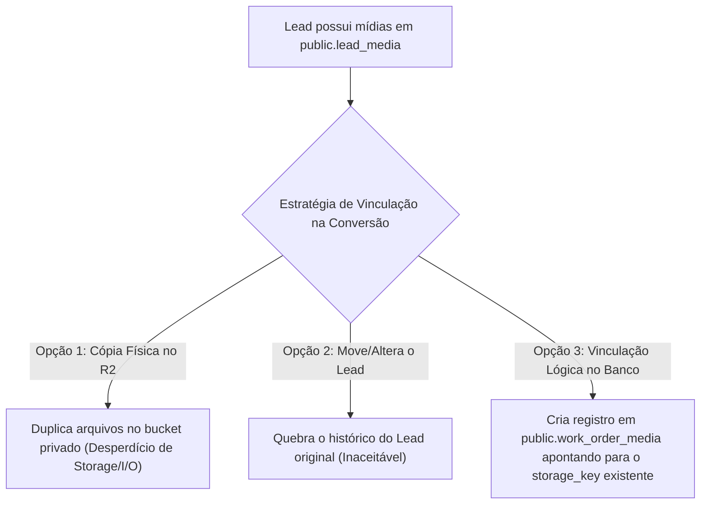

# 07 — AUDITORIA DE MÍDIAS PRIVADAS, PÚBLICAS E CLOUDFLARE R2

**Status:** CONFIRMADO  
**Data da Auditoria:** 26 de Agosto de 2026  
**Escopo:** Mapeamento comparativo entre os ecossistemas de armazenamento privado e público no Cloudflare R2, regras de transição de mídias de Leads para Clientes e diretrizes para mídias privadas de Ordens de Serviço (OS).  
**Arquivos Analisados:**
- [`server/utils/r2Storage.ts`](file:///d:/sicons/ADT/server/utils/r2Storage.ts)
- [`server/shared/r2StorageCore.mjs`](file:///d:/sicons/ADT/server/shared/r2StorageCore.mjs)
- [`server/api/media/authorize-upload.post.ts`](file:///d:/sicons/ADT/server/api/media/authorize-upload.post.ts)
- [`server/api/media/finalize-upload.post.ts`](file:///d:/sicons/ADT/server/api/media/finalize-upload.post.ts)
- [`server/api/admin/media/signed-url.get.ts`](file:///d:/sicons/ADT/server/api/admin/media/signed-url.get.ts)
- [`server/utils/r2SiteStorage.ts`](file:///d:/sicons/ADT/server/utils/r2SiteStorage.ts)
- [`server/shared/r2SiteStorageCore.mjs`](file:///d:/sicons/ADT/server/shared/r2SiteStorageCore.mjs)
- [`server/api/admin/media/site/authorize-upload.post.ts`](file:///d:/sicons/ADT/server/api/admin/media/site/authorize-upload.post.ts)
- [`server/api/admin/media/site/finalize-upload.post.ts`](file:///d:/sicons/ADT/server/api/admin/media/site/finalize-upload.post.ts)
- [`supabase/manual/007_lead_media_storage.sql`](file:///d:/sicons/ADT/supabase/manual/007_lead_media_storage.sql)
- [`supabase/manual/009_service_media_storage.sql`](file:///d:/sicons/ADT/supabase/manual/009_service_media_storage.sql)

---

## 1. Comparativo dos Ambientes de Armazenamento R2 Existentes

| Atributo / Política | Mídias Privadas de Leads | Futuras Mídias Privadas de CRM / OS | Mídias Públicas do Site |
|---|---|---|---|
| **Identificador do Bucket** | `adtelas-leads-private` | `adtelas-leads-private` (ou prefixo segregado) | `adtelas-site-media` |
| **Finalidade** | Fotos/Vídeos de orçamentos enviados por visitantes | Fotos técnicas de vãos, medições, antes/depois | Galerias públicas e provas sociais das 12 páginas |
| **Credenciais de Acesso** | `R2_ACCESS_KEY_ID` / `R2_SECRET_ACCESS_KEY` | Mesmas credenciais privadas seguras | `R2_SITE_MEDIA_ACCESS_KEY_ID` / `R2_SITE_MEDIA_SECRET_ACCESS_KEY` |
| **Acesso a Leitura** | **Privado estrito** (Signed URL com TTL de 300s) | **Privado estrito** (Signed URL com TTL de 300s) | **Público irrestrito** via CDN Cloudflare |
| **URL Base de Visualização** | URLs assinadas temporárias do S3 SDK | URLs assinadas temporárias do S3 SDK | `https://media.adtelasmosquiteiras.com.br` |
| **Tabela no Supabase** | `public.lead_media` | Nova tabela (ex: `public.work_order_media`) | `public.service_media` |
| **Upload Direto** | Presigned PUT (TTL 15 min via Token HMAC) | Presigned PUT autenticado por Admin | Presigned PUT autenticado por Admin |
| **Limites de Tamanho** | Foto: 10 MB \| Vídeo: 50 MB | Foto: 15 MB \| Vídeo: 100 MB | Foto: 10 MB \| Vídeo: 50 MB |
| **Validação no Finalize** | `HeadObject` + Magic Bytes via Range GET | `HeadObject` + Magic Bytes via Range GET | `HeadObject` + Magic Bytes via Range GET |

---

## 2. Regra Fundamental de Imutabilidade e Isolamento de Privacidade

> [!CAUTION]
> **REGRA DE OURO DA PRIVACIDADE (LGPD / SEGURANÇA):**
> Fotos privadas de clientes, vãos residenciais e detalhes de instalações de uma Ordem de Serviço **NUNCA** devem ser expostas ou convertidas em públicas de forma automática.

Se no futuro o administrador desejar utilizar uma foto de instalação realizada em uma OS para a galeria pública do site:
1. Deve haver uma **ação humana explícita no painel** (ex: botão *"Promover para Galeria Pública"*).
2. O backend executará uma operação de cópia (`CopyObjectCommand`) do bucket privado `adtelas-leads-private` para o bucket público `adtelas-site-media` gerando um novo UUID.
3. Um novo registro independente será criado na tabela `public.service_media`.
4. O objeto privado original permanece intacto no bucket privado com seu registro restrito.

---

## 3. Análise da Estratégia de Mídia: Lead → Cliente → Ordem de Serviço

Quando um Lead que possui fotos ou vídeos anexados em `public.lead_media` for convertido em Cliente e gerar sua primeira OS, foram avaliadas três alternativas arquiteturais:

### 3.1. Avaliação das Alternativas

| Alternativa | Prós | Contras | Classificação |
|---|---|---|---|
| **Opção 1: Duplicar arquivo no R2** | Isolamento total por entidade | Custo desnecessário de I/O e bytes duplicados no R2 | *Não recomendada* |
| **Opção 2: Mover e apagar do Lead** | Apenas um ponteiro | Perda de integridade da solicitação original do Lead | *Inaceitável* |
| **Opção 3: Vinculação Lógica de Metadados** | **Zero duplicação no R2**, preserva Lead original, acesso instantâneo na OS | Exige controle cuidadoso na exclusão | **RECOMENDADA (Melhor Prática)** |

### 3.2. Mecanismo de Exclusão Segura
Para a Opção 3 (Recomendada), o backend deve checar antes de remover um objeto do R2 se o `storage_key` está referenciado por mais de uma tabela (`lead_media` e `work_order_media`). O arquivo físico no R2 só deve ser deletado se for a última referência ativa.
