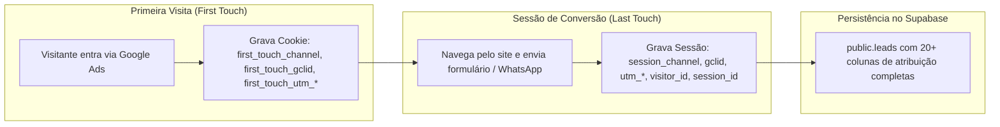

# 09 — AUDITORIA DE ANALYTICS, ATRIBUIÇÃO E ISOLAMENTO DE TRACKING

**Status:** CONFIRMADO  
**Data da Auditoria:** 26 de Agosto de 2026  
**Escopo:** Mapeamento do modelo de atribuição multi-toque existente, rastreamento de campanhas Google Ads e regras de blindagem contra disparos indevidos no CRM.  
**Arquivos Analisados:**
- [`server/shared/adminAnalyticsCore.mjs`](file:///d:/sicons/ADT/server/shared/adminAnalyticsCore.mjs)
- [`server/utils/analytics.ts`](file:///d:/sicons/ADT/server/utils/analytics.ts)
- [`app/plugins/track-clicks.client.ts`](file:///d:/sicons/ADT/app/plugins/track-clicks.client.ts)
- [`app/plugins/track-visits.client.ts`](file:///d:/sicons/ADT/app/plugins/track-visits.client.ts)
- [`docs/GOOGLE_ADS_TRACKING_CORRECTION.md`](file:///d:/sicons/ADT/docs/GOOGLE_ADS_TRACKING_CORRECTION.md)
- [`docs/GOOGLE_ADS_TRACKING_READINESS.md`](file:///d:/sicons/ADT/docs/GOOGLE_ADS_TRACKING_READINESS.md)

---

## 1. Modelo de Atribuição Existente no Projeto

O projeto possui um modelo de atribuição robusto e granular que rastreia a jornada completa do visitante desde a primeira visita até a conversão:

### 1.1. Dimensões de Atribuição Confirmadas em `public.leads`
- **First Touch:** `first_touch_channel`, `first_touch_landing_path`, `first_touch_referrer`, `first_touch_utm_source`, `first_touch_utm_medium`, `first_touch_utm_campaign`, `first_touch_utm_content`, `first_touch_utm_term`, `first_touch_gclid`, `first_touch_gbraid`, `first_touch_wbraid`, `first_touch_fbclid`, `first_touch_msclkid`.
- **Last Touch / Sessão:** `session_channel`, `landing_path`, `conversion_path`, `referrer`, `utm_source`, `utm_medium`, `utm_campaign`, `utm_content`, `utm_term`, `gclid`, `gbraid`, `wbraid`, `fbclid`, `msclkid`.
- **Identidade:** `visitor_id` (cookie persistente de 1 ano) e `session_id` (sessão ativa).

---

## 2. Regras de Blindagem e Isolamento no Novo CRM

> [!IMPORTANT]
> **REGRA CRÍTICA DE TRACKING:**
> Nenhuma ação administrativa realizada dentro do CRM (cadastrar cliente, converter lead, abrir OS, agendar visita, concluir serviço) deve disparar eventos de conversão para Google Ads, Google Tag Manager (GTM), GA4 ou PostHog.

### 2.1. Salvaguardas Implementadas
1. **Rotas `/admin/*` Excluídas do GTM Público:**
   - O layout administrativo (`app/layouts/admin.vue`) não dispara tags de conversão comercial pública.
2. **Formulários Administrativos Segregados:**
   - Os formulários do CRM utilizarão endpoints exclusivos sob `/api/admin/crm/*`, que nunca invocarão webhooks públicos de marketing.
3. **Preservação de Atribuição sem Re-disparo:**
   - Ao converter um Lead em Cliente ou associar um valor real de receita à Ordem de Serviço concluída, os metadados de marketing permanecem congelados no registro original para fins de cálculo de ROI.

---

## 3. Benefício Estratégico para o CRM: Cálculo de LTV e ROI Real de Campanhas

Com a ligação entre `Lead (com GCLID e UTMs)` → `Cliente` → `Ordem de Serviço (com valor real faturado)`:

$$\text{ROI Real da Campanha} = \frac{\sum \text{Valor das OSs Concluídas por Campanha} - \text{Custo Google Ads}}{\text{Custo Google Ads}}$$

Será possível saber no futuro:
- Quais campanhas geraram os clientes mais lucrativos;
- O valor médio de serviço por canal de aquisição (`Google Ads - Telas` vs `Google Ads - Redes` vs `Orgânico`);
- A taxa de conversão real de `Lead Recebido → Cliente Atendido → Garantia Concluída`.
