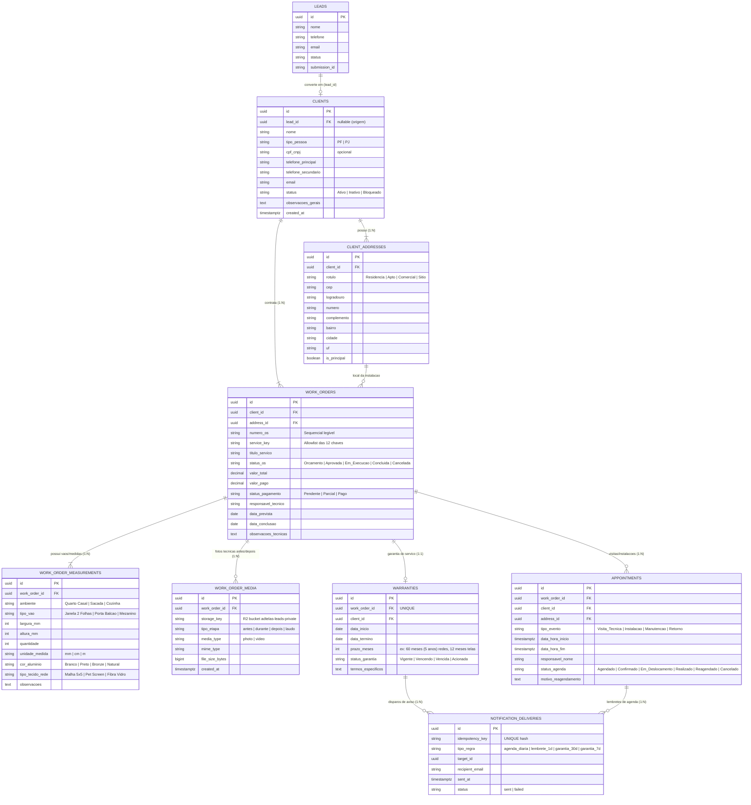

# 11 — ARQUITETURA CONCEITUAL DO CRM (PROPOSTA PARA DISCUSSÃO)

> [!IMPORTANT]
> **MODELAGEM SUPERADA/REFINADA PELA FASE 1.1:**
> O modelo conceitual deste documento foi estendido e formalizado na documentação definitiva da Fase 1.1. Para a modelagem completa e aprovada com múltiplos itens por OS, pagamentos reais e garantias flexíveis, consulte: [docs/CRM_DATA_MODEL/00_INDEX.md](../CRM_DATA_MODEL/00_INDEX.md).

**Status:** HISTÓRICO / REFINADO NA FASE 1.1  
**Data da Auditoria:** 26 de Agosto de 2026  
**Escopo:** Modelo de dados conceitual preliminar da Fase 1.  

---

## 1. Diagrama de Entidades e Relacionamentos (ER Conceitual)



---

## 2. Modelagem das Necessidades Operacionais Críticas

### 2.1. Modelo Cliente × Múltiplos Endereços (1:N)
- Um cliente pode possuir múltiplos imóveis (ex: Residência em Santana, Apartamento em Moema, Comércio no Centro, Casa de Campo).
- Cada Ordem de Serviço (OS) aponta para um `address_id` específico do cliente, garantindo que o técnico saiba exatamente onde realizar a instalação.

### 2.2. Modelo Cliente × Múltiplas Ordens de Serviço (1:N)
- O cliente nunca deve ter seus dados de serviço atrelados a um campo estático na tabela de clientes.
- Um mesmo cliente pode contratar `Telas Mosquiteiras` em 2026 e `Redes de Proteção` em 2027, gerando duas OSs distintas com garantias independentes.

### 2.3. Medidas e Vãos Estruturados (1:N na OS)
- Cada vão de janela/porta é modelado com precisão milimétrica (`largura_mm`, `altura_mm`, `quantidade`, `ambiente`, `cor_aluminio`, `tipo_tecido_rede`).
- Permite cálculo automatizado de metragem quadrada total ($m^2$) e conferência de corte/produção.

### 2.4. Garantias Independentes por Serviço
- A garantia é atrelada diretamente à Ordem de Serviço (`work_orders.id`), possuindo prazo específico (ex: 5 anos para Redes de Proteção e 1 a 2 anos para Telas Mosquiteiras).
- Permite identificar no painel de pós-venda o status exato: `Vigente`, `Vencendo em 30d/15d/7d`, `Vencida` ou `Em Atendimento de Garantia`.

---

## 3. Arquitetura da Timeline 360° do Cliente

A timeline do cliente deve adotar uma **estratégia híbrida** para máxima fidelidade e performance:

```
[Lead Recebido] ──► [Cliente Cadastrado] ──► [Visita Técnica] ──► [Orçamento Aprovado] ──► [Instalação Concluída] ──► [Garantia Ativa] ──► [Pós-Venda]
```

1. **Eventos Transacionais Nativos (Gerados em Tempo Real):**
   - Criação do Lead original;
   - Agendamentos de visita e instalação (`appointments`);
   - Mutações de status da OS (`work_orders`);
   - Prazos e acionamentos de garantia (`warranties`).
2. **Notas e Registros Manuais do Atendente:**
   - Observações de contato telefônico, mensagens de WhatsApp e acordos comerciais gravadas em tabela auditável de interações.
