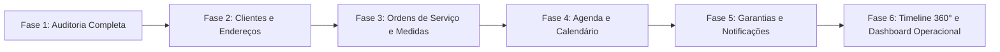

# 12 — PLANEJAMENTO DE FASES DE IMPLEMENTAÇÃO FUTURA DO CRM

> [!IMPORTANT]
> **MODELAGEM SUPERADA/REFINADA PELA FASE 1.1:**
> O detalhamento do escopo das fases futuras e o blueprint da Migration 010 foram formalizados em: [docs/CRM_DATA_MODEL/15_MIGRATION_010_BLUEPRINT.md](../CRM_DATA_MODEL/15_MIGRATION_010_BLUEPRINT.md) e [docs/CRM_DATA_MODEL/00_INDEX.md](../CRM_DATA_MODEL/00_INDEX.md).

**Status:** HISTÓRICO / REFINADO NA FASE 1.1  
**Data da Auditoria:** 26 de Agosto de 2026  
**Escopo:** Roadmap sequencial preliminar da Fase 1.

---

## 1. Visão Geral do Roadmap Modular

---

## 2. Detalhamento de Cada Fase Proposta

### 2.1. Fase 2 — Módulo de Clientes e Endereços (Cadastro Manual & Conversão de Leads)
- **Objetivo:** Estabelecer a base de dados de clientes, permitindo o cadastro manual do zero e a conversão de leads existentes em clientes com múltiplos endereços.
- **Dependências:** Fase 1 (Auditoria) concluída e aprovada.
- **Banco de Dados:** Tabelas `public.clients` e `public.client_addresses` com RLS estrita para `service_role`.
- **Backend Nitro:** Endpoints `/api/admin/crm/clients/*` (listagem, busca rápida por telefone/nome/CPF, criação, edição, conversão de lead).
- **Frontend Admin:** Página `/admin/clientes`, modal/gaveta de cadastro de cliente e botão "Converter em Cliente" em `LeadJourneyDrawer.vue`.
- **Segurança:** Proteção RBAC via `requireActiveAdmin`, CSRF enforcement, sanitização de telefones e validação de duplicidade.
- **Testes:** Suíte automatizada Node.js cobrindo CRUD, validação de campos, idempotência de conversão e proteção RLS.
- **Riscos:** Criação de clientes duplicados; mitigado por busca prévia obrigatória.

---

### 2.2. Fase 3 — Ordens de Serviço (OS), Medições de Vãos e Mídias Privadas
- **Objetivo:** Permitir o gerenciamento completo de serviços contratados, especificações técnicas de medidas/vãos e upload de fotos privadas antes/depois.
- **Dependências:** Fase 2 (Clientes) ativa.
- **Banco de Dados:** Tabelas `public.work_orders`, `public.work_order_measurements` e `public.work_order_media`.
- **Backend Nitro:** Endpoints `/api/admin/crm/orders/*` (cálculo de $m^2$, alteração de status operacional, upload presigned para R2 privado).
- **Frontend Admin:** Página `/admin/servicos` e `/admin/servicos/[id]`, tabela dinâmica de vãos com adição de linhas e galeria de fotos privadas com zoom/lightbox.
- **Segurança:** URLs assinadas com TTL de 300s para fotos técnicas; isolamento absoluto do bucket público.
- **Testes:** Suíte cobrindo cálculos de medidas, integridade de chaves estrangeiras e deleção segura de mídias no R2.
- **Riscos:** Vãos com medidas inválidas; mitigado por validações numéricas estritas no frontend e backend.

---

### 2.3. Fase 4 — Agenda Operacional, Visitas Técnicas e Calendário
- **Objetivo:** Prover uma agenda operacional centralizada para marcação de visitas técnicas para medição, instalações e reagendamentos com visualização em calendário e lista.
- **Dependências:** Fase 3 (Ordens de Serviço) ativa.
- **Banco de Dados:** Tabela `public.appointments` vinculada a `work_orders`, `clients` e `client_addresses`.
- **Backend Nitro:** Endpoints `/api/admin/crm/agenda/*` com filtros por período (`getSaoPauloDateRange`), responsável técnico e status.
- **Frontend Admin:** Página `/admin/agenda` com visão de Calendário (Mês/Semana/Dia) e Lista de Atendimentos.
- **Segurança:** Validação de fuso horário `America/Sao_Paulo` (UTC-3) na criação e listagem.
- **Testes:** Suíte cobrindo conflitos de datas, reagendamentos com justificativa e persistência de timezone.
- **Riscos:** Agendamento em fuso incorreto; mitigado por conversão explícita para TIMESTAMPTZ UTC.

---

### 2.4. Fase 5 — Garantias, Regras de Notificação e Disparos Automáticos (Cron)
- **Objetivo:** Automatizar o controle de prazos de garantia de serviços concluídos e implementar o motor de envio de resumos diários/semanais e alertas via e-mail.
- **Dependências:** Fase 4 (Agenda) e infraestrutura de e-mail existente.
- **Banco de Dados:** Tabelas `public.warranties` e `public.notification_deliveries` (com UNIQUE idempotency_key).
- **Backend Nitro:** Endpoint seguro `/api/cron/process-scheduled-tasks` (protegido por `CRON_SECRET`) e geradores de templates de e-mail em `server/shared/crmEmailTemplates.mjs`.
- **Frontend Admin:** Página `/admin/garantias` e `/admin/notificacoes` para auditoria de entregas e regras ativas.
- **Segurança:** Prevenção absoluta de e-mails duplicados via idempotência estrita no banco.
- **Testes:** Suíte de simulação de disparo de cron, validação de regras de vencimento (30d, 15d, 7d, 0d) e bloqueio de re-execução.
- **Riscos:** Envio de e-mails em duplicidade; mitigado por `UNIQUE(idempotency_key)`.

---

### 2.5. Fase 6 — Timeline 360° do Cliente e Dashboard Operacional
- **Objetivo:** Consolidar a jornada unificada de cada cliente (Lead → Atendimento → Visitas → OSs → Garantias) e criar o dashboard com KPIs de desempenho operacional e faturamento.
- **Dependências:** Fases 2, 3, 4 e 5 ativas.
- **Backend Nitro:** Endpoint `/api/admin/crm/dashboard-stats` e `/api/admin/crm/clients/[id]/timeline`.
- **Frontend Admin:** Ficha unificada em `/admin/clientes/[id]` com timeline interativa e cards de KPIs operacionais no dashboard.
- **Testes:** Testes E2E de navegação e integridade dos dados agregados.
- **Riscos:** Lentidão em consultas agregadas; mitigado por índices btree compostos criados nas fases anteriores.
