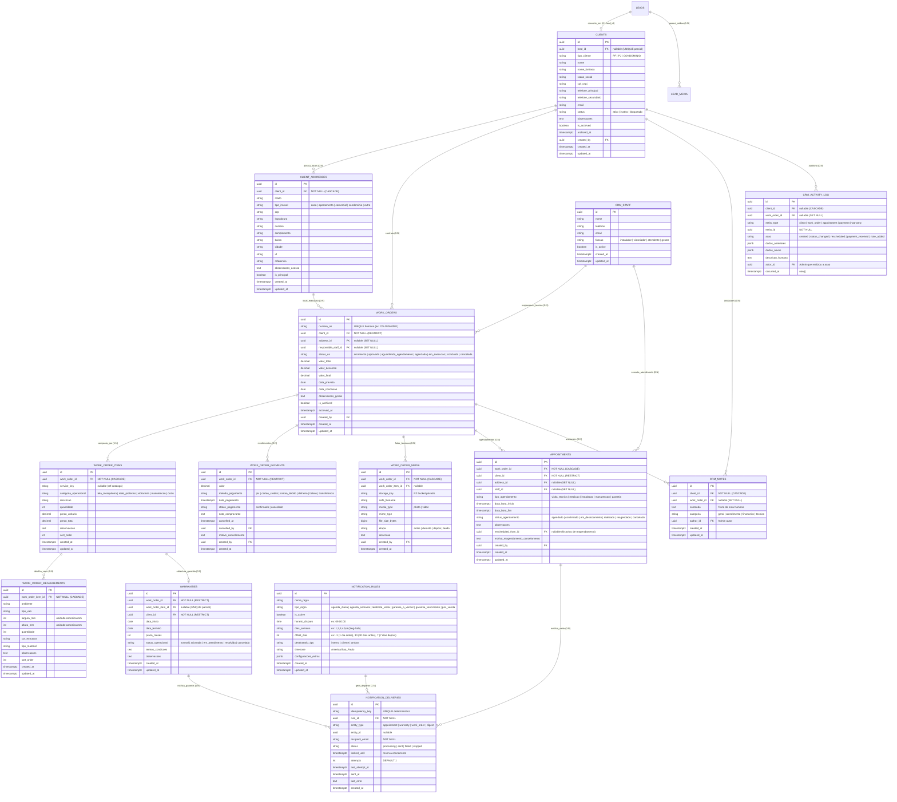

# 02 — MODELO ENTIDADE-RELACIONAMENTO DEFINITIVO (ER)

**Status:** APROVADO PARA MODELAGEM (FASE 1.1)  
**Data:** 26 de Agosto de 2026  
**Escopo:** Diagrama relacional completo de entidades, chaves estrangeiras, cardinalidades e ciclo de vida.

---

## 1. Diagrama Entidade-Relacionamento Completo

---

## 2. Tabela Mestre de Entidades, Cardinalidades e Ciclo de Vida

| Entidade | Finalidade Primária | Entidade Pai | Cardinalidade | Política de Exclusão / Lifecycle |
|---|---|---|---|---|
| `public.clients` | Cadastro do cliente (PF/PJ/Condomínio) | Nenhuma (ou `leads`) | 1:1 com Lead (opcional) | **Arquivamento (`is_archived = true`)**. Não deletável se possuir OS. |
| `public.client_addresses`| Locais e endereços de atendimento | `clients` | `0:N` por cliente | **DELETE físico permitido** se não vinculado a OS ativa. |
| `public.crm_staff` | Técnicos e equipe operacional | Nenhuma | 1:N com OS/Agenda | **Desativação (`is_active = false`)**. Imutável após vínculos. |
| `public.work_orders` | Ordem de Serviço operacional | `clients` | `1:N` por cliente | **Arquivamento / Cancelamento**. Draft vazio pode ser excluído. |
| `public.work_order_items`| Linhas de serviço contratadas | `work_orders` | `1:N` por OS | **CASCADE com OS**. Imutável após OS concluída. |
| `public.work_order_measurements` | Medições técnicas de vãos | `work_order_items` | `0:N` por item | **CASCADE com item**. |
| `public.work_order_media` | Fotos/vídeos privados do serviço | `work_orders` | `0:N` por OS | **CASCADE lógico** com proteção de arquivo no R2. |
| `public.work_order_payments`| Lançamentos de recebimentos | `work_orders` | `0:N` por OS | **Cancelamento com auditoria (`status: 'cancelado'`)**. |
| `public.appointments` | Visitas técnicas e instalações | `work_orders` / `clients` | `0:N` por OS | **Cancelamento / Reagendamento** com justificativa. |
| `public.warranties` | Prazos e controle de garantia | `work_orders` / `items` | `0:1` por item ou OS | **Cancelamento operacional**. Registros históricos permanentes. |
| `public.notification_rules` | Regras configuráveis de avisos | Nenhuma | 1:N com entregas | **Desativação (`is_active = false`)**. |
| `public.notification_deliveries`| Auditoria e idempotência de envios | `notification_rules` | 1:N por regra | **Tabela Imutável (Append-only / Update de status)**. |
| `public.crm_activity_log` | Trilha de auditoria cronológica | `clients` / `work_orders` | 1:N | **Tabela Imutável (Append-only)**. |
| `public.crm_notes` | Anotações humanas de atendimento | `clients` | `0:N` por cliente | **DELETE permitido** apenas pelo autor ou superadmin. |
