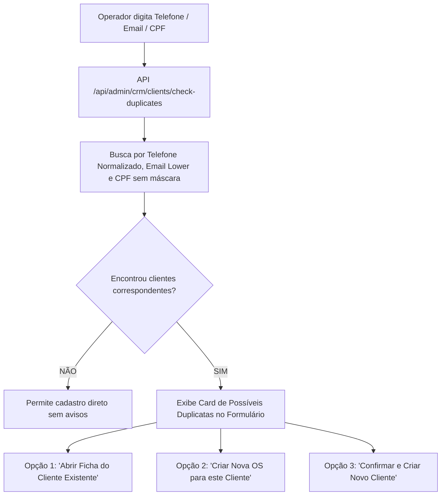

# 03 — ESPECIFICAÇÃO DE CLIENTES E ENDEREÇOS (`clients` / `client_addresses`)

**Status:** APROVADO PARA MODELAGEM (FASE 1.1)  
**Data:** 26 de Agosto de 2026  
**Escopo:** Modelagem detalhada das tabelas `public.clients` e `public.client_addresses`, regras de deduplicação, múltiplos endereços e suporte a PF/PJ/Condomínio.

---

## 1. Tabela `public.clients`

A tabela `public.clients` representa a entidade cliente consolidada no sistema, permitindo tanto cadastro manual quanto conversão atômica de leads.

### 1.1. Dicionário de Dados de `public.clients`

| Campo | Tipo PostgreSQL | NULL? | Default | Constraint / Validação | Índice? | Descrição e Regra de Negócio |
|---|---|---|---|---|---|---|
| `id` | `UUID` | **NÃO** | `gen_random_uuid()` | PRIMARY KEY | PK | Identificador universal único do cliente |
| `lead_id` | `UUID` | SIM | `NULL` | FK `public.leads(id)` ON DELETE SET NULL | **SIM (Partial UNIQUE)** | ID do lead de origem. **Regra:** 1 lead gera no máximo 1 cliente. Manual = NULL |
| `tipo_cliente` | `VARCHAR(20)` | **NÃO** | `'pessoa_fisica'` | CHECK IN (`'pessoa_fisica'`, `'empresa'`, `'condominio'`) | SIM | Segmentação jurídica do cliente |
| `nome` | `VARCHAR(255)` | **NÃO** | - | `length(trim(nome)) >= 2` | SIM (GIN / Trigram) | Nome do cliente / contato principal |
| `nome_fantasia` | `VARCHAR(255)` | SIM | `NULL` | - | - | Nome comercial (para empresas e condomínios) |
| `razao_social` | `VARCHAR(255)` | SIM | `NULL` | - | - | Razão social formal (PJ) |
| `cpf_cnpj` | `VARCHAR(20)` | SIM | `NULL` | Formato numérico 11 ou 14 dígitos | SIM | CPF ou CNPJ. **Opcional no primeiro contato** |
| `telefone_principal` | `VARCHAR(30)` | **NÃO** | - | `length(regexp_replace(telefone_principal, '\D', '', 'g')) >= 10` | SIM (Btree normalizado) | Telefone principal com DDD (armazenado formatado) |
| `telefone_secundario`| `VARCHAR(30)` | SIM | `NULL` | - | - | Segundo telefone / fixo / recado |
| `email` | `VARCHAR(255)` | SIM | `NULL` | Formato de e-mail válido | SIM (Btree lower) | E-mail do cliente (opcional no cadastro rápido) |
| `status` | `VARCHAR(20)` | **NÃO** | `'ativo'` | CHECK IN (`'ativo'`, `'inativo'`, `'bloqueado'`) | SIM | Estado do relacionamento comercial |
| `observacoes` | `TEXT` | SIM | `NULL` | - | - | Notas gerais fixas sobre o perfil do cliente |
| `is_archived` | `BOOLEAN` | **NÃO** | `false` | - | SIM | Flag de arquivamento (Soft Delete) |
| `archived_at` | `TIMESTAMPTZ` | SIM | `NULL` | - | - | Data e hora em que o cliente foi arquivado |
| `created_by` | `UUID` | SIM | `NULL` | FK `auth.users(id)` ON DELETE SET NULL | - | Administrador que realizou o cadastro |
| `created_at` | `TIMESTAMPTZ` | **NÃO** | `now()` | - | SIM | Data e hora de criação |
| `updated_at` | `TIMESTAMPTZ` | **NÃO** | `now()` | Atualizado via trigger | - | Data e hora da última modificação |

### 1.2. Constraints e Índices Especiais em `clients`
- **Partial UNIQUE para Lead de Origem:**
  `CREATE UNIQUE INDEX unq_clients_lead_id ON public.clients(lead_id) WHERE lead_id IS NOT NULL;`
  Garante que nenhum lead possa ser convertido duas vezes em clientes distintos.
- **Índice Normalizado de Telefone para Deduplicação:**
  `CREATE INDEX idx_clients_telefone_normalized ON public.clients((regexp_replace(telefone_principal, '\D', '', 'g')));`
  Permite busca instantânea por dígitos puros (ex: `11999998888`), independente de máscara com parênteses e traços.
- **Índice de E-mail em Minúsculas:**
  `CREATE INDEX idx_clients_email_lower ON public.clients((lower(email))) WHERE email IS NOT NULL;`

---

## 2. Tabela `public.client_addresses`

Representa os imóveis e locais de atendimento vinculados ao cliente (0:N).

### 2.1. Dicionário de Dados de `public.client_addresses`

| Campo | Tipo PostgreSQL | NULL? | Default | Constraint / Validação | Índice? | Descrição e Regra de Negócio |
|---|---|---|---|---|---|---|
| `id` | `UUID` | **NÃO** | `gen_random_uuid()` | PRIMARY KEY | PK | Identificador único do endereço |
| `client_id` | `UUID` | **NÃO** | - | FK `public.clients(id)` ON DELETE CASCADE | SIM | Cliente proprietário do endereço |
| `rotulo` | `VARCHAR(50)` | SIM | `'Principal'` | - | - | Rótulo amigável (ex: `'Casa Santana'`, `'Apto Moema'`, `'Loja Centro'`) |
| `tipo_imovel` | `VARCHAR(30)` | SIM | `'apartamento'` | CHECK IN (`'casa'`, `'apartamento'`, `'comercial'`, `'condominio'`, `'outro'`) | - | Tipologia da construção |
| `cep` | `VARCHAR(10)` | SIM | `NULL` | - | SIM | CEP do local (8 dígitos numéricos) |
| `logradouro` | `VARCHAR(255)` | SIM | `NULL` | - | - | Rua, Avenida, Alameda, etc. |
| `numero` | `VARCHAR(30)` | SIM | `NULL` | - | - | Número do imóvel ou `'S/N'` |
| `complemento` | `VARCHAR(100)` | SIM | `NULL` | - | - | Apto, Bloco, Conjunto, Sala |
| `bairro` | `VARCHAR(100)` | SIM | `NULL` | - | SIM | Bairro |
| `cidade` | `VARCHAR(100)` | **NÃO** | `'São Paulo'` | - | SIM | Cidade de atendimento |
| `uf` | `VARCHAR(2)` | **NÃO** | `'SP'` | `length(uf) = 2` | - | Unidade Federativa |
| `referencia` | `TEXT` | SIM | `NULL` | - | - | Ponto de referência para a equipe |
| `observacoes_acesso` | `TEXT` | SIM | `NULL` | - | - | Instruções de portaria, horários de barulho, autorizações |
| `is_principal` | `BOOLEAN` | **NÃO** | `false` | - | SIM | Marca se é o endereço padrão de faturamento/contato |
| `created_at` | `TIMESTAMPTZ` | **NÃO** | `now()` | - | - | Data de cadastro |
| `updated_at` | `TIMESTAMPTZ` | **NÃO** | `now()` | Atualizado via trigger | - | Data da última alteração |

### 2.2. Regra de Unicidade do Endereço Principal (`is_principal`)
- **Regra:** Um cliente pode ter no máximo **UM** endereço marcado como `is_principal = true`.
- **Constraint de Integridade:**
  `CREATE UNIQUE INDEX unq_client_addresses_principal ON public.client_addresses(client_id) WHERE is_principal = true;`
- **Operação de Troca Segura:** Quando o operador marca um novo endereço como principal, o backend desmarca o endereço principal anterior na mesma transação atômica.

---

## 3. Estratégia de Deduplicação Inteligente (Cadastro Manual & Conversão)

Em vez de bloquear o cadastro com `UNIQUE` rígido no telefone (o que geraria erros ao cadastrar cônjuges ou parentes), o sistema adota **Detecção Proativa**:

- **Valores Mínimos para Cadastro Manual Rápido:**
  - `nome` (Obrigatório)
  - `telefone_principal` (Obrigatório)
  - Endereço pode ser inserido posteriormente ou na mesma tela.
