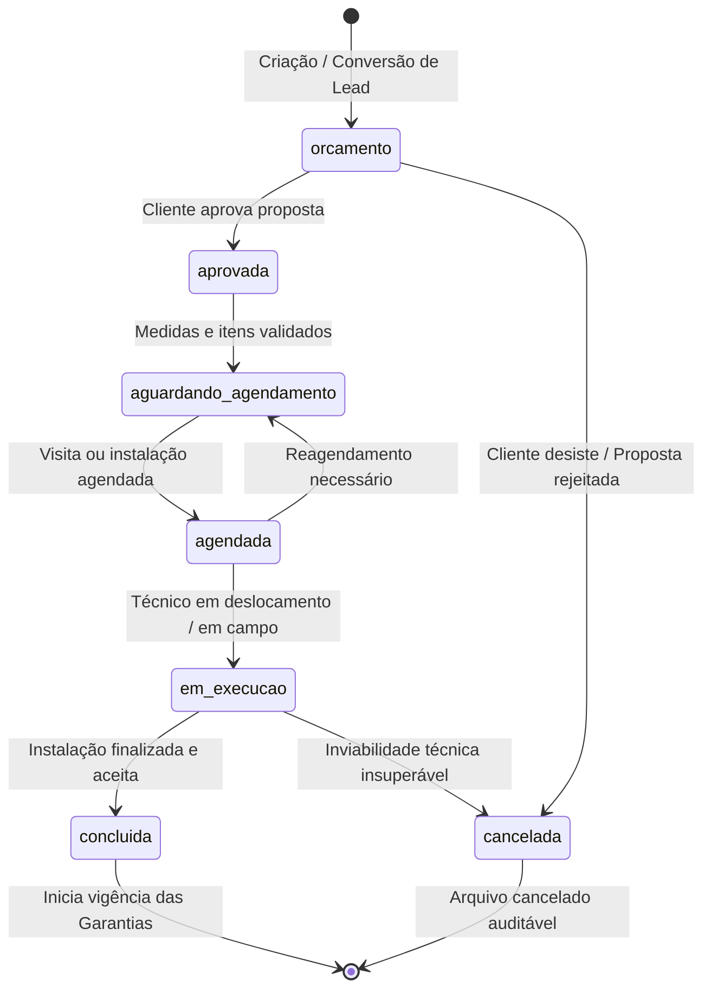

# 04 — ESPECIFICAÇÃO DE ORDENS DE SERVIÇO E ITENS (`work_orders` / `work_order_items`)

**Status:** APROVADO PARA MODELAGEM (FASE 1.1)  
**Data:** 26 de Agosto de 2026  
**Escopo:** Modelagem detalhada das Ordens de Serviço (OS), múltiplos itens de serviço contratados, ciclo de vida operacional, numeração legível e totalizadores financeiros.

---

## 1. Tabela `public.work_orders`

A Ordem de Serviço é a entidade agregadora central de execução, contendo cliente, local, status operacional, valores financeiros globais e prazos.

### 1.1. Dicionário de Dados de `public.work_orders`

| Campo | Tipo PostgreSQL | NULL? | Default | Constraint / Validação | Índice? | Descrição e Regra de Negócio |
|---|---|---|---|---|---|---|
| `id` | `UUID` | **NÃO** | `gen_random_uuid()` | PRIMARY KEY | PK | Identificador único interno |
| `numero_os` | `VARCHAR(30)` | **NÃO** | - | **UNIQUE** | SIM | Código legível humano (ex: `'OS-2026-000123'`) |
| `client_id` | `UUID` | **NÃO** | - | FK `public.clients(id)` ON DELETE RESTRICT | SIM | Cliente titular da Ordem de Serviço |
| `address_id` | `UUID` | SIM | `NULL` | FK `public.client_addresses(id)` ON DELETE SET NULL | SIM | Endereço onde o serviço será executado |
| `responsible_staff_id`| `UUID` | SIM | `NULL` | FK `public.crm_staff(id)` ON DELETE SET NULL | SIM | Técnico/Instalador responsável principal |
| `status_os` | `VARCHAR(30)` | **NÃO** | `'orcamento'` | CHECK IN (`'orcamento'`, `'aprovada'`, `'aguardando_agendamento'`, `'agendada'`, `'em_execucao'`, `'concluida'`, `'cancelada'`) | SIM | Status do ciclo de vida da OS |
| `valor_total` | `NUMERIC(12,2)`| **NÃO** | `0.00` | `valor_total >= 0` | - | Soma dos valores totais dos itens da OS |
| `valor_desconto` | `NUMERIC(12,2)`| **NÃO** | `0.00` | `valor_desconto >= 0` | - | Desconto comercial aplicado |
| `valor_final` | `NUMERIC(12,2)`| **NÃO** | `0.00` | `valor_final = valor_total - valor_desconto` | - | Valor líquido faturado |
| `data_prevista` | `DATE` | SIM | `NULL` | - | SIM | Data prevista para instalação/execução |
| `data_conclusao` | `DATE` | SIM | `NULL` | - | SIM | Data real em que a instalação foi concluída |
| `observacoes_gerais` | `TEXT` | SIM | `NULL` | - | - | Instruções gerais para a equipe de instalação |
| `is_archived` | `BOOLEAN` | **NÃO** | `false` | - | SIM | Flag de arquivamento (Soft Delete) |
| `archived_at` | `TIMESTAMPTZ` | SIM | `NULL` | - | - | Data de arquivamento |
| `created_by` | `UUID` | SIM | `NULL` | FK `auth.users(id)` ON DELETE SET NULL | - | Administrador criador da OS |
| `created_at` | `TIMESTAMPTZ` | **NÃO** | `now()` | - | SIM | Data e hora de abertura |
| `updated_at` | `TIMESTAMPTZ` | **NÃO** | `now()` | Atualizado via trigger | - | Data e hora da última modificação |

---

## 2. Ciclo de Vida e Transições de Status da OS (`status_os`)



### 2.1. Regras de Transição de Status
1. **Bloqueio de Edição em OS Concluída:** Quando a OS atinge `status_os = 'concluida'`, os itens, vãos e medidas ficam em modo somente-leitura para garantir a integridade dos termos de garantia.
2. **Gatilho de Garantia:** A conclusão da OS (`concluida`) define a `data_conclusao` e dispara a ativação automática dos registros de garantia em `public.warranties`.

---

## 3. Geração Segura do Número da OS (`numero_os`)

Para garantir um código amigável sem risco de colisão sob acessos concorrentes:
- **Padrão:** `OS-YYYY-XXXXXX` (ex: `OS-2026-000001`, `OS-2026-000002`).
- **Mecanismo:** PostgreSQL Sequence anual ou contador transacional atômico:
  ```sql
  -- Exemplo de sequência conceitual
  CREATE SEQUENCE IF NOT EXISTS public.seq_work_orders_2026 START WITH 1;
  ```
- **Formatação no Backend:** `numero_os = 'OS-' + year + '-' + String(nextVal).padStart(6, '0')`.

---

## 4. Tabela `public.work_order_items`

Um item representa cada linha contratada na Ordem de Serviço (1:N).

### 4.1. Dicionário de Dados de `public.work_order_items`

| Campo | Tipo PostgreSQL | NULL? | Default | Constraint / Validação | Índice? | Descrição e Regra de Negócio |
|---|---|---|---|---|---|---|
| `id` | `UUID` | **NÃO** | `gen_random_uuid()` | PRIMARY KEY | PK | Identificador único do item |
| `work_order_id` | `UUID` | **NÃO** | - | FK `public.work_orders(id)` ON DELETE CASCADE | SIM | Ordem de Serviço à qual o item pertence |
| `service_key` | `VARCHAR(64)` | SIM | `NULL` | Referência opcional ao catálogo público | - | Chave de marketing (ex: `'telas_janelas'`, `'redes_sacadas'`) |
| `categoria_operacional`| `VARCHAR(50)`| **NÃO** | `'tela_mosquiteira'` | CHECK IN (`'tela_mosquiteira'`, `'rede_protecao'`, `'vidracaria'`, `'manutencao'`, `'outro'`) | SIM | Classificação operacional do serviço |
| `descricao` | `VARCHAR(255)` | **NÃO** | - | `length(trim(descricao)) >= 3` | - | Nome descritivo (ex: `'Tela Mosquiteira em Alumínio Branco'`) |
| `quantidade` | `INT` | **NÃO** | `1` | `quantidade > 0` | - | Quantidade de unidades/vãos |
| `preco_unitario` | `NUMERIC(10,2)`| **NÃO** | `0.00` | `preco_unitario >= 0` | - | Valor unitário acordado |
| `preco_total` | `NUMERIC(12,2)`| **NÃO** | `0.00` | `preco_total = quantidade * preco_unitario` | - | Valor total da linha de serviço |
| `observacoes` | `TEXT` | SIM | `NULL` | - | - | Instruções específicas para confecção/instalação |
| `sort_order` | `INT` | **NÃO** | `0` | `sort_order >= 0` | - | Ordem de exibição visual na proposta e ficha |
| `created_at` | `TIMESTAMPTZ` | **NÃO** | `now()` | - | - | Data de inclusão do item |
| `updated_at` | `TIMESTAMPTZ` | **NÃO** | `now()` | Atualizado via trigger | - | Data da última alteração |

### 4.2. Totalização e Integridade
- A soma dos `preco_total` de todos os itens de uma OS atualiza atomicamente o campo `valor_total` de `public.work_orders`.
- Se um item for excluído antes da aprovação da OS, a deleção em cascata (`CASCADE`) remove automaticamente as medições associadas em `public.work_order_measurements`.
