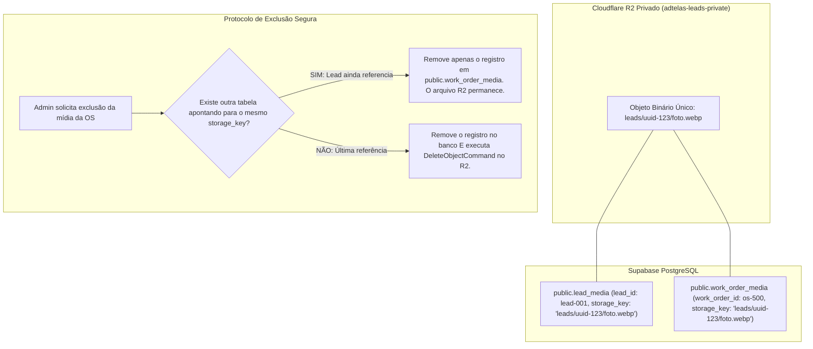

# 05 — ESPECIFICAÇÃO DE MEDIÇÕES E MÍDIAS PRIVADAS (`work_order_measurements` / `work_order_media`)

**Status:** APROVADO PARA MODELAGEM (FASE 1.1)  
**Data:** 26 de Agosto de 2026  
**Escopo:** Modelagem das medições técnicas de vãos (em milímetros canônicos) e gestão de fotos e vídeos privados de execução no Cloudflare R2 com contagem lógica de referências.

---

## 1. Tabela `public.work_order_measurements`

Registra os vãos físicos (janelas, portas, sacadas, mezaninos) medidos pela equipe técnica para confecção e instalação.

### 1.1. Dicionário de Dados de `public.work_order_measurements`

| Campo | Tipo PostgreSQL | NULL? | Default | Constraint / Validação | Índice? | Descrição e Regra de Negócio |
|---|---|---|---|---|---|---|
| `id` | `UUID` | **NÃO** | `gen_random_uuid()` | PRIMARY KEY | PK | Identificador único do vão medido |
| `work_order_item_id` | `UUID` | **NÃO** | - | FK `public.work_order_items(id)` ON DELETE CASCADE | SIM | Item de serviço ao qual a medição pertence |
| `ambiente` | `VARCHAR(100)` | **NÃO** | - | `length(trim(ambiente)) >= 2` | - | Cômodo da instalação (ex: `'Quarto Casal'`, `'Sacada'`, `'Cozinha'`) |
| `tipo_vao` | `VARCHAR(50)` | **NÃO** | `'janela'` | CHECK IN (`'janela'`, `'porta'`, `'sacada'`, `'maxim_ar'`, `'basculante'`, `'mezanino'`, `'outro'`) | - | Tipologia física da abertura |
| `largura_mm` | `INT` | **NÃO** | - | `largura_mm > 0` | - | **Largura canônica estrita em milímetros** (ex: 1200) |
| `altura_mm` | `INT` | **NÃO** | - | `altura_mm > 0` | - | **Altura canônica estrita em milímetros** (ex: 1100) |
| `quantidade` | `INT` | **NÃO** | `1` | `quantidade > 0` | - | Quantidade de vãos idênticos neste ambiente |
| `cor_estrutura` | `VARCHAR(50)` | SIM | `'Branco'` | - | - | Cor do perfil de alumínio (`'Branco'`, `'Preto'`, `'Bronze'`, `'Natural'`) |
| `tipo_material` | `VARCHAR(100)` | SIM | `NULL` | - | - | Tecido/Rede (`'Malha 5x5 Polietileno'`, `'Pet Screen'`, `'Fibra de Vidro'`) |
| `observacoes` | `TEXT` | SIM | `NULL` | - | - | Notas de corte, trilhos, cantoneiras ou dificuldades de fixação |
| `sort_order` | `INT` | **NÃO** | `0` | `sort_order >= 0` | - | Ordem de exibição na lista de corte |
| `created_at` | `TIMESTAMPTZ` | **NÃO** | `now()` | - | - | Data de cadastro |
| `updated_at` | `TIMESTAMPTZ` | **NÃO** | `now()` | Atualizado via trigger | - | Data da última alteração |

### 1.2. Fórmula Canônica de Cálculo de Área ($m^2$)
$$\text{Área Unitária } (m^2) = \frac{\text{largura\_mm} \times \text{altura\_mm}}{1.000.000}$$
$$\text{Área Total do Vão } (m^2) = \text{Área Unitária } \times \text{quantidade}$$

---

## 2. Tabela `public.work_order_media`

Armazena os metadados de fotos e vídeos técnicos capturados pela equipe em campo (vãos antes da instalação, detalhes de fixação, laudos e resultado concluído).

### 2.1. Dicionário de Dados de `public.work_order_media`

| Campo | Tipo PostgreSQL | NULL? | Default | Constraint / Validação | Índice? | Descrição e Regra de Negócio |
|---|---|---|---|---|---|---|
| `id` | `UUID` | **NÃO** | `gen_random_uuid()` | PRIMARY KEY | PK | Identificador único da mídia da OS |
| `work_order_id` | `UUID` | **NÃO** | - | FK `public.work_orders(id)` ON DELETE CASCADE | SIM | Ordem de Serviço associada |
| `work_order_item_id` | `UUID` | SIM | `NULL` | FK `public.work_order_items(id)` ON DELETE SET NULL | SIM | Item específico da OS (opcional) |
| `storage_key` | `TEXT` | **NÃO** | - | Caminho físico no bucket R2 privado (`adtelas-leads-private`) | SIM | Identificador do objeto binário no Cloudflare R2 |
| `safe_filename` | `TEXT` | **NÃO** | - | - | - | Nome amigável sanitizado para download |
| `media_type` | `VARCHAR(20)` | **NÃO** | - | CHECK IN (`'photo'`, `'video'`) | - | Tipo da mídia |
| `mime_type` | `VARCHAR(100)` | **NÃO** | - | CHECK MIME suportados | - | MIME Type validado por Magic Bytes |
| `file_size_bytes` | `BIGINT` | **NÃO** | - | `file_size_bytes > 0` | - | Tamanho físico em bytes |
| `etapa` | `VARCHAR(20)` | **NÃO** | `'antes'` | CHECK IN (`'antes'`, `'durante'`, `'depois'`, `'laudo'`) | SIM | Fase de registro da instalação |
| `descricao` | `TEXT` | SIM | `NULL` | - | - | Comentário técnico sobre a foto/vídeo |
| `created_by` | `UUID` | SIM | `NULL` | FK `auth.users(id)` ON DELETE SET NULL | - | Operador que realizou o upload |
| `created_at` | `TIMESTAMPTZ` | **NÃO** | `now()` | - | SIM | Data e hora do envio |

---

## 3. Protocolo de Compartilhamento Lógico e Exclusão Segura no R2

Para reaproveitar as fotos enviadas no Lead original sem duplicar bytes no Cloudflare R2, o sistema adota **Contagem Lógica de Referências (Logical Reference Counting)**:

### 3.1. Regras de Visualização e Segurança
- Mídias de `work_order_media` são acessadas exclusivamente através de **Signed URLs temporárias com TTL de 300 segundos** geradas pelo endpoint seguro `/api/admin/crm/media/signed-url`.
- Nenhuma URL de foto técnica privada é pública ou indexável por motores de busca.
