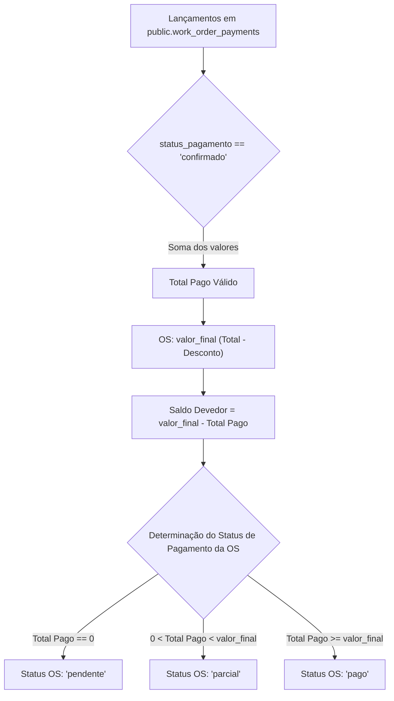

# 06 — ESPECIFICAÇÃO DO MÓDULO FINANCEIRO E PAGAMENTOS (`work_order_payments`)

**Status:** APROVADO PARA MODELAGEM (FASE 1.1)  
**Data:** 26 de Agosto de 2026  
**Escopo:** Modelagem dos lançamentos financeiros, múltiplos pagamentos por Ordem de Serviço, cálculo de saldo devedor e política de cancelamento/estorno auditável.

---

## 1. Tabela `public.work_order_payments`

Registra cada recebimento financeiro real vinculado a uma Ordem de Serviço (1:N), permitindo entradas de sinal, parcelamentos e quitações pós-instalação.

### 1.1. Dicionário de Dados de `public.work_order_payments`

| Campo | Tipo PostgreSQL | NULL? | Default | Constraint / Validação | Índice? | Descrição e Regra de Negócio |
|---|---|---|---|---|---|---|
| `id` | `UUID` | **NÃO** | `gen_random_uuid()` | PRIMARY KEY | PK | Identificador único do lançamento |
| `work_order_id` | `UUID` | **NÃO** | - | FK `public.work_orders(id)` ON DELETE RESTRICT | SIM | Ordem de Serviço à qual o pagamento se refere |
| `valor` | `NUMERIC(12,2)`| **NÃO** | - | `valor > 0` | - | Valor monetário recebido em Reais (R$) |
| `metodo_pagamento` | `VARCHAR(30)` | **NÃO** | `'pix'` | CHECK IN (`'pix'`, `'cartao_credito'`, `'cartao_debito'`, `'dinheiro'`, `'boleto'`, `'transferencia'`) | SIM | Meio de pagamento utilizado pelo cliente |
| `data_pagamento` | `TIMESTAMPTZ` | **NÃO** | `now()` | - | SIM | Data e hora em que o valor foi pago/recebido |
| `status_pagamento` | `VARCHAR(20)` | **NÃO** | `'confirmado'` | CHECK IN (`'confirmado'`, `'cancelado'`) | SIM | Estado da transação no sistema |
| `nota_comprovante` | `TEXT` | SIM | `NULL` | - | - | Código da transação Pix, comprovante ou observação |
| `cancelled_at` | `TIMESTAMPTZ` | SIM | `NULL` | - | - | Data em que o lançamento foi cancelado/estornado |
| `cancelled_by` | `UUID` | SIM | `NULL` | FK `auth.users(id)` ON DELETE SET NULL | - | Administrador responsável pelo cancelamento |
| `motivo_cancelamento`| `TEXT` | SIM | `NULL` | Obrigatório se `status_pagamento = 'cancelado'` | - | Justificativa do estorno / correção de lançamento |
| `created_by` | `UUID` | SIM | `NULL` | FK `auth.users(id)` ON DELETE SET NULL | - | Administrador que registrou o pagamento |
| `created_at` | `TIMESTAMPTZ` | **NÃO** | `now()` | - | SIM | Data e hora de inclusão do registro |

---

## 2. Lógica de Totalização e Cálculo do Saldo Devedor

O sistema não armazena `valor_pago` como campo editável manual, evitando discrepâncias entre o que foi digitado e os pagamentos lançados:

### 2.1. Fórmulas de Resumo Financeiro
$$\text{Total Pago Válido} = \sum \left( \text{valor} \mid \text{status\_pagamento} = \text{'confirmado'} \right)$$
$$\text{Saldo Devedor} = \max(0, \text{valor\_final} - \text{Total Pago Válido})$$

---

## 3. Política de Correção e Cancelamento sem Exclusão Física

Para garantir conformidade contábil e auditoria financeira interna:
1. **Lançamentos Confirmados NÃO são Deletados Fisicamente:**
   - Se o operador cometer um erro de digitação de valor ou método, o pagamento incorreto é marcado como `status_pagamento = 'cancelado'`, preenchendo obrigatoriamente `motivo_cancelamento` e `cancelled_by`.
   - Um novo pagamento com o valor correto é registrado na sequência.
2. **Pagamentos Acima do Valor:**
   - O sistema permite recebimentos com valor superior ao `valor_final` (ex: gorjeta, taxa adicional ou arredondamento), registrando o status da OS como `'pago'` e alertando o operador visualmente.
