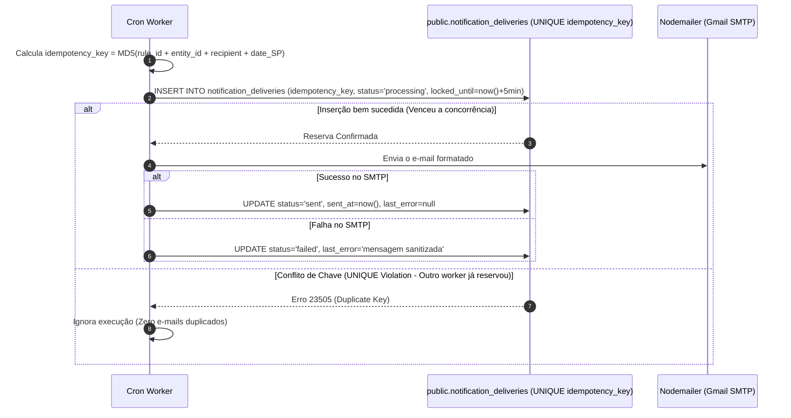

# 09 — ESPECIFICAÇÃO DE REGRAS DE NOTIFICAÇÃO E AGENDADOR (`notification_rules` / `notification_deliveries`)

**Status:** APROVADO PARA MODELAGEM (FASE 1.1)  
**Data:** 26 de Agosto de 2026  
**Escopo:** Modelagem das regras configuráveis de notificação por e-mail, infraestrutura de cron com fuso `America/Sao_Paulo` e protocolo de reserva concorrente à prova de disparos duplicados.

---

## 1. Tabela `public.notification_rules`

Armazena as políticas e regras ativas de automação de e-mails do sistema (resumos de agenda, lembretes de visitas, avisos de garantia e pós-venda).

### 1.1. Dicionário de Dados de `public.notification_rules`

| Campo | Tipo PostgreSQL | NULL? | Default | Constraint / Validação | Índice? | Descrição e Regra de Negócio |
|---|---|---|---|---|---|---|
| `id` | `UUID` | **NÃO** | `gen_random_uuid()` | PRIMARY KEY | PK | Identificador único da regra |
| `nome_regra` | `VARCHAR(100)` | **NÃO** | - | `length(trim(nome_regra)) >= 3` | - | Nome amigável de exibição (ex: `'Resumo Diário da Agenda'`) |
| `tipo_regra` | `VARCHAR(40)` | **NÃO** | - | CHECK IN (`'agenda_diaria'`, `'agenda_semanal'`, `'agenda_personalizada'`, `'lembrete_visita'`, `'garantia_a_vencer'`, `'garantia_vencimento'`, `'pos_venda'`) | SIM | Gatilho funcional da regra |
| `is_active` | `BOOLEAN` | **NÃO** | `true` | - | SIM | Toggle de ativação/desativação da regra |
| `horario_disparo` | `TIME` | **NÃO** | `'09:00:00'` | - | - | Horário alvo no fuso local (`America/Sao_Paulo`) |
| `dias_semana` | `VARCHAR(20)` | SIM | `'1,2,3,4,5,6'` | String com dias permitidos (1=Seg, 7=Dom) | - | Dias em que a regra roda (ex: `'1,4'` para Seg e Qui) |
| `offset_dias` | `INT` | **NÃO** | `0` | - | - | Deslocamento em dias (ex: `-1` para 1 dia antes, `30` para 30 dias antes) |
| `destinatario_tipo` | `VARCHAR(20)` | **NÃO** | `'interno'` | CHECK IN (`'interno'`, `'cliente'`, `'ambos'`) | - | Público alvo do disparo |
| `timezone` | `VARCHAR(50)` | **NÃO** | `'America/Sao_Paulo'` | - | - | Identificador IANA de fuso horário |
| `configuracoes_extras`| `JSONB` | SIM | `'{}'::jsonb` | - | - | E-mails adicionais em cópia ou parâmetros específicos |
| `created_at` | `TIMESTAMPTZ` | **NÃO** | `now()` | - | - | Data de criação |
| `updated_at` | `TIMESTAMPTZ` | **NÃO** | `now()` | Atualizado via trigger | - | Data da última modificação |

---

## 2. Tabela `public.notification_deliveries`

Tabela de auditoria atômica e controle de concorrência. Cada linha representa uma intenção de envio com garantia de unicidade estrita no banco.

### 2.1. Dicionário de Dados de `public.notification_deliveries`

| Campo | Tipo PostgreSQL | NULL? | Default | Constraint / Validação | Índice? | Descrição e Regra de Negócio |
|---|---|---|---|---|---|---|
| `id` | `UUID` | **NÃO** | `gen_random_uuid()` | PRIMARY KEY | PK | Identificador único da entrega |
| `idempotency_key` | `VARCHAR(128)` | **NÃO** | - | **UNIQUE** | SIM | Hash determinístico único do disparo |
| `rule_id` | `UUID` | **NÃO** | - | FK `public.notification_rules(id)` ON DELETE RESTRICT | SIM | Regra que originou o disparo |
| `entity_type` | `VARCHAR(30)` | **NÃO** | `'digest'` | CHECK IN (`'digest'`, `'appointment'`, `'warranty'`, `'work_order'`) | - | Tipo da entidade alvo |
| `entity_id` | `UUID` | SIM | `NULL` | - | SIM | ID da entidade (OS, agendamento ou garantia) |
| `recipient_email` | `VARCHAR(255)` | **NÃO** | - | - | SIM | Destinatário da mensagem |
| `status` | `VARCHAR(20)` | **NÃO** | `'processing'` | CHECK IN (`'processing'`, `'sent'`, `'failed'`, `'skipped'`) | SIM | Estado da entrega |
| `locked_until` | `TIMESTAMPTZ` | **NÃO** | `now() + interval '5 minutes'` | - | SIM | Trava temporária contra crash de worker |
| `attempts` | `INT` | **NÃO** | `1` | `attempts >= 1` | - | Número de tentativas executadas |
| `last_attempt_at` | `TIMESTAMPTZ` | **NÃO** | `now()` | - | - | Timestamp da tentativa mais recente |
| `sent_at` | `TIMESTAMPTZ` | SIM | `NULL` | - | SIM | Timestamp de confirmação de entrega SMTP |
| `last_error` | `TEXT` | SIM | `NULL` | - | - | Mensagem de erro sanitizada (sem senhas/tokens) |
| `created_at` | `TIMESTAMPTZ` | **NÃO** | `now()` | - | - | Timestamp de reserva inicial |

---

## 3. Protocolo de Reserva Concorrente (Reservation-Before-Send)

Para eliminar qualquer risco de envio duplicado por execuções de cron paralelas ou retries:

### 3.1. Recuperação de Travas Mortas (Stale Lock Recovery)
Se um processo do servidor sofrer crash no meio do envio (ficando travado em `processing`), uma nova execução após o vencimento de `locked_until` pode assumir a reserva e reexecutar a tentativa com `attempts = attempts + 1`.
