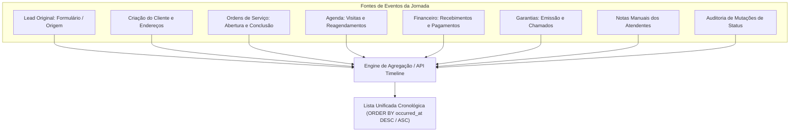

# 10 — ESPECIFICAÇÃO DE TIMELINE, AUDITORIA E NOTAS (`crm_activity_log` / `crm_notes`)

**Status:** APROVADO PARA MODELAGEM (FASE 1.1)  
**Data:** 26 de Agosto de 2026  
**Escopo:** Modelagem da trilha de auditoria corporativa imutável (`crm_activity_log`), anotações humanas categorizadas (`crm_notes`) e algoritmo de agregação da Timeline 360° do cliente.

---

## 1. Tabela `public.crm_activity_log`

Trilha de auditoria cronológica e imutável que registra automaticamente todas as mutações e eventos críticos ocorridos nas entidades do CRM.

### 1.1. Dicionário de Dados de `public.crm_activity_log`

| Campo | Tipo PostgreSQL | NULL? | Default | Constraint / Validação | Índice? | Descrição e Regra de Negócio |
|---|---|---|---|---|---|---|
| `id` | `UUID` | **NÃO** | `gen_random_uuid()` | PRIMARY KEY | PK | Identificador único do evento de log |
| `client_id` | `UUID` | SIM | `NULL` | FK `public.clients(id)` ON DELETE CASCADE | SIM | Cliente impactado (facilita consultas da timeline) |
| `work_order_id` | `UUID` | SIM | `NULL` | FK `public.work_orders(id)` ON DELETE SET NULL | SIM | Ordem de Serviço relacionada (quando aplicável) |
| `entity_type` | `VARCHAR(40)` | **NÃO** | - | CHECK IN (`'client'`, `'work_order'`, `'appointment'`, `'payment'`, `'warranty'`, `'media'`, `'address'`) | SIM | Nome da tabela/entidade alvo |
| `entity_id` | `UUID` | **NÃO** | - | - | SIM | ID do registro afetado |
| `acao` | `VARCHAR(50)` | **NÃO** | - | CHECK IN (`'created'`, `'status_changed'`, `'rescheduled'`, `'payment_received'`, `'payment_cancelled'`, `'warranty_issued'`, `'media_uploaded'`, `'archived'`, `'note_added'`) | SIM | Ação executada |
| `dados_anteriores` | `JSONB` | SIM | `NULL` | - | - | Snapshot dos dados antes da alteração (Diff) |
| `dados_novos` | `JSONB` | SIM | `NULL` | - | - | Snapshot dos dados após a alteração |
| `descricao_humana` | `TEXT` | **NÃO** | - | - | - | Frase amigável (ex: `'Status da OS alterado de Orçamento para Aprovada por Samuel'`) |
| `actor_id` | `UUID` | SIM | `NULL` | FK `auth.users(id)` ON DELETE SET NULL | SIM | Usuário administrador que executou a ação |
| `occurred_at` | `TIMESTAMPTZ` | **NÃO** | `now()` | - | SIM (DESC) | Timestamp exato da ocorrência |

---

## 2. Tabela `public.crm_notes`

Permite aos atendentes e operadores registrar anotações humanas de conversas telefônicas, acordos verbais, preferências e histórico de relacionamento.

### 2.1. Dicionário de Dados de `public.crm_notes`

| Campo | Tipo PostgreSQL | NULL? | Default | Constraint / Validação | Índice? | Descrição e Regra de Negócio |
|---|---|---|---|---|---|---|
| `id` | `UUID` | **NÃO** | `gen_random_uuid()` | PRIMARY KEY | PK | Identificador único da anotação |
| `client_id` | `UUID` | **NÃO** | - | FK `public.clients(id)` ON DELETE CASCADE | SIM | Cliente ao qual a nota pertence |
| `work_order_id` | `UUID` | SIM | `NULL` | FK `public.work_orders(id)` ON DELETE SET NULL | SIM | OS específica associada à anotação (opcional) |
| `conteudo` | `TEXT` | **NÃO** | - | `length(trim(conteudo)) >= 2` | - | Texto da nota humana digitada |
| `categoria` | `VARCHAR(30)` | **NÃO** | `'geral'` | CHECK IN (`'geral'`, `'atendimento'`, `'financeiro'`, `'tecnico'`, `'cobranca'`) | SIM | Classificação do teor da anotação |
| `author_id` | `UUID` | SIM | `NULL` | FK `auth.users(id)` ON DELETE SET NULL | - | Administrador autor da anotação |
| `created_at` | `TIMESTAMPTZ` | **NÃO** | `now()` | - | SIM (DESC) | Data e hora de criação |
| `updated_at` | `TIMESTAMPTZ` | **NÃO** | `now()` | Atualizado via trigger | - | Data da última edição |

---

## 3. Algoritmo de Compilação da Timeline 360° do Cliente

A visualização unificada da ficha do cliente (`GET /api/admin/crm/clients/:id/timeline`) agrega e ordena cronologicamente os eventos de múltiplas fontes:



### 3.1. Estrutura do Item de Timeline Retornado
```json
{
  "id": "uuid",
  "type": "work_order_completed | payment_received | appointment_scheduled | human_note",
  "title": "Instalação Concluída — OS-2026-0001",
  "description": "3 Telas Mosquiteiras instaladas com sucesso por Carlos",
  "category": "tecnico",
  "author": "Samuel (Admin)",
  "occurred_at": "2026-08-26T14:30:00.000Z",
  "metadata": {
    "work_order_id": "uuid-123",
    "amount": 1500.00
  }
}
```
