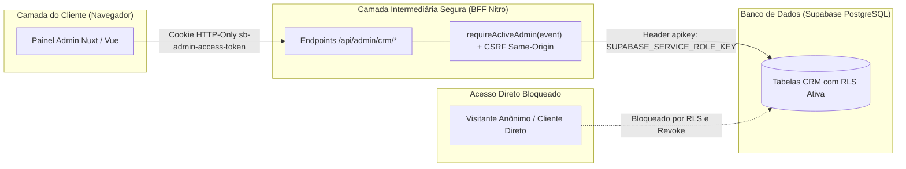

# 11 — SEGURANÇA, ROW LEVEL SECURITY (RLS) E PROTEÇÃO DE DADOS (LGPD)

**Status:** APROVADO PARA MODELAGEM (FASE 1.1)  
**Data:** 26 de Agosto de 2026  
**Escopo:** Matriz de segurança de Row Level Security (RLS) para todas as tabelas do CRM, regras de isolamento de papéis, permissões de banco e diretrizes de privacidade LGPD.

---

## 1. Padrão Arquitetural de Segurança: Acesso Server-Only

O ecossistema CRM adota o padrão **Server-Only Intermediated Access**:



---

## 2. Matriz Completa de RLS e Privilégios por Tabela

Todas as 13 tabelas do novo módulo CRM serão criadas com **RLS ativada** e privilégios públicos totalmente revogados:

| Tabela do CRM | RLS Ativa? | Role `anon` | Role `authenticated` (Direto) | Role `service_role` (Nitro) | Acesso Direto pelo Navegador |
|---|---|---|---|---|---|
| `public.clients` | **SIM** | **NENHUM (Revogado)** | **NENHUM (Revogado)** | **ALL (Total)** | **BLOQUEADO** |
| `public.client_addresses` | **SIM** | **NENHUM (Revogado)** | **NENHUM (Revogado)** | **ALL (Total)** | **BLOQUEADO** |
| `public.crm_staff` | **SIM** | **NENHUM (Revogado)** | **NENHUM (Revogado)** | **ALL (Total)** | **BLOQUEADO** |
| `public.work_orders` | **SIM** | **NENHUM (Revogado)** | **NENHUM (Revogado)** | **ALL (Total)** | **BLOQUEADO** |
| `public.work_order_items` | **SIM** | **NENHUM (Revogado)** | **NENHUM (Revogado)** | **ALL (Total)** | **BLOQUEADO** |
| `public.work_order_measurements`| **SIM** | **NENHUM (Revogado)** | **NENHUM (Revogado)** | **ALL (Total)** | **BLOQUEADO** |
| `public.work_order_media` | **SIM** | **NENHUM (Revogado)** | **NENHUM (Revogado)** | **ALL (Total)** | **BLOQUEADO** |
| `public.work_order_payments`| **SIM** | **NENHUM (Revogado)** | **NENHUM (Revogado)** | **ALL (Total)** | **BLOQUEADO** |
| `public.appointments` | **SIM** | **NENHUM (Revogado)** | **NENHUM (Revogado)** | **ALL (Total)** | **BLOQUEADO** |
| `public.warranties` | **SIM** | **NENHUM (Revogado)** | **NENHUM (Revogado)** | **ALL (Total)** | **BLOQUEADO** |
| `public.notification_rules` | **SIM** | **NENHUM (Revogado)** | **NENHUM (Revogado)** | **ALL (Total)** | **BLOQUEADO** |
| `public.notification_deliveries`| **SIM**| **NENHUM (Revogado)** | **NENHUM (Revogado)** | **ALL (Total)** | **BLOQUEADO** |
| `public.crm_activity_log` | **SIM** | **NENHUM (Revogado)** | **NENHUM (Revogado)** | **ALL (Total)** | **BLOQUEADO** |
| `public.crm_notes` | **SIM** | **NENHUM (Revogado)** | **NENHUM (Revogado)** | **ALL (Total)** | **BLOQUEADO** |

### 2.1. Padrão DDL de Revogação em Cada Tabela
```sql
-- Exemplo de especificação de segurança para cada nova tabela
ALTER TABLE public.nome_tabela ENABLE ROW LEVEL SECURITY;
REVOKE ALL ON public.nome_tabela FROM anon;
REVOKE ALL ON public.nome_tabela FROM authenticated;
GRANT ALL ON public.nome_tabela TO service_role;
```

---

## 3. Diretrizes de Proteção de Dados Pessoais (LGPD / Privacidade)

O novo CRM armazenará dados pessoais de clientes (Nome, CPF/CNPJ, Telefones, E-mails, Endereços residenciais, Fotos de ambientes internos). As seguintes regras de conformidade são mandatórias:

1. **Isolamento de Analytics e Tags de Marketing:**
   - Nenhum dado pessoal identificado (PII) pode ser transmitido para ferramentas de analytics ou mensuração (Google Analytics 4, Google Tag Manager, Google Ads, PostHog).
   - O layout administrativo (`admin.vue`) e as rotas `/admin/*` não disparam tags de remarketing ou pixels de conversão comercial.
2. **Proibição de PII em URLs e Logs:**
   - Parâmetros `GET query` nunca devem conter CPF, telefones ou e-mails em texto claro.
   - Mensagens de log de erro de servidor devem ser sanitizadas através de funções puras (ex: `sanitizeEmailError`), mascarando senhas, tokens e credenciais.
3. **Privacidade de Fotos Residenciais e Vãos:**
   - Fotos técnicas de clientes (sacadas, janelas de quartos, plantas de casas) são armazenadas no bucket **privado** `adtelas-leads-private`.
   - O acesso visual no painel admin ocorre unicamente por **Signed URLs temporárias com TTL estrito de 300 segundos** geradas pelo backend após validação de sessão ativa.
   - Nenhuma foto de OS é tornada pública sem ação humana explícita e cópia independente para o bucket público do site.
