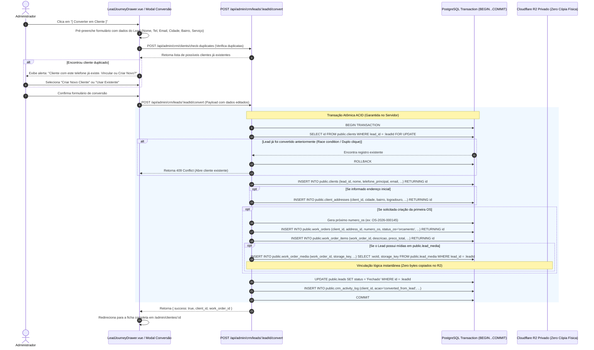

# 14 — FLUXO TRANSACIONAL ATÔMICO: LEAD → CLIENTE → ORDEM DE SERVIÇO

**Status:** APROVADO PARA MODELAGEM (FASE 1.1)  
**Data:** 26 de Agosto de 2026  
**Escopo:** Especificação passo a passo do fluxo atômico e transacional de conversão de Leads em Clientes e Ordens de Serviço, com garantias de idempotência e tolerância a falhas.

---

## 1. Diagrama Sequencial da Transação Atômica

---

## 2. Garantias e Regras de Negócio na Conversão

### 2.1. Idempotência e Bloqueio de Concorrência
- A constraint `unq_clients_lead_id` (`WHERE lead_id IS NOT NULL`) impede em nível de banco que dois cliques rápidos gerem dois clientes a partir do mesmo lead.
- Caso ocorra colisão, a transação aborta via `ROLLBACK` e o backend retorna o cliente já existente.

### 2.2. Preservação Total dos Dados de Marketing
- Os campos de atribuição de marketing (`utm_source`, `utm_campaign`, `gclid`, `first_touch_channel`) **permanecem intactos na tabela `public.leads`**, servindo para relatórios analíticos de ROI comercial.
- A tabela `public.clients` não duplica desnecessariamente os 20+ campos de marketing, mantendo o esquema limpo e normalizado.

### 2.3. Vinculação Lógica de Mídias Privadas
- Fotos e vídeos enviados pelo visitante no formulário de lead são vinculados à primeira Ordem de Serviço inserindo linhas em `public.work_order_media` que apontam para o mesmo `storage_key` no Cloudflare R2.
- Isso economiza tráfego de rede, tempo de processamento (< 50ms) e custo de armazenamento no R2.
