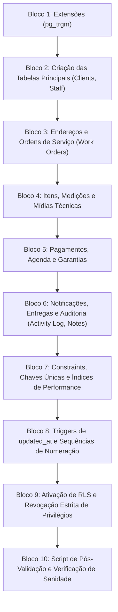

# 15 — BLUEPRINT E ESTRUTURAÇÃO DA FUTURA MIGRATION 010

**Status:** APROVADO PARA MODELAGEM (FASE 1.1)  
**Data:** 26 de Agosto de 2026  
**Escopo:** Planejamento estrutural em blocos lógicos ordenados para a futura migração `010_crm_core_tables.sql` no Supabase PostgreSQL.

> [!NOTE]
> **AVISO DE SEGURANÇA:** Este documento descreve o **roteiro de execução e ordenação de dependências** da futura migration. Nenhum código SQL final executável está contido neste arquivo nesta fase.

---

## 1. Grafo de Dependências dos Blocos de Migração

---

## 2. Detalhamento dos 10 Blocos da Futura Migration 010

### Bloco 01 — Habilitação de Extensões Auxiliares
- Verificação e ativação idempotente da extensão `pg_trgm` (para busca textual aproximada e autocomplete no nome de clientes):
  `CREATE EXTENSION IF NOT EXISTS "pg_trgm";`

### Bloco 02 — Tabelas Mestres Independentes
- Criação de `public.crm_staff` (tabela de colaboradores técnicos).
- Criação de `public.clients` (com coluna `lead_id` referenciando `public.leads(id)`).

### Bloco 03 — Endereços e Agregador de Ordens de Serviço
- Criação de `public.client_addresses` (vinculada a `clients.id` com `ON DELETE CASCADE`).
- Criação de `public.work_orders` (vinculada a `clients.id`, `address_id` e `responsible_staff_id`).

### Bloco 04 — Itens de Serviço, Medições de Vãos e Mídias
- Criação de `public.work_order_items` (vinculada a `work_orders.id` com `ON DELETE CASCADE`).
- Criação de `public.work_order_measurements` (vinculada a `work_order_items.id` com `ON DELETE CASCADE`).
- Criação de `public.work_order_media` (vinculada a `work_orders.id`).

### Bloco 05 — Lançamentos Financeiros, Agenda e Garantias
- Criação de `public.work_order_payments` (vinculada a `work_orders.id` com `ON DELETE RESTRICT`).
- Criação de `public.appointments` (vinculada a `work_orders.id` e `clients.id`).
- Criação de `public.warranties` (vinculada a `work_orders.id`, `items.id` e `clients.id`).

### Bloco 06 — Automação de Notificações e Auditoria
- Criação de `public.notification_rules` (regras configuráveis de agenda e garantia).
- Criação de `public.notification_deliveries` (controle de reserva concorrente e status de entrega).
- Criação de `public.crm_activity_log` (trilha de auditoria append-only).
- Criação de `public.crm_notes` (anotações humanas de atendimento).

### Bloco 07 — Constraints, Partial UNIQUEs e Índices Especializados
- Criação da constraint `unq_clients_lead_id` (`WHERE lead_id IS NOT NULL`).
- Criação da constraint `unq_client_addresses_principal` (`WHERE is_principal = true`).
- Criação da constraint `unq_notification_deliveries_key` (`UNIQUE(idempotency_key)`).
- Criação dos índices compostos de busca, datas de agendamento e normalização de telefones.

### Bloco 08 — Triggers e Sequências
- Aplicação do trigger padrão `trg_set_updated_at` em todas as tabelas mutáveis.
- Criação da sequência segura `seq_work_orders_number` para geração do `numero_os`.

### Bloco 09 — Row Level Security (RLS) e Isolamento
- Execução de `ALTER TABLE ... ENABLE ROW LEVEL SECURITY;` em todas as 13 tabelas novas.
- Execução de `REVOKE ALL ON ... FROM anon, authenticated;` em todas as 13 tabelas.
- Concessão de privilégio total exclusivamente para `service_role`.

### Bloco 10 — Verificação Pós-Execução
- Script de consulta na tabela `information_schema.tables` e `pg_indexes` para atestar que todas as 13 tabelas e seus respectivos índices e políticas RLS foram criados sem erros.

---

## 3. Diretrizes de Rollback
- Caso a migração falhe no meio da execução, o Supabase executa `ROLLBACK` DDL automático da transação, mantendo o banco intacto no estado anterior da Migration 009.
