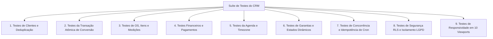

# 16 — ESTRATÉGIA DE TESTES AUTOMATIZADOS E MATRIZ DE VALIDAÇÃO DO CRM

**Status:** APROVADO PARA MODELAGEM (FASE 1.1)  
**Data:** 26 de Agosto de 2026  
**Escopo:** Planejamento detalhado das suítes de testes unitários, testes de integração de API, testes de concorrência, testes de segurança RLS e validação de responsividade mobile.

---

## 1. Matriz de Cenários de Testes Automatizados

---

## 2. Detalhamento dos Cenários de Teste

### 2.1. Clientes e Deduplicação Inteligente
- **Cenário 1.1 (Cadastro Manual Rápido):** Cadastrar cliente informando apenas Nome e Telefone. Deve persistir com sucesso e gerar `lead_id = NULL`.
- **Cenário 1.2 (Detecção Proativa de Duplicatas):** Enviar telefone com formato diferente (ex: `(11) 99999-8888` vs `11999998888`). A API `check-duplicates` deve encontrar o cliente existente pelo índice normalizado.
- **Cenário 1.3 (Arquivamento / Soft Delete):** Arquivar cliente. O registro deve receber `is_archived = true` e `archived_at = now()`, deixando de aparecer nas listagens padrão sem apagar o histórico.

### 2.2. Conversão Atômica de Lead → Cliente
- **Cenário 2.1 (Conversão Nominal Completa):** Converter lead com dados válidos, endereço e primeira OS. Deve criar todos os registros e marcar `leads.status = 'Fechado'` em transação única.
- **Cenário 2.2 (Bloqueio de Duplo Clique Concorrente):** Disparar 2 requisições idênticas simultâneas de conversão para o mesmo `leadId`. Exatamente uma deve ter sucesso (201 Created) e a outra deve retornar erro 409 Conflict.
- **Cenário 2.3 (Rollback por Falha Intermediária):** Simular falha de validação na OS. Toda a operação deve sofrer rollback, não deixando cliente nem endereço órfãos.

### 2.3. Ordens de Serviço, Itens e Medições
- **Cenário 3.1 (Múltiplos Itens e Soma de Valores):** Criar OS com 3 itens (2 Telas Janela a R$ 250 cada + 1 Rede Sacada a R$ 600) e desconto de R$ 100. `valor_total` deve ser R$ 1.100,00 e `valor_final` R$ 1.000,00.
- **Cenário 3.2 (Medições em Milímetros Canônicos):** Inserir vão com `largura_mm = 1200` e `altura_mm = 1000`. O cálculo de área unitária deve resultar precisamente em $1,20 m^2$.

### 2.4. Pagamentos e Controle Financeiro
- **Cenário 4.1 (Pagamento Parcial e Saldo Devedor):** OS de R$ 1.000,00 com pagamento de sinal de R$ 400,00 via Pix. Status deve ser `'parcial'` e saldo devedor R$ 600,00.
- **Cenário 4.2 (Quitação Total):** Lançamento de segundo pagamento de R$ 600,00. Status da OS deve mudar para `'pago'` e saldo devedor zerar.
- **Cenário 4.3 (Cancelamento de Lançamento sem Exclusão Física):** Cancelar um pagamento incorreto com justificativa. O valor cancelado não deve somar no total pago da OS e os campos `cancelled_at`/`cancelled_by` devem estar preenchidos.

### 2.5. Agenda e Fuso Horário (`America/Sao_Paulo`)
- **Cenário 5.1 (Persistência em TIMESTAMPTZ):** Agendar atendimento para 09:00 SP. No banco deve ser persistido como 12:00 UTC e devolvido formatado como 09:00 SP na consulta.
- **Cenário 5.2 (Alerta de Conflito de Técnico):** Tentar agendar o mesmo instalador em horário coincidente. A API deve retornar o alerta consultivo de sobreposição.

### 2.6. Garantias e Estados Temporais Dinâmicos
- **Cenário 6.1 (Garantias com Prazos Distintos na Mesma OS):** Concluir OS contendo 1 item de Rede (60 meses) e 1 item de Tela (12 meses). Devem ser gerados 2 registros de garantia com datas de término independentes.
- **Cenário 6.2 (Cálculo Dinâmico de Vencimento):** Consultar garantia cujo término vence em 10 dias. O status temporal calculado deve ser `'vencendo'` sem necessidade de update prévio no banco.

### 2.7. Concorrência e Idempotência no Cron de Notificações
- **Cenário 7.1 (Execução Paralela de Workers):** Simular 10 chamadas concorrentes para `/api/cron/process-scheduled-tasks` na mesma janela temporal. Apenas o worker que reservou a linha com a chave de idempotência deve enviar o e-mail; os outros 9 devem ignorar (Zero duplicidade).

### 2.8. Segurança RLS e Isolamento LGPD
- **Cenário 8.1 (Tentativa de Acesso Público Anon):** Tentar consultar `public.clients` via cliente Supabase anônimo. Deve retornar lista vazia ou erro de permissão (RLS bloqueia).
- **Cenário 8.2 (Tentativa sem Autenticação Admin no BFF):** Fazer requisição a `/api/admin/crm/clients` sem cookie `sb-admin-access-token`. Deve retornar 401 Unauthorized.

---

## 3. Matriz de Validação de Responsividade (10 Viewports)

| Viewport | Resolução | Teste Crítico no CRM | Critério de Aceitação |
|---|---|---|---|
| **320px** | 320 x 568 | Cadastro Rápido de Cliente | Zero overflow-x horizontal, formulário em coluna única |
| **360px** | 360 x 640 | Tabela de Vãos e Medições | Vãos exibidos como Cards Empilhados, inputs confortáveis |
| **375px** | 375 x 667 | Modal de Lançamento de Pagamento | Modal centrado com botões com área de clique >= 44x44px |
| **390px** | 390 x 844 | Ficha 360° do Cliente e Tabs | Navegação por abas com scroll touch horizontal suave |
| **412px** | 412 x 915 | Lightbox de Fotos Técnicas | Zoom touch, pan e botões de navegação acessíveis |
| **430px** | 430 x 932 | Drawer de Detalhes da OS | Drawer fluido ocupando largura confortável com safe areas |
| **768px** | 768 x 1024 | Calendário da Agenda | Grid de dias legível com visualização mensal e semanal |
| **1024px** | 1024 x 768 | Painel Kanban de Ordens de Serviço | Colunas de status com drag-and-drop suave |
| **1280px** | 1280 x 800 | Dashboard e KPIs Operacionais | Grid de 3 colunas com cards de métricas e gráficos |
| **1920px** | 1920 x 1080 | Visão Geral Multi-colunas | Container centralizado max-w com excelente aproveitamento visual |
