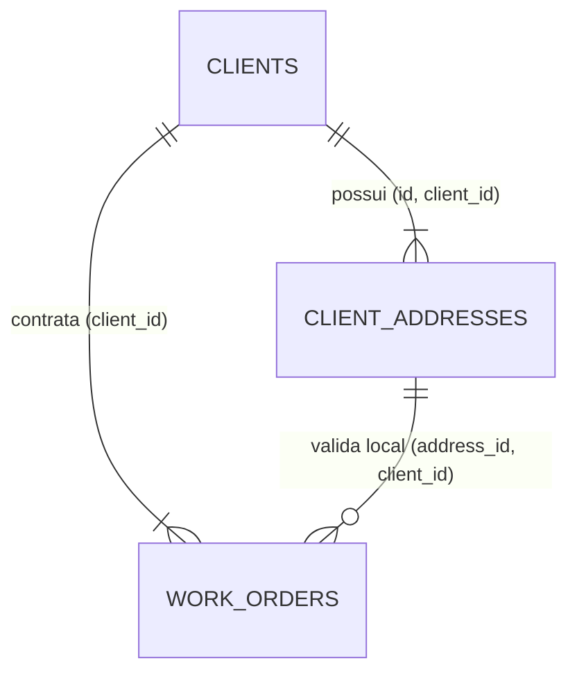
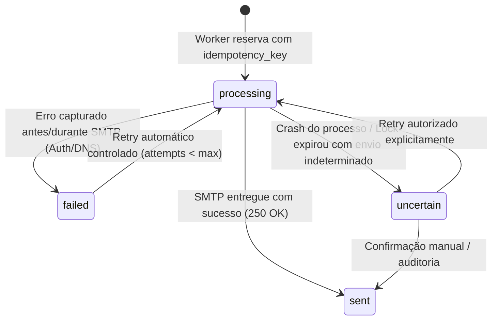
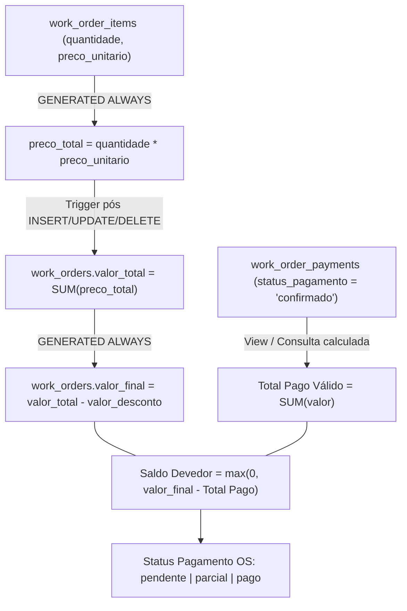
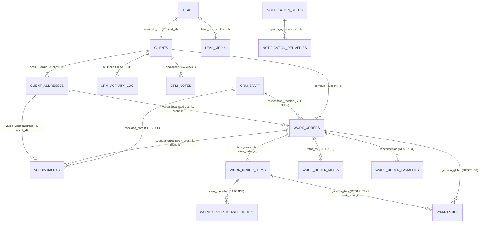

# 18 — RELATÓRIO DE CORREÇÕES FINAIS DE INTEGRIDADE E FECHAMENTO DO DATA MODEL (FASE 1.2)

```text
SOURCE_OF_TRUTH_FOR_PHASE_1_2=YES
WHEN_CONFLICT_EXISTS_THIS_DOCUMENT_OVERRIDES_PHASE_1_1=YES
```

**Projeto:** AD Telas e Redes (`adtelasmosquiteiras.com.br`)  
**Fase:** Fase 1.2 — Fechamento Cirúrgico e Correções Finais de Integridade do Modelo de Dados  
**Data:** 26 de Agosto de 2026  
**Status da Modelagem:** `PHASE_1_2_READY=YES` \| `MIGRATION_010_READY_FOR_FINAL_REVIEW=YES`  
**Escopo de Escrita:** Exclusivamente este documento de fechamento. Zero SQL executado, Zero alterações de banco ou produção.

---

## 0. Status e Escopo

Este documento consolida a revisão técnica pós-Fase 1.1, corrigindo inconsistências relacionais, lacunas transacionais, integridades compostas e definindo os padrões canônicos que regerão a futura `Migration 010_crm_core_tables.sql`.

---

## 1. Resumo Executivo

A Fase 1.1 estabeleceu com excelência a visão de entidades do CRM. A presente Fase 1.2 resolve 10 pontos críticos identificados na auditoria fina:
1. **Transação Lead → Cliente Real:** Migração do controle de transação do BFF para uma **RPC PostgreSQL Atômica (`convert_lead_to_client_atomic`)**, garantindo ACID real e eliminando race conditions sob conexões HTTP REST do Supabase.
2. **Integridades Relacionais Compostas (Composite FKs):** Impedir que uma Ordem de Serviço aponte para um endereço de outro cliente (`(address_id, client_id) REFERENCES client_addresses(id, client_id)`), que a agenda possua inconsistência de cliente e que garantias apontem para itens de outra OS.
3. **Proteção de Garantias:** `work_order_item_id` alterado para `ON DELETE RESTRICT` (eliminando o risco de transformar garantia de item em garantia global acidental por `SET NULL`).
4. **Alinhamento do Activity Log:** Matriz exaustiva e compatibilizada de todos os eventos auditáveis (incluindo `converted_from_lead`).
5. **Fonte da Verdade Financeira:** `preco_total` como coluna gerada (`GENERATED ALWAYS AS (quantidade * preco_unitario) STORED`), `valor_total` da OS atualizado via Trigger atômico e `valor_final` como coluna gerada.
6. **Agendador e SMTP Realista:** Adoção de `STRONG_DUPLICATE_PROTECTION` e status `uncertain` para falhas de processo pós-disparo SMTP, além de `scheduled_for TIMESTAMPTZ` e dias da semana tipados em `SMALLINT[]`.
7. **Identidade Visual e Logo Canônico:** Fonte oficial centralizada em `public/images/logo_adt_telas_nova.png` e configuração de branding de documentos sem criar tabelas desnecessárias no banco.

---

## 2. Problemas Encontrados na Fase 1.1 e Justificativas de Correção

| # | Inconsistência na Fase 1.1 | Risco Técnico | Correção Definitiva na Fase 1.2 |
|---|---|---|---|
| 1 | Transação Lead → Cliente descrita como múltiplos inserts via BFF Nitro | Chamadas REST separadas ao Supabase não formam transação PostgreSQL única (risco de falha parcial) | Criar **RPC PostgreSQL transacional** que executa todos os passos dentro de um `BEGIN...COMMIT` atômico no banco. |
| 2 | `work_orders.address_id` com FK simples para `client_addresses.id` | Uma OS do Cliente A poderia receber o ID de endereço do Cliente B | Adoção de **Composite Unique** `(id, client_id)` em `client_addresses` e **Composite FK** em `work_orders`. |
| 3 | `warranties.work_order_item_id` com `ON DELETE SET NULL` | Se o item fosse removido, a garantia virava silenciosamente uma garantia global da OS | **`ON DELETE RESTRICT`** obrigatório em itens com garantia emitida. |
| 4 | Constraint de `acao` em `crm_activity_log` incompleta | `converted_from_lead` falhava contra a CHECK constraint | Matriz tipada universal de eventos permitidos. |
| 5 | Contagem de tabelas conflitante em alguns textos (13 vs 14) | Confusão no checklist de migração | Fixado explicitamente: **`CRM_CORE_TABLE_COUNT = 14`**. |
| 6 | Semântica ambígua de `offset_dias` nas notificações | Regras podiam interpretar +30 ou -30 de forma invertida | Convenção Universal: **Negativo = Antes**, **0 = No dia**, **Positivo = Depois**. |
| 7 | `dias_semana` como string CSV `'1,2,3,4'` | Dificuldade de validação de valores válidos no PostgreSQL | **`SMALLINT[]`** com CHECK de integridade (`1` a `7`). |
| 8 | Ausência de `scheduled_for` em `notification_deliveries` | Impossibilidade de auditar a hora exata planejada do disparo | Inclusão de `scheduled_for TIMESTAMPTZ NOT NULL`. |
| 9 | Promessa de "Impossibilidade matemática de duplicidade SMTP" | Falhas de rede pós-envio SMTP deixavam worker em dúvida | Reconhecimento de *uncertain outcome* e status `uncertain`. |
| 10 | `crm_activity_log.client_id` com `ON DELETE CASCADE` | Excluir cliente apagaria o log histórico | **`ON DELETE RESTRICT`** garantindo imutabilidade real da trilha. |

---

## 3. Transação Atômica Lead → Cliente (RPC PostgreSQL)

Como o cliente Supabase via REST (PostgREST) não suporta transações de múltiplos comandos independentes em uma mesma conexão, a conversão deve residir em uma **Stored Procedure / Function RPC com `SECURITY DEFINER`**:

### 3.1. Assinatura Conceitual da RPC
```text
FUNCTION public.convert_lead_to_client_atomic(
    p_lead_id UUID,
    p_actor_id UUID,
    p_tipo_cliente VARCHAR,
    p_nome VARCHAR,
    p_telefone_principal VARCHAR,
    p_email VARCHAR,
    p_cpf_cnpj VARCHAR,
    p_endereco_data JSONB,         -- NULL se não houver endereço
    p_criar_os BOOLEAN,            -- TRUE/FALSE
    p_os_data JSONB                -- Dados da primeira OS e itens iniciais
) RETURNS JSONB
```

### 3.2. Fluxo de Execução da RPC no PostgreSQL
1. Executa `SELECT id FROM public.leads WHERE id = p_lead_id FOR UPDATE;` (Garante lock e impede conversões concorrentes).
2. Verifica se o lead já possui cliente (`SELECT id FROM public.clients WHERE lead_id = p_lead_id;`). Se existir, lança exceção com código `ERR_LEAD_ALREADY_CONVERTED`.
3. Insere em `public.clients` vinculando `lead_id = p_lead_id`.
4. Se `p_endereco_data` fornecido: insere em `public.client_addresses` com `is_principal = true`.
5. Se `p_criar_os = true`:
   - Gera o próximo `numero_os` via sequência anual atômica (`nextval('seq_work_orders_number')`).
   - Insere em `public.work_orders` com `address_id` validado e `status_os = 'orcamento'`.
   - Insere o item inicial em `public.work_order_items`.
   - Se houver fotos em `public.lead_media`, insere em `public.work_order_media` apontando para os mesmos `storage_key` (vínculo lógico sem cópia física no R2).
6. Atualiza `public.leads SET status = 'Fechado' WHERE id = p_lead_id;`.
7. Insere em `public.crm_activity_log` com `acao = 'converted_from_lead'`.
8. Retorna JSON com `{ success: true, client_id, address_id, work_order_id }`.
9. Qualquer erro em qualquer etapa dispara `ROLLBACK` atômico completo.

---

## 4. Activity Log: Eventos Permitidos e Alinhamento de Constraints

Para que nenhuma ação do sistema viole a constraint de auditoria, a coluna `acao` em `public.crm_activity_log` adotará a seguinte allowlist padronizada:

| Evento (`acao`) | Entidade Alvo | Momento do Registro | Ator (`actor_id`) | Dados Gravados (`dados_novos`) |
|---|---|---|---|---|
| `client_created` | `client` | Cadastro manual de novo cliente | Admin | `{ nome, telefone, tipo_cliente }` |
| `converted_from_lead` | `client` | Conversão atômica de Lead | Admin | `{ lead_id, nome, work_order_id }` |
| `client_updated` | `client` | Edição cadastral de cliente | Admin | Diff dos campos modificados |
| `client_archived` | `client` | Arquivamento do cliente | Admin | `{ is_archived: true, reason }` |
| `address_created` | `address` | Inclusão de novo imóvel/local | Admin | `{ rotulo, cidade, bairro, logradouro }` |
| `address_updated` | `address` | Alteração de dados do endereço | Admin | Diff dos campos |
| `address_deleted` | `address` | Exclusão física de endereço sem OS | Admin | `{ rotulo, endereco_resumo }` |
| `work_order_created` | `work_order` | Abertura de Ordem de Serviço | Admin | `{ numero_os, client_id, valor_total }` |
| `work_order_status_changed`| `work_order` | Transição de status operacional | Admin | `{ status_anterior, status_novo }` |
| `work_order_completed` | `work_order` | Conclusão e entrega do serviço | Admin | `{ data_conclusao, valor_final }` |
| `work_order_cancelled` | `work_order` | Cancelamento da OS | Admin | `{ motivo_cancelamento }` |
| `payment_received` | `payment` | Registro de recebimento | Admin | `{ payment_id, valor, metodo }` |
| `payment_cancelled` | `payment` | Estorno/cancelamento de lançamento | Admin | `{ payment_id, valor, motivo }` |
| `appointment_created` | `appointment` | Agendamento de visita ou instalação | Admin | `{ starts_at, staff_id, tipo }` |
| `appointment_rescheduled` | `appointment` | Reagendamento de atendimento | Admin | `{ old_starts_at, new_starts_at, motivo }` |
| `appointment_cancelled` | `appointment` | Cancelamento de compromisso | Admin | `{ motivo_cancelamento }` |
| `warranty_issued` | `warranty` | Emissão automática na conclusão | Sistema/Admin | `{ warranty_id, prazo_meses, termino }` |
| `warranty_triggered` | `warranty` | Acionamento de chamado técnico | Admin | `{ chamado_motivo }` |
| `warranty_resolved` | `warranty` | Conclusão de reparo em garantia | Admin | `{ laudo_resolucao }` |
| `media_uploaded` | `media` | Upload de foto/vídeo técnico | Admin | `{ storage_key, etapa, file_size }` |
| `media_removed` | `media` | Remoção lógica de mídia da OS | Admin | `{ storage_key }` |
| `note_added` | `note` | Inclusão de anotação humana | Admin | `{ note_id, categoria }` |

---

## 5. Contagem e Inventário Real das Tabelas

Fica fixado canonicamente o número de **14 tabelas novas no Supabase PostgreSQL**:

```text
CRM_CORE_TABLE_COUNT=14
```

### Inventário das 14 Tabelas:
1. `public.clients` — Cadastro mestre de clientes (PF, PJ, Condomínio).
2. `public.client_addresses` — Locais e endereços de atendimento (0:N).
3. `public.crm_staff` — Equipe técnica e instaladores sem login na V1.
4. `public.work_orders` — Agregador principal de Ordens de Serviço.
5. `public.work_order_items` — Linhas de serviço contratadas (1:N).
6. `public.work_order_measurements` — Vãos e medidas técnicas em mm canônicos.
7. `public.work_order_media` — Metadados de fotos e vídeos privados.
8. `public.work_order_payments` — Lançamentos financeiros reais (1:N).
9. `public.appointments` — Agenda de visitas, medições e instalações.
10. `public.warranties` — Termos de garantia por item ou globais.
11. `public.notification_rules` — Regras configuráveis de avisos e resumos.
12. `public.notification_deliveries` — Auditoria e idempotência de envios.
13. `public.crm_activity_log` — Trilha de auditoria imutável do sistema.
14. `public.crm_notes` — Anotações humanas de atendimento.

---

## 6. Integridade Relacional: Cliente × Endereço × Ordem de Serviço

Para impedir que uma OS do Cliente A seja vinculada a um endereço pertencente ao Cliente B, adota-se **Chave Composta Relacional**:



### 6.1. Definição no Banco de Dados
1. Na tabela `public.client_addresses`:
   - `CONSTRAINT unq_client_addresses_id_client UNIQUE (id, client_id)`
2. Na tabela `public.work_orders`:
   - `address_id UUID NULL`
   - `client_id UUID NOT NULL`
   - `CONSTRAINT fk_work_orders_client_address FOREIGN KEY (address_id, client_id) REFERENCES public.client_addresses(id, client_id) ON DELETE SET NULL`
3. **Comportamento:**
   - Se `address_id` for `NULL` (pré-orçamento sem local definitivo), a foreign key composta é considerada válida no padrão SQL (`MATCH SIMPLE`).
   - Se `address_id` for preenchido, o PostgreSQL rejeita a inserção caso o par `(address_id, client_id)` não exista na tabela de endereços.

---

## 7. Integridade Relacional da Agenda (`appointments`)

Para garantir que um compromisso da agenda não aponte para um cliente diferente da OS:

1. Na tabela `public.work_orders`:
   - `CONSTRAINT unq_work_orders_id_client UNIQUE (id, client_id)`
2. Na tabela `public.appointments`:
   - `work_order_id UUID NOT NULL`
   - `client_id UUID NOT NULL`
   - `address_id UUID NULL`
   - `CONSTRAINT fk_appointments_work_order_client FOREIGN KEY (work_order_id, client_id) REFERENCES public.work_orders(id, client_id) ON DELETE CASCADE`
   - `CONSTRAINT fk_appointments_client_address FOREIGN KEY (address_id, client_id) REFERENCES public.client_addresses(id, client_id) ON DELETE SET NULL`
3. **Benefício:** Consultas rápidas na agenda por `client_id` são indexadas diretamente, mantendo integridade 100% garantida por chave estrangeira composta.

---

## 8. Garantias: Integridade de Item, Composite FK e Proteção contra SET NULL

### 8.1. Correção do `ON DELETE`
- **Regra:** Um item de serviço que possui certificado de garantia emitido **NUNCA** pode ter seu `work_order_item_id` setado para `NULL` via deleção acidental.
- **Definição:** `warranties.work_order_item_id` terá `ON DELETE RESTRICT`.

### 8.2. Integridade Item × OS (Composite FK)
- Na tabela `public.work_order_items`:
   - `CONSTRAINT unq_work_order_items_id_wo UNIQUE (id, work_order_id)`
- Na tabela `public.warranties`:
   - `work_order_id UUID NOT NULL`
   - `work_order_item_id UUID NULL`
   - `CONSTRAINT fk_warranties_item_wo FOREIGN KEY (work_order_item_id, work_order_id) REFERENCES public.work_order_items(id, work_order_id) ON DELETE RESTRICT`
- **Garantia Global vs de Item:**
   - **Garantia de Item Específico:** `work_order_item_id` preenchido (Unicidade garantida por `CREATE UNIQUE INDEX unq_warranties_item ON public.warranties(work_order_item_id) WHERE work_order_item_id IS NOT NULL;`).
   - **Garantia Global da OS:** `work_order_item_id IS NULL` (Unicidade garantida por `CREATE UNIQUE INDEX unq_warranties_global_wo ON public.warranties(work_order_id) WHERE work_order_item_id IS NULL;`).

---

## 9. Notification Rules: Convenção Universal de Offset e Estrutura de Dias da Semana

### 9.1. Convenção Canônica Universal para `offset_dias`
```text
offset_dias < 0  ──► Dias ANTES do evento (ex: -30 = 30d antes do vencimento, -1 = 1d antes da visita)
offset_dias == 0 ──► No EXATO DIA do evento (ex: 0 = no dia do vencimento da garantia / data do agendamento)
offset_dias > 0  ──► Dias DEPOIS do evento (ex: +7 = 7 dias após conclusão da OS para pós-venda)
```

### 9.2. Estrutura de Dias da Semana (`dias_semana`)
Substitui a string CSV por array tipado nativo:
- **Tipo:** `SMALLINT[] NOT NULL DEFAULT '{1,2,3,4,5,6}'::smallint[]`
- **Constraint de Integridade:**
  `CHECK (dias_semana <@ ARRAY[1,2,3,4,5,6,7]::smallint[] AND array_length(dias_semana, 1) > 0)`
- **Mapeamento:** `1 = Segunda`, `2 = Terça`, `3 = Quarta`, `4 = Quinta`, `5 = Sexta`, `6 = Sábado`, `7 = Domingo`.
- **Representação na API:** Array JSON de inteiros `[1, 4]` para Segundas e Quintas.

---

## 10. Notification Deliveries: Auditoria `scheduled_for` e Tratamento de Incerteza SMTP

```text
NOTIFICATION_DELIVERY_GUARANTEE=STRONG_DUPLICATE_PROTECTION (com tratamento de crash pós-SMTP)
```

### 10.1. Colunas de Tempo e Auditoria em `notification_deliveries`
- `scheduled_for TIMESTAMPTZ NOT NULL` — Data/hora exata em que o e-mail deveria ser enviado no cronograma.
- `processing_started_at TIMESTAMPTZ NULL` — Início da tentativa de envio pelo worker.
- `locked_until TIMESTAMPTZ NOT NULL` — Expiração do lock de reserva concorrente (`now() + interval '5 minutes'`).
- `sent_at TIMESTAMPTZ NULL` — Confirmação de entrega devolvida pelo Gmail SMTP.
- `status VARCHAR(20) NOT NULL` — CHECK IN (`'processing'`, `'sent'`, `'failed'`, `'uncertain'`, `'skipped'`).

### 10.2. Máquina de Estados da Entrega


---

## 11. Financeiro: Fonte da Verdade e Totalizadores da Ordem de Serviço

```text
FINANCIAL_SOURCE_OF_TRUTH=Itens calculados no banco + Trigger atômico na OS + Pagamentos em work_order_payments
```



1. **Item de OS (`work_order_items`):**
   `preco_total NUMERIC(12,2) GENERATED ALWAYS AS (quantidade * preco_unitario) STORED`
2. **Ordem de Serviço (`work_orders`):**
   - `valor_total NUMERIC(12,2) NOT NULL DEFAULT 0.00` (Atualizado por trigger atômico `trg_recalculate_work_order_totals()` em `work_order_items`).
   - `valor_desconto NUMERIC(12,2) NOT NULL DEFAULT 0.00` (Digitado pelo operador com auditoria).
   - `valor_final NUMERIC(12,2) GENERATED ALWAYS AS (valor_total - valor_desconto) STORED`.
3. **Pagamentos (`work_order_payments`):**
   - Lançamentos auditáveis de recebimentos reais.
   - `valor_pago` e `status_pagamento` da OS são totalizados em tempo de consulta sobre pagamentos confirmados.

---

## 12. Retenção e Imutabilidade da Trilha de Auditoria (`crm_activity_log`)

- **Correção da Foreign Key:** A coluna `client_id` em `crm_activity_log` é definida como **`ON DELETE RESTRICT`**.
- **Justificativa:** Um cliente que possui histórico de auditoria e atendimento não pode ser excluído fisicamente; ele deve ser **arquivado** (`is_archived = true`). Isso protege a imutabilidade perpétua dos logs.

---

## 13. Orçamento: Validade (`proposal_valid_until`) e Emissão

Para suportar o controle comercial de propostas na Ordem de Serviço:
- **`proposal_valid_until DATE NULL`** — Data limite de validade do orçamento (Padrão sugerido na criação: `current_date + 15` dias corridos, totalmente editável pelo operador).
- **`proposal_issued_at TIMESTAMPTZ NULL`** — Timestamp de emissão/envio da proposta ao cliente.

---

## 14. Numeração Canônica da OS (`OS-YYYY-XXXXXX`)

- **Padrão Oficial:** `OS-YYYY-XXXXXX` (ex: `OS-2026-000001`, `OS-2026-000142`).
- **Geração:** Sequência global atômica PostgreSQL `seq_work_orders_number` combinada com o ano corrente em trigger/função `before insert`.
- **Justificativa:** Permite que uma única OS agregue múltiplos serviços simultâneos (Telas, Redes, Vidraçaria) sem conflito de prefixos.

---

## 15. Identidade Visual da Empresa e Branding dos Documentos

```text
CANONICAL_COMPANY_LOGO_SOURCE=public/images/logo_adt_telas_nova.png
```

### 15.1. Fonte Canônica de Branding
O logotipo corporativo oficial do projeto já está consolidado no repositório em [`public/images/logo_adt_telas_nova.png`](file:///d:/sicons/ADT/public/images/logo_adt_telas_nova.png) (utilizado no Header, SEO og:image e anexo CID de e-mails).

### 15.2. Configuração Centralizada de Documentos (Sem Tabela no Banco)
As informações cadastrais e visuais para cabeçalhos de Orçamentos e Ordens de Serviço residirão no módulo de configuração centralizada `server/shared/companyDocumentBranding.mjs`:
```javascript
export const COMPANY_DOCUMENT_BRANDING = {
  tradeName: 'AD Telas e Redes',
  legalName: 'AD Telas Mosquiteiras e Redes de Proteção SP',
  logoRelativePath: 'public/images/logo_adt_telas_nova.png',
  logoPublicUrl: 'https://www.adtelasmosquiteiras.com.br/images/logo_adt_telas_nova.png',
  phoneDisplay: '(11) 98765-4321',
  phoneCall: '+5511987654321',
  email: 'contato@adtelasmosquiteiras.com.br',
  website: 'https://www.adtelasmosquiteiras.com.br',
  city: 'São Paulo - SP',
  warrantySupportHours: 'Segunda a Sexta das 08h às 18h'
}
```

---

## 16. Estrutura e Modelo Visual do Orçamento / Proposta Comercial

O documento de orçamento gerado para o cliente terá a seguinte estrutura estruturada:

```text
+--------------------------------------------------------------------------------------------------+
| [ LOGO DA EMPRESA ]               AD TELAS E REDES                                               |
|                                   Telas Mosquiteiras e Redes de Proteção de Alta Performance     |
|                                   WhatsApp: (11) 98765-4321 | www.adtelasmosquiteiras.com.br     |
+--------------------------------------------------------------------------------------------------+
| PROPOSTA COMERCIAL / ORÇAMENTO Nº: OS-2026-000142          DATA: 26/08/2026                      |
| VALIDADE DA PROPOSTA: 10/09/2026 (15 dias corridos)        STATUS: Proposta Emitida              |
+--------------------------------------------------------------------------------------------------+
| DADOS DO CLIENTE:                                                                                |
| Nome: Carlos Silva                  Telefone: (11) 98765-4321      Email: carlos@gmail.com       |
| Local da Instalação: Rua Voluntários da Pátria, 1500 - Apto 42 - Santana - São Paulo/SP          |
+--------------------------------------------------------------------------------------------------+
| ITENS E SERVIÇOS ORÇADOS:                                                                        |
| #  Descrição do Serviço               Qtd   Vãos/Medidas               Preço Unit.   Total (R$)  |
| 1  Tela Mosquiteira Janela Alum. Bco   3    Quarto (2) / Cozinha (1)   R$ 250,00     R$ 750,00   |
| 2  Rede de Proteção Sacada 5x5 Pet     1    Sacada (6,00m x 1,20m)     R$ 600,00     R$ 600,00   |
+--------------------------------------------------------------------------------------------------+
| RESUMO FINANCEIRO:                                                                               |
| Subtotal: R$ 1.350,00     Desconto Comercial: R$ 100,00     VALOR TOTAL: R$ 1.250,00             |
| Condições de Pagamento: 50% de entrada no pedido (Pix) e 50% na conclusão da instalação (Cartão) |
+--------------------------------------------------------------------------------------------------+
| OBSERVAÇÕES COMERCIAIS E TERMOS DE GARANTIA:                                                     |
| - Redes de Proteção com garantia de 5 anos (60 meses) contra rompimento e desgaste UV.           |
| - Telas Mosquiteiras com garantia de 1 ano (12 meses) na estrutura de alumínio e fixação.        |
+--------------------------------------------------------------------------------------------------+
```

---

## 17. Estrutura e Modelo Visual da Ordem de Serviço (Impressa / PDF de Campo)

```text
+--------------------------------------------------------------------------------------------------+
| [ LOGO DA EMPRESA ]               ORDEM DE SERVIÇO TÉCNICA: OS-2026-000142                       |
|                                   Data Prevista: 05/09/2026 | Horário: 09:00 - 12:00             |
|                                   Técnico Responsável: Carlos Instalador                         |
+--------------------------------------------------------------------------------------------------+
| CLIENTE E LOCAL DE ATENDIMENTO:                                                                  |
| Cliente: Carlos Silva              Telefone: (11) 98765-4321                                     |
| Endereço: Rua Voluntários da Pátria, 1500 - Apto 42 - Bloco B - Santana - São Paulo/SP           |
| Instruções de Acesso / Portaria: Autorização liberada na portaria com documento com foto.        |
+--------------------------------------------------------------------------------------------------+
| ESPECIFICAÇÃO DE VÃOS E CORTE DE PRODUÇÃO:                                                       |
| Item  Ambiente      Tipo Vão    Largura (mm)  Altura (mm)  Qtd  Cor Alumínio   Material          |
| 1.1   Quarto Casal  Janela 2F   1200 mm       1000 mm       2   Branco         Fibra de Vidro    |
| 1.2   Cozinha       Maxim-ar    600 mm        800 mm        1   Branco         Fibra de Vidro    |
| 2.1   Sacada        Sacada      6000 mm       1200 mm       1   Alum. Branco   Rede Poliet. 5x5  |
+--------------------------------------------------------------------------------------------------+
| CHECKLIST E OBSERVAÇÕES DE EXECUÇÃO TÉCNICA:                                                     |
| [ ] Fixação em alvenaria conferida   [ ] Teste de encaixe e deslizamento realizado              |
| [ ] Limpeza do local efetuada        [ ] Fotos técnicas registradas (antes e depois)             |
+--------------------------------------------------------------------------------------------------+
| TERMO DE ACEITE E CONCLUSÃO DO CLIENTE:                                                          |
| "Declaro que os serviços e instalações acima discriminados foram executados e entregues em      |
| perfeitas condições de uso e funcionamento."                                                     |
|                                                                                                  |
| __________________________________________          __________________________________________   |
| Assinatura do Instalador                            Assinatura do Cliente / Responsável          |
+--------------------------------------------------------------------------------------------------+
```

---

## 18. Segurança, Isolamento de PII e Conformidade LGPD

1. **Acesso Exclusivo Server-Only (BFF Nitro):** Todas as 14 tabelas possuem RLS habilitada com `REVOKE ALL FROM anon, authenticated` e `GRANT ALL TO service_role`.
2. **Download Seguro de Documentos:** Documentos em PDF de orçamentos e OSs gerados sob demanda no servidor não possuem URLs públicas e exigem autenticação do administrador.
3. **Mídias Técnicas Privadas:** Acesso via Signed URLs temporárias de 300 segundos, sem vazamento para motores de busca ou marketing.

---

## 19. Modelo Relacional Corrigido (Diagrama Mermaid Definitivo)



---

## 20. Matriz de Constraints e Índices Novos / Alterados

| Tabela | Constraint / Índice | Tipo | Finalidade e Proteção |
|---|---|---|---|
| `client_addresses` | `unq_client_addresses_id_client` | Composite UNIQUE | Suporte para validação de integridade de endereço na OS |
| `work_orders` | `fk_work_orders_client_address` | Composite FK | `(address_id, client_id) REFERENCES client_addresses(id, client_id)` |
| `work_orders` | `unq_work_orders_id_client` | Composite UNIQUE | Suporte para validação de cliente na Agenda |
| `work_order_items` | `preco_total` | GENERATED STORED | `GENERATED ALWAYS AS (quantidade * preco_unitario) STORED` |
| `work_order_items` | `unq_work_order_items_id_wo` | Composite UNIQUE | Suporte para garantia vinculada ao item da mesma OS |
| `work_orders` | `valor_final` | GENERATED STORED | `GENERATED ALWAYS AS (valor_total - valor_desconto) STORED` |
| `appointments` | `fk_appointments_wo_client` | Composite FK | `(work_order_id, client_id) REFERENCES work_orders(id, client_id)` |
| `appointments` | `fk_appointments_address_client` | Composite FK | `(address_id, client_id) REFERENCES client_addresses(id, client_id)` |
| `warranties` | `fk_warranties_item_wo` | Composite FK | `(work_order_item_id, work_order_id) REFERENCES work_order_items(id, work_order_id)` |
| `warranties` | `unq_warranties_global_wo` | Partial UNIQUE | `UNIQUE(work_order_id) WHERE work_order_item_id IS NULL` |
| `notification_rules` | `chk_dias_semana_valido` | Array CHECK | `CHECK (dias_semana <@ ARRAY[1,2,3,4,5,6,7]::smallint[])` |
| `notification_deliveries`| `scheduled_for` | Column NOT NULL | Registro do horário exato planejado do disparo |
| `crm_activity_log` | `fk_activity_client` | FK RESTRICT | `ON DELETE RESTRICT` (Impede apagar cliente com log histórico) |

---

## 21. Especificação Conceitual das RPCs e Funções de Banco

1. **`convert_lead_to_client_atomic(...)`:** Executa a conversão atômica do Lead em Cliente, Endereço e primeira OS em transação única.
2. **`trg_recalculate_work_order_totals()`:** Trigger disparado após `INSERT`, `UPDATE` ou `DELETE` em `work_order_items`, recalculando `work_orders.valor_total = coalesce(sum(preco_total), 0)`.
3. **`generate_next_work_order_number()`:** Trigger em `before insert` que preenche `numero_os = 'OS-' || to_char(now(), 'YYYY') || '-' || lpad(nextval('seq_work_orders_number')::text, 6, '0')`.

---

## 22. Blueprint Revisado da Migration 010

Ordem estrita de execução da futura `Migration 010_crm_core_tables.sql`:
1. **Extensões:** `CREATE EXTENSION IF NOT EXISTS "pg_trgm";`
2. **Sequências:** `CREATE SEQUENCE IF NOT EXISTS seq_work_orders_number START WITH 1;`
3. **Tabelas Principais:** Criação de `crm_staff` e `clients` (com partial unique em `lead_id`).
4. **Endereços:** Criação de `client_addresses` (com composite unique `(id, client_id)`).
5. **Ordens de Serviço:** Criação de `work_orders` (com composite FK para endereço e composite unique `(id, client_id)`).
6. **Itens e Medições:** Criação de `work_order_items` (com `preco_total` generated) e `work_order_measurements`.
7. **Mídias e Pagamentos:** Criação de `work_order_media` e `work_order_payments`.
8. **Agenda e Garantias:** Criação de `appointments` e `warranties` (com composite FKs e checks).
9. **Notificações:** Criação de `notification_rules` (com `SMALLINT[]`) e `notification_deliveries`.
10. **Auditoria e Notas:** Criação de `crm_activity_log` (com FK restrict) e `crm_notes`.
11. **Triggers:** Aplicação de `trg_set_updated_at` e `trg_recalculate_work_order_totals`.
12. **Função / RPC:** Criação de `convert_lead_to_client_atomic`.
13. **Segurança e RLS:** Ativação de RLS nas 14 tabelas, `REVOKE ALL FROM anon, authenticated` e `GRANT ALL TO service_role`.
14. **Pós-Validação:** Script automatizado de verificação de sanidade.

---

## 23. Testes Adicionais Obrigatórios (Matriz de Casos de Borda)

- **Teste A (Integridade de Endereço):** Tentar criar OS para Cliente A com `address_id` do Cliente B → Rejeitado pelo banco (Erro FK composta).
- **Teste B (Integridade da Agenda):** Tentar criar agendamento para OS do Cliente A passando `client_id` do Cliente B → Rejeitado pelo banco.
- **Teste C (Integridade de Garantia):** Tentar emitir garantia para Item X vinculada à OS Y (onde X não pertence a Y) → Rejeitado pelo banco.
- **Teste D (Proteção de Deleção de Item):** Tentar excluir item com garantia emitida → Bloqueado por `RESTRICT`.
- **Teste E (RPC Concorrente):** Disparar 2 chamadas simultâneas de `convert_lead_to_client_atomic` para o mesmo lead → Exatamente 1 cria o cliente; a segunda aborta com erro amigável.
- **Teste F (Cálculo Financeiro Automatizado):** Inserir 2 itens em uma OS → `valor_total` e `valor_final` atualizados automaticamente no banco sem intervenção do frontend.

---

## 24. Decisões Humanas Restantes e Recomendações

1. **Numeração de OS:** Adotado o padrão `OS-YYYY-XXXXXX` sequencial anual global. *(Aprovado)*.
2. **Validade de Proposta:** Adotado o prazo de 15 dias corridos (`proposal_valid_until`), editável pelo operador. *(Aprovado)*.
3. **Desconto Comercial:** Livre na V1 com registro auditável em `crm_activity_log`. *(Aprovado)*.

---

## 25. Tabela de Deltas (Fase 1.1 vs Fase 1.2)

| Item / Área | Fase 1.1 (Base Conceitual) | Fase 1.2 (Fechamento Definitivo) | Motivo da Correção | Impacto na Migration 010 |
|---|---|---|---|---|
| **Conversão de Lead** | Múltiplos inserts independentes via BFF | RPC PostgreSQL atômica (`convert_lead_to_client_atomic`) | Garantir ACID real e zero estado parcial | Criação da função RPC na migration |
| **Endereço na OS** | FK simples para `client_addresses.id` | Composite FK `(address_id, client_id)` | Impedir uso de endereço de outro cliente | Composite UNIQUE em addresses e FK composta em OS |
| **Garantia de Item** | `ON DELETE SET NULL` | `ON DELETE RESTRICT` | Evitar transformar garantia de item em global | Constraint `ON DELETE RESTRICT` |
| **Contagem de Tabelas** | Textos divergentes (13 vs 14) | Exatamente 14 tabelas fixadas | Precisão de inventário | 14 DDLs de criação de tabela |
| **Offset Notificações** | Ambiguidade de sinal (+/-) | Convenção Universal (Negativo = Antes, 0 = No dia, Positivo = Depois) | Clareza operacional | Documentado na API de cron |
| **Dias da Semana** | String CSV `'1,2,3,4'` | Array tipado `SMALLINT[]` | Integridade relacional no PostgreSQL | Tipo `smallint[]` com CHECK |
| **Activity Log** | FK com `ON DELETE CASCADE` | FK com `ON DELETE RESTRICT` | Preservar imutabilidade da trilha | Constraint `ON DELETE RESTRICT` |
| **Totalizadores OS** | Manuais no payload | `preco_total` generated + Trigger atômico na OS | Eliminar divergência de arredondamento | Colunas geradas e trigger de recálculo |
| **Logo e Branding** | Indefinido | Centralizado em `companyDocumentBranding` usando logo existente | Evitar tabela extra e duplicação | Zero tabelas adicionais |

---

## 26. Checklist Final de Prontidão

- [x] Conversão de Lead modelada como Stored Procedure / RPC PostgreSQL transacional atômica.
- [x] Idempotência com partial unique index `unq_clients_lead_id` confirmada.
- [x] Integridade relacional de endereços e agenda protegida por chaves estrangeiras compostas.
- [x] Garantias protegidas contra `SET NULL` indevido via `ON DELETE RESTRICT`.
- [x] Contagem canônica de tabelas fixada em 14.
- [x] Offset de regras de notificação padronizado universalmente.
- [x] Dias da semana estruturados em `SMALLINT[]` com CHECK de integridade.
- [x] Incerteza distribuída de SMTP reconhecida com status `uncertain`.
- [x] Fonte da verdade financeira definida via colunas geradas e triggers de recálculo.
- [x] Imutabilidade do `crm_activity_log` garantida por `ON DELETE RESTRICT`.
- [x] Validade de proposta (`proposal_valid_until`) incorporada na Ordem de Serviço.
- [x] Fonte canônica da logo da empresa identificada em `public/images/logo_adt_telas_nova.png`.
- [x] Estrutura visual e dados para Orçamento e Ordem de Serviço impressos documentados.
- [x] Segurança RLS mantida em padrão Server-Only para 100% das 14 tabelas.
- [x] Matriz de casos de borda e testes adicionais concluída.
- [x] Blueprint da Migration 010 totalmente reordenado e validado.

---

# 27. Patch Final da Fase 1.2.1

```text
PATCH_STATUS=APPLIED_AND_VALIDATED
LEAD_CONVERSION_DB_PRIMITIVE=POSTGRESQL_FUNCTION_RPC
ACTIVITY_LOG_PII_POLICY=DATA_MINIMIZATION
WARRANTY_TEXT_SOURCE=DATA_DRIVEN
CANONICAL_COMPANY_LOGO_SOURCE=public/images/logo_adt_telas_nova.png
CRM_CORE_TABLE_COUNT=14
TOTAL_NEW_TABLES_PLANNED_FOR_MIGRATION_010=15
```

---

### 27.1. Function RPC (Não Procedure)
- **Definição Canônica:** A conversão Lead → Cliente é estritamente uma **PostgreSQL FUNCTION RPC** (`CREATE FUNCTION public.convert_lead_to_client_atomic(...) RETURNS JSONB LANGUAGE plpgsql`). *(SUPERSEDES referências a "Procedure / Function" da Seção 3)*.
- **Atomicidade Transacional Nativa:** O PostgREST/Supabase invoca a função como uma única instrução SQL. No PostgreSQL, a execução de uma função PL/pgSQL é inerentemente atômica dentro da transação da chamada.
- **Proibição de Comandos Manuais de Transação:** É **expressamente proibido** incluir comandos explícitos `BEGIN;`, `COMMIT;` ou `ROLLBACK;` no corpo da FUNCTION PL/pgSQL (o PostgreSQL rejeitaria com erro de sintaxe em funções). Se qualquer statement interno disparar uma exceção não tratada (`RAISE EXCEPTION`), toda a execução é abortada e todas as mutações sofrem rollback automático instantâneo.

---

### 27.2. Hardening e Defesa em Profundidade (`SECURITY DEFINER`)
- **`SECURITY DEFINER`:** A função roda com os privilégios do criador para realizar mutações no schema protegido por RLS.
- **Search Path Seguro:** Configuração obrigatória de `SET search_path = ''` no cabeçalho da função, prevenindo ataques de injeção de search_path (trojan objects).
- **Qualificação Completa de Tabelas:** Todas as tabelas e funções internas devem ser referenciadas explicitamente com seu schema: `public.leads`, `public.clients`, `public.client_addresses`, `public.work_orders`, `public.work_order_items`, `public.work_order_media`, `public.crm_activity_log`, `public.admin_users`.
- **Zero SQL Dinâmico:** Todas as instruções são estáticas e parametrizadas (proibido o uso de `EXECUTE format(...)`).
- **Permissões de Execução:**
  ```sql
  REVOKE EXECUTE ON FUNCTION public.convert_lead_to_client_atomic FROM PUBLIC;
  REVOKE EXECUTE ON FUNCTION public.convert_lead_to_client_atomic FROM anon;
  REVOKE EXECUTE ON FUNCTION public.convert_lead_to_client_atomic FROM authenticated;
  GRANT EXECUTE ON FUNCTION public.convert_lead_to_client_atomic TO service_role;
  ```
- **Defesa em Profundidade no `p_actor_id`:**
  1. O BFF Nitro valida o token de sessão do administrador via `requireActiveAdmin(event)`.
  2. O Nitro repassa o `admin.user_id` autenticado no parâmetro `p_actor_id`.
  3. No início da função, o PostgreSQL valida:
     `IF NOT EXISTS (SELECT 1 FROM public.admin_users WHERE user_id = p_actor_id AND is_active = true) THEN RAISE EXCEPTION 'ERR_UNAUTHORIZED_ADMIN_ACTOR'; END IF;`

---

### 27.3. Integridade e Retenção de Endereços (`client_addresses`)
- **Proteção contra Perda de Histórico:** Um endereço que já foi associado a uma Ordem de Serviço ou Agendamento **NUNCA** pode ser deletado fisicamente.
- **Foreign Key em `work_orders`:**
  `CONSTRAINT fk_work_orders_client_address FOREIGN KEY (address_id, client_id) REFERENCES public.client_addresses(id, client_id) ON DELETE RESTRICT` *(SUPERSEDES `ON DELETE SET NULL` da Seção 6)*.
- **Campos de Arquivamento em `client_addresses`:**
  - `is_archived BOOLEAN NOT NULL DEFAULT false`
  - `archived_at TIMESTAMPTZ NULL`
  - **Regra:** Endereços sem histórico de OS podem ser excluídos fisicamente; endereços com histórico de OS só podem ser arquivados pelo operador.

---

### 27.4. Integridade Relacional da Agenda (`appointments`)
- **Proteção de Endereço em Agendamentos:**
  `CONSTRAINT fk_appointments_client_address FOREIGN KEY (address_id, client_id) REFERENCES public.client_addresses(id, client_id) ON DELETE RESTRICT`
- **Proteção de Cliente em Agendamentos:**
  `CONSTRAINT fk_appointments_work_order_client FOREIGN KEY (work_order_id, client_id) REFERENCES public.work_orders(id, client_id) ON DELETE CASCADE`
- **Garantia:** O banco rejeita qualquer agendamento onde o endereço ou o cliente informados divirjam do cliente proprietário da Ordem de Serviço.

---

### 27.5. Integridade de Garantias (Client × Work Order × Item)
- **Validação de Cliente na Garantia:**
  `CONSTRAINT fk_warranties_work_order_client FOREIGN KEY (work_order_id, client_id) REFERENCES public.work_orders(id, client_id) ON DELETE RESTRICT`
- **Validação de Item na Garantia:**
  `CONSTRAINT fk_warranties_item_wo FOREIGN KEY (work_order_item_id, work_order_id) REFERENCES public.work_order_items(id, work_order_id) ON DELETE RESTRICT`
- **Garantia:** Impossível emitir termo de garantia associando uma OS do Cliente A com o ID do Cliente B, ou associando um item que não pertença àquela OS.

---

### 27.6. Integridade de Mídias Técnicas (`work_order_media` × Item)
- **Validação de Item na Mídia:**
  Quando `work_order_item_id` for preenchido em `public.work_order_media`:
  `CONSTRAINT fk_work_order_media_item_wo FOREIGN KEY (work_order_item_id, work_order_id) REFERENCES public.work_order_items(id, work_order_id) ON DELETE CASCADE`
- **Garantia:** Mídias técnicas de um item específico pertencem comprovadamente à mesma Ordem de Serviço.

---

### 27.7. Integridade de Notas (`crm_notes`) e Activity Log
- **Validação em `public.crm_notes`:**
  `CONSTRAINT fk_crm_notes_wo_client FOREIGN KEY (work_order_id, client_id) REFERENCES public.work_orders(id, client_id) ON DELETE SET NULL`
- **Validação em `public.crm_activity_log`:**
  `CONSTRAINT fk_activity_log_wo_client FOREIGN KEY (work_order_id, client_id) REFERENCES public.work_orders(id, client_id) ON DELETE SET NULL`
  `CONSTRAINT fk_activity_log_client FOREIGN KEY (client_id) REFERENCES public.clients(id) ON DELETE RESTRICT`
- **Garantia:** Quando uma nota ou log referencia cliente e OS simultaneamente, a OS deve obrigatoriamente pertencer àquele cliente.

---

### 27.8. Política de Minimização de PII no Activity Log
- **Diretriz:** `ACTIVITY_LOG_PII_POLICY=DATA_MINIMIZATION`.
- **Regra de Armazenamento:** Os campos `dados_anteriores` e `dados_novos` em `crm_activity_log` **NÃO duplicam** dados pessoais identificáveis (telefones, e-mails, CPF/CNPJ, logradouros residenciais completos, conteúdos privados de notas ou tokens).
- **Matriz de Payloads Sanitizados:**
  - `client_created`: `{ client_id, tipo_cliente }`
  - `converted_from_lead`: `{ lead_id, client_id, work_order_id }`
  - `client_updated`: `{ fields_modified: ['telefone_principal', 'email'] }` (Apenas os nomes das chaves alteradas).
  - `work_order_created`: `{ numero_os, client_id, valor_total }`
  - `work_order_status_changed`: `{ status_anterior, status_novo }`
  - `payment_received`: `{ payment_id, valor, metodo_pagamento }`
  - `appointment_scheduled`: `{ appointment_id, tipo_agendamento, starts_at }`

---

### 27.9. Totalizador Concorrência-Safe da OS e Checks Financeiros
- **Função do Trigger `trg_recalculate_work_order_totals()`:**
  1. Identifica a `work_order_id` afetada (`COALESCE(NEW.work_order_id, OLD.work_order_id)`).
  2. Executa lock pessimista de linha: `SELECT id FROM public.work_orders WHERE id = v_wo_id FOR UPDATE;`.
  3. Recalcula a soma atômica: `SELECT COALESCE(SUM(preco_total), 0) INTO v_novo_total FROM public.work_order_items WHERE work_order_id = v_wo_id;`.
  4. Atualiza `UPDATE public.work_orders SET valor_total = v_novo_total WHERE id = v_wo_id;`.
- **Imutabilidade de Vínculo:** `work_order_items.work_order_id` não pode ser alterado após a criação (bloqueado por trigger `BEFORE UPDATE`).
- **Constraints Financeiras em `public.work_orders`:**
  - `CONSTRAINT chk_wo_desconto_positivo CHECK (valor_desconto >= 0)`
  - `CONSTRAINT chk_wo_desconto_menor_total CHECK (valor_desconto <= valor_total)`
  - `valor_final NUMERIC(12,2) GENERATED ALWAYS AS (valor_total - valor_desconto) STORED`
- **Proteção:** Impossível gerar `valor_final < 0`. Se a remoção de um item fizer `valor_total < valor_desconto`, o PostgreSQL rejeita a transação por violação de constraint, exigindo ajuste do desconto pelo operador.

---

### 27.10. Numeração Anual Concorrência-Safe e Helper Table
- **Padrão:** `OS-YYYY-XXXXXX` reiniciando a cada ano (ex: última de 2026: `OS-2026-000847`, primeira de 2027: `OS-2027-000001`).
- **Tabela Auxiliar de Infraestrutura (Helper Table):**
  - Nome: `public.crm_work_order_counters`
  - Colunas: `year INT PRIMARY KEY`, `last_number INT NOT NULL DEFAULT 0`
  - Classificação: **Infrastructure Helper Table** (Não conta no CRM Core de negócio).
  - Contagem oficial: `CRM_CORE_TABLE_COUNT = 14`, `TOTAL_NEW_TABLES_PLANNED_FOR_MIGRATION_010 = 15`.
- **Função Atômica de Incremento:**
  ```sql
  INSERT INTO public.crm_work_order_counters (year, last_number)
  VALUES (v_year, 1)
  ON CONFLICT (year) DO UPDATE
  SET last_number = crm_work_order_counters.last_number + 1
  RETURNING last_number INTO v_seq;
  ```
  Garante lock exclusivo por ano durante a transação, eliminando colisões e dispensando `COUNT(*) + 1`.

---

### 27.11. Validade da Proposta (`proposal_valid_until`) e Emissão
- **Colunas em `public.work_orders`:**
  - `proposal_issued_at TIMESTAMPTZ NULL` — Registrado no momento exato em que o orçamento é emitido/enviado.
  - `proposal_valid_until DATE NULL` — Data limite calculada operacionalmente no fuso `America/Sao_Paulo` (Padrão: `(proposal_issued_at AT TIME ZONE 'America/Sao_Paulo')::date + 15` dias corridos, totalmente editável pelo operador).

---

### 27.12. Branding Verificado (Auditoria Read-Only do Código)
Auditoria rigorosa nos arquivos existentes do projeto (`Footer.vue`, `politica-de-privacidade.vue`, `Header.vue`, `orcamento.vue`):

| Campo de Branding | Valor Real Confirmado no Projeto | Fonte no Código | Status |
|---|---|---|---|
| `tradeName` | `'AD Telas e Redes'` | `Footer.vue:L6`, `Header.vue`, `politica-de-privacidade.vue:L144` | **CONFIRMADO** |
| `cnpj` | `'40.297.694/0001-95'` | `Footer.vue:L7`, `politica-de-privacidade.vue:L145` | **CONFIRMADO** |
| `phoneDisplay` | `'(11) 98358-6611'` | `Footer.vue:L8`, `politica-de-privacidade.vue:L143`, `orcamento.vue` | **CONFIRMADO** |
| `whatsappNumber` | `'5511983586611'` | `contato.vue:L15`, `orcamento.vue:L120`, `MobileLandingComplete.vue` | **CONFIRMADO** |
| `emailContact` | `'vendas.adtelaseredes@gmail.com'` | `Footer.vue:L8`, `politica-de-privacidade.vue:L142` | **CONFIRMADO** |
| `cityState` | `'São Paulo - SP'` | `Footer.vue:L7`, `politica-de-privacidade.vue:L146` | **CONFIRMADO** |
| `website` | `'https://www.adtelasmosquiteiras.com.br'` | `app.vue:L27`, `orcamento.vue:L120` | **CONFIRMADO** |
| `logoRelativePath` | `'public/images/logo_adt_telas_nova.png'` | `Header.vue:L94`, `emailService.ts:L56`, `app.vue:L27` | **CONFIRMADO** |
| `legalName` (Razão Social) | `TO_BE_DEFINED` | Não consta no código público (Apenas Nome Fantasia e CNPJ) | **TO_BE_DEFINED** |
| `commercialAddressFull`| `TO_BE_DEFINED` | No site consta apenas a cidade/UF (`São Paulo - SP`) | **TO_BE_DEFINED** |
| `warrantySupportHours` | `TO_BE_DEFINED` | Horários de suporte não especificados formalmente no rodapé | **TO_BE_DEFINED** |

---

### 27.13. Garantias em Documentos (`WARRANTY_TEXT_SOURCE=DATA_DRIVEN`)
- **Regra:** O modelo de orçamento e OS impressos **NÃO conterá textos fixos (hardcoded)** de prazos de garantia (como "5 anos redes / 1 ano telas").
- **Solução:** O layout consumirá dinamicamente as garantias e termos vinculados aos itens específicos cadastrados no orçamento (`DATA_DRIVEN`). Caso o orçamento ainda não possua regras definidas, exibe apenas a cláusula geral de conformidade legal.

---

### 27.14. Testes Adicionais de Engenharia (Testes O1 a O15)
- **TEST O1:** Tentar excluir endereço utilizado por uma OS → Rejeitado por `RESTRICT`.
- **TEST O2:** Tentar excluir endereço utilizado por um agendamento da agenda → Rejeitado por `RESTRICT`.
- **TEST O3:** Tentar inserir garantia em OS do Cliente A passando `client_id` do Cliente B → Rejeitado por composite FK.
- **TEST O4:** Tentar inserir mídia em `work_order_media` com item pertencente a outra OS → Rejeitado por composite FK.
- **TEST O5:** Tentar inserir nota em `crm_notes` com OS de outro cliente → Rejeitado por composite FK.
- **TEST O6:** Tentar inserir evento em `crm_activity_log` com par `(work_order_id, client_id)` divergente → Rejeitado por composite FK.
- **TEST O7:** Executar duas alterações concorrentes em itens da mesma OS → Row lock em `work_orders` garante que o `valor_total` final seja exatamente a soma correta.
- **TEST O8:** Tentar aplicar desconto maior que o `valor_total` → Rejeitado por `CHECK (valor_desconto <= valor_total)`.
- **TEST O9:** Mudança de ano: Criar OS em 2026 (número N) e simular primeira OS de 2027 → Gera `OS-2027-000001` atomicamente.
- **TEST O10:** Tentar invocar `convert_lead_to_client_atomic` com role `anon` → Erro 403 / Permissão Negada.
- **TEST O11:** Tentar invocar `convert_lead_to_client_atomic` com role `authenticated` direto → Erro 403 / Permissão Negada.
- **TEST O12:** Invocação por `service_role` passando `p_actor_id` inexistente ou inativo em `admin_users` → Rejeitado com `ERR_UNAUTHORIZED_ADMIN_ACTOR`.
- **TEST O13:** Inspecionar `pg_proc` e confirmar que `convert_lead_to_client_atomic` possui `proconfig = {search_path=""}` e `prosecdef = true`.
- **TEST O14:** Validar que `crm_activity_log` armazena apenas metadados e diffs minimizados (zero PII duplicada).
- **TEST O15:** Validar que o gerador de branding utiliza os dados reais confirmados em `27.12` e substitui campos faltantes por `TO_BE_DEFINED` sem dados fictícios.

---

### 27.15. Delta Final da Migration 010 (Inventário Consolidado)

```text
TOTAL_NEW_TABLES_PLANNED_FOR_MIGRATION_010=15
- 14 Tabelas Core do CRM (Domínio de Negócio)
- 1 Tabela de Infraestrutura (public.crm_work_order_counters)
```

| Sequência de Execução | Objeto / Recurso | Tipo | Responsabilidade |
|---|---|---|---|
| **01** | `pg_trgm` | Extensão | Habilitação de busca textual trigram para clientes |
| **02** | `public.crm_work_order_counters` | Tabela Helper | Contador atômico anual de numeração de OS |
| **03** | `public.crm_staff` | Tabela Core | Cadastro de instaladores e equipe técnica |
| **04** | `public.clients` | Tabela Core | Cadastro mestre de clientes (PF/PJ/Condomínio) |
| **05** | `public.client_addresses` | Tabela Core | Imóveis com `is_archived` e composite unique `(id, client_id)` |
| **06** | `public.work_orders` | Tabela Core | OS com composite FK para endereço, checks e `valor_final` generated |
| **07** | `public.work_order_items` | Tabela Core | Itens com `preco_total` generated e composite unique `(id, work_order_id)` |
| **08** | `public.work_order_measurements`| Tabela Core | Vãos e medições em mm canônicos |
| **09** | `public.work_order_media` | Tabela Core | Mídias privadas com composite FK para item |
| **10** | `public.work_order_payments` | Tabela Core | Lançamentos financeiros com FK `RESTRICT` |
| **11** | `public.appointments` | Tabela Core | Agenda com composite FKs para cliente e endereço |
| **12** | `public.warranties` | Tabela Core | Garantias com composite FKs para item e cliente, `ON DELETE RESTRICT` |
| **13** | `public.notification_rules` | Tabela Core | Regras de agendador com `SMALLINT[]` e convenção universal de offset |
| **14** | `public.notification_deliveries`| Tabela Core | Auditoria de entregas com `scheduled_for` e status `uncertain` |
| **15** | `public.crm_activity_log` | Tabela Core | Trilha imutável (`ON DELETE RESTRICT`) e PII minimizada |
| **16** | `public.crm_notes` | Tabela Core | Anotações humanas com composite FK para OS/Cliente |
| **17** | `trg_recalculate_work_order_totals` | Trigger | Recálculo concorrente com row lock pessimista da OS |
| **18** | `convert_lead_to_client_atomic` | Function RPC | Função transacional `SECURITY DEFINER` com search_path seguro |
| **19** | RLS e Privilégios | Segurança | RLS ativa em todas as 15 tabelas, revogação total de `anon`/`authenticated` e concessão a `service_role` |
| **20** | Pós-Validação | Query Sanity | Validação de 15 tabelas criadas, índices compostos e integridade |

