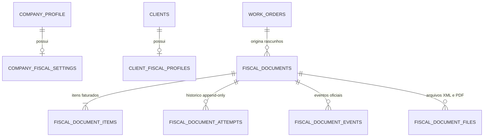
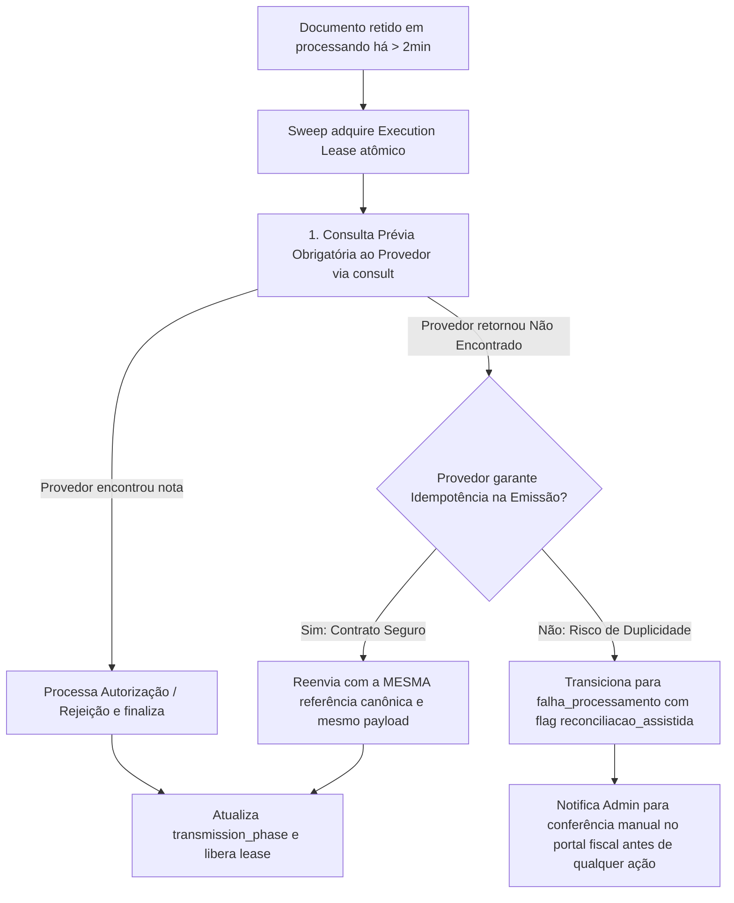

# Plano de Implementação: Emissão de Documentos Fiscais (NF-e / NFS-e) e Armazenamento no Painel Admin

## 1. Contexto e Diagnóstico da Arquitetura Atual

O sistema atual (AD Telas e Redes) é construído com **Nuxt 4.2.2**, **Vue 3.5.26**, **Nitro**, **TypeScript**, **PostgreSQL 17 / Supabase** e **Cloudflare R2** para armazenamento de mídias e propostas comerciais.

### 1.1 Confirmação dos Achados no Código
1. **Governança de Migrações**:
   - As migrações `012_crm_appointments_and_staff_engine.sql` e `013_work_order_terminal_appointment_guard.sql` estão instaladas e validadas em produção (`MIGRATION_012_REEXECUTION=FORBIDDEN`, `MIGRATION_013_REEXECUTION=FORBIDDEN`).
   - A nova migração será estritamente incremental: `supabase/manual/014_fiscal_invoicing_engine.sql`.
   - Limitação declarada: A inspeção via MCP Supabase (`list_tables`) retornou restrição de permissão de chave remota; a referência canônica utilizada é o conjunto de migrações locais `001` a `013`.
2. **Propostas Comerciais vs. Documentos Fiscais**:
   - Os PDFs gerados por `server/utils/proposalOrchestrator.ts` são orçamentos comerciais e termos operacionais, não possuindo validade fiscal ou formato de DANFE/DANFSE.
3. **Classificação Fiscal Ausente nas Entidades Atuais**:
   - `company_profile`: possui apenas dados institucionais e de contato. Não possui Inscrição Estadual (IE), Inscrição Municipal (IM), Regime Tributário (CRT), CNAE principal/secundários, Código IBGE do Município nem parâmetros de integração fiscal.
   - `clients`: possui CPF/CNPJ sem validação de dígitos verificadores e sem suporte ao CNPJ alfanumérico, nem indicação de contribuinte de ICMS ou IE/IM.
   - `work_order_items`: possui apenas dados operacionais (`categoria_operacional`, `quantidade`, `preco_unitario`). Não possui NCM, CEST, CFOP, CST/CSOSN, Código de Serviço LC 116 nem alíquotas tributárias.
4. **Fragilidade na Validação de CPF/CNPJ**:
   - Em `server/shared/crmValidation.mjs`, `normalizeCpfCnpj` executa `doc.replace(/\D/g, '')`, removendo caracteres alfabéticos válidos do novo CNPJ alfanumérico.
   - `isValidCpfCnpj` verifica apenas comprimento (11 ou 14), sem cálculo algorítmico de dígitos verificadores (Módulo 11).

---

## 2. Definições Externas, Normas e Neutralidade Fiscal

### 2.1 O Que Depende Estritamente de Definição do Usuário / Contador
> [!IMPORTANT]
> **Neutralidade Fiscal Estrita**: O sistema NÃO presumirá códigos fiscais (CFOP, CST, NCM, CNAE ou Código de Serviço) como regras fixas ou padrões embutidos no código. Não haverá divisão arbitrária pré-estabelecida entre material e instalação. Todos os enquadramentos fiscais deverão ser configurados e validados pelo usuário e sua contabilidade.

Itens que dependem de definição externa:
1. **Tipo de Documento e Regra de Faturamento**:
   - Definição se a operação emite **NFS-e** (serviços), **NF-e** (fornecimento/venda de mercadorias), ou ambas de forma segregada.
   - Critério aprovado pelo contador para determinar quais itens da OS configuram prestação de serviço e quais configuram fornecimento de material.
2. **Parâmetros Cadastrais e Fiscais da Empresa**:
   - Município e UF de domicílio fiscal e Código IBGE oficial;
   - Inscrição Municipal (CCM) e Inscrição Estadual (se contribuinte do ICMS);
   - Regime Tributário: **Sem valor padrão assumido** — deve ser expressamente selecionado (Simples Nacional, MEI, Lucro Presumido ou Lucro Real);
   - CNAE Principal e CNAEs Secundários aprovados pelo contador;
   - Códigos fiscais informados pela contabilidade para cada categoria de item: Código de Serviço LC 116/2003, Código de Tributação Municipal, alíquotas de ISS (e se há retenção), CFOPs de saída, NCMs, CST/CSOSN aplicáveis.
3. **Parâmetros Fiscais dos Destinatários**:
   - Indicador de Inscrição Estadual: **Sem valor padrão assumido** — o cadastro inicia nulo e deve ser expressamente preenchido como Contribuinte (1), Isento (2) ou Não Contribuinte (9) para viabilizar emissões que o exijam.
4. **Provedor Escolhido e Credenciais**:
   - Definição do provedor fiscal especializado (ex: Focus NFe, PlugNotas/TecnoSpeed, Nuvem Fiscal, eNotas, Webmania);
   - Chave de API / Token privado de integração;
   - Certificado Digital A1 (.pfx/.p12) e respectiva senha (ou gestão centralizada de certificado pelo provedor);
   - Série e numeração sequencial vigente da NF-e e da NFS-e (RPS) para evitar conflitos de numeração já utilizada em emissores anteriores.
5. **Configurações de Hospedagem**:
   - Inclusão das variáveis de ambiente privadas no painel da hospedagem (Vercel / servidor Nitro).

### 2.2 Normas Oficiais Consultadas
- **CNPJ Alfanumérico**: Instrução Normativa RFB nº 2.229/2024. Formato de 14 caracteres (`XX.XXX.XXX/XXXX-XX`), onde as 12 primeiras posições são alfanuméricas `[0-9A-Z]` (convertidas para valor numérico subtraindo 48 do código ASCII) e as 2 últimas posições são dígitos verificadores numéricos calculados pelo Módulo 11 com pesos de 2 a 9 da direita para a esquerda.
- **NF-e / NFC-e**: Manual de Orientação do Contribuinte (MOC) v7.0; Nota Técnica 2024.001; Nota Técnica 2025.002 (Reforma Tributária - campos do grupo `<gIBSCBS>`, `cClassTrib` e novos CSTs).
- **NFS-e**: Padrão Nacional NFS-e (Portal da Gestão NFS-e, DPS, Resolução CGSN nº 169/2022, Lei Complementar nº 116/2003 e Nota Técnica nº 009 RTC / CNPJ Alfanumérico); Padrão Paulistano (São Paulo - Lei Municipal nº 14.042/2005).

---

## 3. Modelo de Dados, Concorrência, Lease Persistente e Imutabilidade (Migração 014)



### 3.1 Estrutura das Tabelas (`014_fiscal_invoicing_engine.sql`)
1. `public.company_fiscal_settings`:
   - Singleton (`id SMALLINT PRIMARY KEY DEFAULT 1 CHECK (id = 1)`);
   - `inscricao_municipal VARCHAR(30) NULL`, `inscricao_estadual VARCHAR(30) NULL`;
   - `regime_tributario VARCHAR(30) NULL CHECK (regime_tributario IS NULL OR regime_tributario IN ('simples_nacional', 'simples_nacional_excesso', 'regime_normal', 'mei'))` (inicia `NULL`, exigindo preenchimento explícito);
   - `cnae_principal VARCHAR(15) NULL`, `cnaes_secundarios TEXT[] NULL`;
   - `codigo_municipio_ibge VARCHAR(7) NULL`;
   - `ambiente_padrao VARCHAR(20) NOT NULL DEFAULT 'homologacao' CHECK (ambiente_padrao IN ('homologacao', 'producao'))`;
   - `provedor_ativo VARCHAR(50) NOT NULL DEFAULT 'mock_sandbox'`;
   - `nfe_serie VARCHAR(10) NULL`, `nfe_proximo_numero INT NULL`;
   - `nfse_serie VARCHAR(10) NULL`, `nfse_proximo_numero INT NULL`;
   - Timestamps e `updated_by` vinculado a `auth.users(id)`.
   - **Zero Segredos**: Chaves de API e senhas NÃO constam no banco.

2. `public.client_fiscal_profiles`:
   - Vínculo 1:1 com `clients` (`client_id UUID PRIMARY KEY REFERENCES public.clients(id) ON DELETE CASCADE`);
   - `indicador_ie VARCHAR(5) NULL CHECK (indicador_ie IS NULL OR indicador_ie IN ('1', '2', '9'))` (inicia `NULL`, exigindo preenchimento explícito);
   - `inscricao_estadual VARCHAR(30) NULL`, `inscricao_municipal VARCHAR(30) NULL`;
   - `email_fiscal VARCHAR(255) NULL`;
   - `codigo_municipio_ibge VARCHAR(7) NULL`.

3. `public.fiscal_document_templates`:
   - Catálogo de predefinições fiscais cadastradas pela contabilidade:
   - `id UUID PRIMARY KEY DEFAULT gen_random_uuid()`;
   - `codigo VARCHAR(50) NOT NULL UNIQUE`, `descricao VARCHAR(255) NOT NULL`;
   - `tipo_documento VARCHAR(10) NOT NULL CHECK (tipo_documento IN ('nfe', 'nfse'))`;
   - `tipo_item VARCHAR(20) NOT NULL CHECK (tipo_item IN ('servico', 'mercadoria'))`;
   - `cfop VARCHAR(10) NULL`, `ncm VARCHAR(15) NULL`, `cest VARCHAR(15) NULL`;
   - `cst_icms VARCHAR(10) NULL`, `csosn VARCHAR(10) NULL`;
   - `codigo_servico_lc116 VARCHAR(20) NULL`, `codigo_tributacao_municipio VARCHAR(30) NULL`;
   - `aliquota_iss_padrao NUMERIC(5,2) NULL`, `cClassTrib VARCHAR(20) NULL`;
   - `is_active BOOLEAN NOT NULL DEFAULT true`.

4. `public.fiscal_documents`:
   - `id UUID PRIMARY KEY DEFAULT gen_random_uuid()`;
   - `work_order_id UUID NOT NULL REFERENCES public.work_orders(id) ON DELETE RESTRICT`;
   - `client_id UUID NOT NULL REFERENCES public.clients(id) ON DELETE RESTRICT`;
   - `address_id UUID NULL REFERENCES public.client_addresses(id) ON DELETE RESTRICT`;
   - `numero_documento VARCHAR(30) NULL`, `serie VARCHAR(10) NULL`;
   - `tipo_documento VARCHAR(10) NOT NULL CHECK (tipo_documento IN ('nfe', 'nfse'))`;
   - `ambiente VARCHAR(20) NOT NULL CHECK (ambiente IN ('homologacao', 'producao'))`;
   - `is_simulated BOOLEAN NOT NULL DEFAULT false`;
   - `status VARCHAR(25) NOT NULL DEFAULT 'rascunho' CHECK (status IN ('rascunho', 'processando', 'autorizado', 'rejeitado', 'cancelado', 'falha_processamento'))`;
   - `transmission_phase VARCHAR(30) NOT NULL DEFAULT 'draft' CHECK (transmission_phase IN ('draft', 'locked_pre_send', 'dispatched_awaiting_response', 'completed'))`;
   - `storage_pending BOOLEAN NOT NULL DEFAULT false`;
   - `locked_by_executor VARCHAR(100) NULL`;
   - `locked_until TIMESTAMPTZ NULL`;
   - `last_attempt_at TIMESTAMPTZ NULL`;
   - `next_retry_at TIMESTAMPTZ NULL`;
   - `provider VARCHAR(50) NOT NULL`;
   - `provider_reference VARCHAR(100) NULL`;
   - `idempotency_key VARCHAR(120) NOT NULL UNIQUE`;
   - `chave_acesso VARCHAR(44) NULL`, `numero_protocolo VARCHAR(60) NULL`;
   - `data_autorizacao TIMESTAMPTZ NULL`;
   - `codigo_status VARCHAR(20) NULL`, `motivo_status TEXT NULL`;
   - `valor_total NUMERIC(12,2) NOT NULL DEFAULT 0.00 CHECK (valor_total >= 0)`;
   - `valor_servicos NUMERIC(12,2) NOT NULL DEFAULT 0.00 CHECK (valor_servicos >= 0)`;
   - `valor_produtos NUMERIC(12,2) NOT NULL DEFAULT 0.00 CHECK (valor_produtos >= 0)`;
   - `valor_desconto NUMERIC(12,2) NOT NULL DEFAULT 0.00 CHECK (valor_desconto >= 0)`;
   - `valor_liquido NUMERIC(12,2) NOT NULL DEFAULT 0.00 CHECK (valor_liquido >= 0)`;
   - `valor_iss NUMERIC(12,2) NOT NULL DEFAULT 0.00`, `valor_icms NUMERIC(12,2) NOT NULL DEFAULT 0.00`;
   - `valor_pis NUMERIC(12,2) NOT NULL DEFAULT 0.00`, `valor_cofins NUMERIC(12,2) NOT NULL DEFAULT 0.00`;
   - `valor_ibs NUMERIC(12,2) NOT NULL DEFAULT 0.00`, `valor_cbs NUMERIC(12,2) NOT NULL DEFAULT 0.00`;
   - `valor_retencoes NUMERIC(12,2) NOT NULL DEFAULT 0.00`;
   - `snapshot_emitente JSONB NOT NULL DEFAULT '{}'::jsonb`;
   - `snapshot_destinatario JSONB NOT NULL DEFAULT '{}'::jsonb`;
   - `snapshot_endereco JSONB NOT NULL DEFAULT '{}'::jsonb`;
   - `snapshot_itens JSONB NOT NULL DEFAULT '[]'::jsonb`;
   - `created_by UUID NULL REFERENCES auth.users(id) ON DELETE SET NULL`;
   - `updated_by UUID NULL REFERENCES auth.users(id) ON DELETE SET NULL`;
   - `created_at TIMESTAMPTZ NOT NULL DEFAULT now()`, `updated_at TIMESTAMPTZ NOT NULL DEFAULT now()`.

5. `public.fiscal_document_items`:
   - `id UUID PRIMARY KEY DEFAULT gen_random_uuid()`;
   - `fiscal_document_id UUID NOT NULL REFERENCES public.fiscal_documents(id) ON DELETE CASCADE`;
   - `work_order_item_id UUID NOT NULL REFERENCES public.work_order_items(id) ON DELETE RESTRICT`;
   - `descricao VARCHAR(255) NOT NULL`;
   - `quantidade NUMERIC(10,3) NOT NULL CHECK (quantidade > 0)`;
   - `valor_unitario NUMERIC(10,2) NOT NULL CHECK (valor_unitario >= 0)`;
   - `valor_total NUMERIC(12,2) NOT NULL CHECK (valor_total >= 0)`;
   - `valor_desconto NUMERIC(12,2) NOT NULL DEFAULT 0.00 CHECK (valor_desconto >= 0)`;
   - `valor_liquido NUMERIC(12,2) NOT NULL CHECK (valor_liquido >= 0)`;
   - `tipo_item VARCHAR(20) NOT NULL CHECK (tipo_item IN ('servico', 'mercadoria'))`;
   - `ncm VARCHAR(15) NULL`, `cest VARCHAR(15) NULL`, `cfop VARCHAR(10) NULL`;
   - `cst_icms VARCHAR(10) NULL`, `csosn VARCHAR(10) NULL`;
   - `codigo_servico_lc116 VARCHAR(20) NULL`, `codigo_tributacao_municipio VARCHAR(30) NULL`;
   - `aliquota_iss NUMERIC(5,2) NULL`, `iss_retido BOOLEAN NOT NULL DEFAULT false`;
   - `cClassTrib VARCHAR(20) NULL`, `aliquota_ibs NUMERIC(5,2) NULL`, `aliquota_cbs NUMERIC(5,2) NULL`.

6. `public.fiscal_document_attempts`:
   - Log append-only de tentativas de comunicação:
   - `id UUID PRIMARY KEY DEFAULT gen_random_uuid()`;
   - `fiscal_document_id UUID NOT NULL REFERENCES public.fiscal_documents(id) ON DELETE RESTRICT`;
   - `attempt_number INT NOT NULL`;
   - `transmission_phase VARCHAR(30) NOT NULL`;
   - `request_payload JSONB NULL`, `response_payload JSONB NULL`;
   - `http_status INT NULL`, `duration_ms INT NULL`;
   - `status_result VARCHAR(30) NOT NULL`;
   - `error_code VARCHAR(50) NULL`, `error_message TEXT NULL`;
   - `created_at TIMESTAMPTZ NOT NULL DEFAULT now()`;
   - `actor_id UUID NULL REFERENCES auth.users(id) ON DELETE SET NULL`.

7. `public.fiscal_document_events`:
   - Eventos fiscais oficiais e histórico auditável (`id`, `fiscal_document_id`, `tipo_evento`, `protocolo`, `descricao`, `xml_evento_storage_key`, `created_at`, `actor_id`).

8. `public.fiscal_document_files`:
   - Metadados dos artefatos físicos no R2 (`id`, `fiscal_document_id`, `tipo_arquivo` CHECK in ('xml_autorizado', 'xml_cancelamento', 'danfe_pdf', 'danfse_pdf'), `storage_key`, `sha256`, `size_bytes`, `content_type`, `uploaded_at`).

---

### 3.2 Regras de Saldo da OS: Rascunho vs. Emissão Transmitida
> [!IMPORTANT]
> **Definição Estrita do Ciclo de Saldo**:
> - **Rascunho (`status = 'rascunho'`)**: **Apenas confere** se há saldo disponível na OS no momento da montagem/edição. Rascunhos **não reservam saldo** e não impedem outros rascunhos de serem elaborados.
> - **Início da Transmissão (`transmit`)**: É o **momento exato da reserva atômica exclusiva**. Ao transicionar de `rascunho` para `processando`, adquire-se bloqueio exclusivo de linha (`SELECT ... FOR UPDATE` ordenado) em todos os itens da OS afetados e grava-se a reserva.
> - **Estados que Mantêm a Reserva de Saldo Ativa**:
>   $$\text{StatusComprometidos} = \{\text{'processando'}, \text{'autorizado'}, \text{'falha\_processamento'}\}$$
> - O estado `falha_processamento` **continua consumindo o saldo** até que haja resolução definitiva (confirmação formal de rejeição ou evento oficial de cancelamento).
> - Notas em `homologacao` ou `is_simulated = true` são restritas ao ambiente de testes e **não consomem o saldo de produção da OS**.

```sql
-- Executado atomicamente dentro da RPC de transição para 'processando':
SELECT id, quantidade 
FROM public.work_order_items
WHERE id = ANY(v_item_ids)
ORDER BY id ASC
FOR UPDATE;

SELECT COALESCE(SUM(fdi.quantidade), 0)
INTO v_qtd_comprometida
FROM public.fiscal_document_items fdi
JOIN public.fiscal_documents fd ON fd.id = fdi.fiscal_document_id
WHERE fdi.work_order_item_id = r_item.id
  AND fd.ambiente = v_target_ambiente
  AND fd.is_simulated = v_is_simulated
  AND fd.status IN ('processando', 'autorizado', 'falha_processamento')
  AND fd.id <> v_current_doc_id;

IF (v_qtd_comprometida + v_requested_qtd) > r_item.quantidade THEN
    RAISE EXCEPTION 'ERR_ITEM_BALANCE_EXCEEDED: Item % ultrapassa saldo disponível na OS (Solicitado: %, Disponível: %)',
        r_item.id, v_requested_qtd, (r_item.quantidade - v_qtd_comprometida);
END IF;
```

---

### 3.3 Coordenação de Executores via Lease Persistente e Fencing Token (Compatível com PostgREST/Supabase)
> [!IMPORTANT]
> **Substituição de Advisory Lock por Lease Persistente com Fencing Token (`lease_token`)**:
> Devido ao uso de connection pooling HTTP (PostgREST/PgBouncer em transaction mode), bloqueios dependentes de sessão (`pg_try_advisory_lock`) não oferecem garantias entre chamadas web sem conexão dedicada persistente. Emprega-se uma **reserva persistente de execução por documento (Execution Lease)** via colunas `locked_by_executor`, `locked_until` e `lease_token` (UUID) com aquisição atômica por RPC:

1. **Segurança Rigorosa das Funções SQL**:
   - Todas as RPCs privilegiadas utilizam impreterivelmente `SECURITY DEFINER SET search_path = ''`.
   - Todas as tabelas e tipos são qualificados explicitamente com o schema (`public.*`).
   - Todos os acessos são revogados explicitamente de `PUBLIC`, `anon` e `authenticated`, e concedidos exclusivamente a `service_role`.
   - O parâmetro de duração do lease (`p_lease_seconds`) é estritamente limitado pelo banco: `v_lease_secs := LEAST(600, GREATEST(10, COALESCE(p_lease_seconds, 180)));`.
2. **Fencing Token (`lease_token` UUID) Contra Executores Vencidos**:
   - Cada aquisição de lease gera um novo token criptográfico (`gen_random_uuid()`).
   - Operações de renovação (`renew_fiscal_execution_lease`), liberação (`release_fiscal_execution_lease`) e conclusão (`complete_fiscal_emission_atomic`) exigem e conferem o `p_lease_token` vigente.
   - **Garantia Anti-Zombie**: Se o lease de um executor A expirar e um executor B assumir (gerando um novo `lease_token`), qualquer resposta tardia de A que tente renovar, liberar ou sobrescrever o status é sumariamente rejeitada pelo banco (`ERR_LEASE_LOST_OR_EXPIRED`), impedindo interferência mútua e corrupção de resultados.
3. **Aquisição Atômica do Lease (`acquire_fiscal_execution_lease`)**:
   ```sql
   CREATE OR REPLACE FUNCTION public.acquire_fiscal_execution_lease(
       p_document_id UUID,
       p_executor_id VARCHAR(100),
       p_lease_seconds INT DEFAULT 180
   ) RETURNS JSONB AS $$
   DECLARE
       v_updated INT;
       v_lease_secs INT;
       v_lease_token UUID;
   BEGIN
       v_lease_secs := LEAST(600, GREATEST(10, COALESCE(p_lease_seconds, 180)));
       v_lease_token := gen_random_uuid();

       UPDATE public.fiscal_documents
       SET locked_by_executor = p_executor_id,
           locked_until = now() + (v_lease_secs || ' seconds')::interval,
           lease_token = v_lease_token,
           updated_at = now()
       WHERE id = p_document_id
         AND status IN ('rascunho', 'processando', 'rejeitado', 'falha_processamento')
         AND (locked_until IS NULL OR locked_until < now() OR locked_by_executor = p_executor_id);
       
       GET DIAGNOSTICS v_updated = ROW_COUNT;
       IF v_updated > 0 THEN
           RETURN jsonb_build_object('acquired', true, 'lease_token', v_lease_token, 'locked_until', now() + (v_lease_secs || ' seconds')::interval);
       ELSE
           RETURN jsonb_build_object('acquired', false);
       END IF;
   END;
   $$ LANGUAGE plpgsql SECURITY DEFINER SET search_path = '';
   ```
4. **Coordenação Entre Manual e Automático**:
   - Tanto o clique manual do administrador (`manual:<actor_id>:<request_uuid>`) quanto o executor de varredura periódica (`sweep:<worker_uuid>`) adquirem o lease e utilizam o `lease_token` retornado. Se `acquired = false`, a requisição é rejeitada (`409 Conflict: Documento já em processamento por outro executor`).

---

### 3.4 Proteção Integral do Histórico e Imutabilidade em Banco
> [!IMPORTANT]
> **Imutabilidade Completa (Cabeçalho, Snapshots, Valores e Itens)**: Triggers no PostgreSQL com `SECURITY DEFINER SET search_path = ''` protegem tanto o documento quanto seus itens contra mutações indevidas desde o início da transmissão (`processando`), passando por `falha_processamento`, até os estados finais `autorizado` e `cancelado`:

1. **Blindagem de Itens Fiscais (`trg_protect_fiscal_items`)**:
   - `BEFORE INSERT OR UPDATE OR DELETE ON public.fiscal_document_items`:
     - Se o documento pai possui `status IN ('processando', 'falha_processamento', 'autorizado', 'cancelado')`:
       - Operação é terminantemente bloqueada (`RAISE EXCEPTION 'ERR_FISCAL_ITEMS_LOCKED'`).
     - Os itens são editáveis **estritamente quando o documento estiver em `rascunho` ou `rejeitado`**.
2. **Blindagem do Cabeçalho Fiscal e Snapshots (`trg_protect_fiscal_documents`)**:
   - `BEFORE DELETE ON public.fiscal_documents`:
     - Se `OLD.status IN ('processando', 'falha_processamento', 'autorizado', 'cancelado')`:
       - `DELETE` é terminantemente bloqueado (`RAISE EXCEPTION 'ERR_DOCUMENT_DELETE_FORBIDDEN'`).
   - `BEFORE UPDATE ON public.fiscal_documents`:
     - **Congelamento Imediato no Início da Transmissão**: Se `OLD.status IN ('processando', 'falha_processamento', 'autorizado', 'cancelado')`, é expressamente proibida qualquer alteração em:
       - Valores financeiros: `valor_total`, `valor_servicos`, `valor_produtos`, `valor_desconto`, `valor_liquido`, `valor_iss`, `valor_icms`, `valor_pis`, `valor_cofins`, `valor_ibs`, `valor_cbs`, `valor_retencoes`;
       - Snapshots tributários e cadastrais: `snapshot_emitente`, `snapshot_destinatario`, `snapshot_endereco`, `snapshot_itens`;
       - Vínculos e referências canônicas: `work_order_id`, `client_id`, `address_id`, `provider`, `tipo_documento`, `ambiente`, `is_simulated`, `idempotency_key`.
     - **Blindagem Adicional de Documento Emitido**: Se `OLD.status IN ('autorizado', 'cancelado')`:
       - Proibida alteração de: `numero_documento`, `serie`, `chave_acesso`, `numero_protocolo`, `data_autorizacao`.
       - Apenas permite transição de `autorizado` -> `cancelado`. Se `OLD.status = 'cancelado'`, o documento é estritamente terminal.
     - **Campos Operacionais Permitidos**: Apenas `status`, `transmission_phase`, `storage_pending`, `locked_by_executor`, `locked_until`, `lease_token`, `last_attempt_at`, `next_retry_at`, `updated_at`, `updated_by`.
3. **Tentativas Append-Only**:
   - Trigger em `public.fiscal_document_attempts` bloqueando `UPDATE` e `DELETE` (`ERR_ATTEMPTS_HISTORY_IS_APPEND_ONLY`).

---

## 4. Política de Credenciais e Segurança

### 4.1 Armazenamento Protegido e Restrito de Segredos
1. **Zero Credenciais no Banco de Dados ou Navegador**:
   - Chaves de API, senhas de certificado e tokens privados pertencem estritamente às variáveis de ambiente privadas do servidor Nitro (`runtimeConfig.fiscal...`).
2. **Variáveis de Ambiente Privadas no Servidor**:
   - `FISCAL_PROVIDER` (ex: `mock_sandbox`, `focusnfe`, `plugnotas`, `nuvemfiscal`);
   - `FISCAL_API_TOKEN` (chave privada do provedor);
   - `FISCAL_ENVIRONMENT` (`homologacao` ou `producao`);
   - `FISCAL_WEBHOOK_AUTH_TYPE` (método suportado pelo provedor: `header_token`, `bearer`, `basic_auth` ou `signature`);
   - `FISCAL_WEBHOOK_AUTH_SECRET` (segredo correspondente);
   - `R2_FISCAL_BUCKET_NAME` (bucket R2 privado).
3. **Interface de Configurações Apenas Informativa**:
   - A tela administrativa exibe apenas badges informativos de status ("Configurado / Não configurado") em modo somente-leitura, sem campos de input para senhas na V1.

---

## 5. Processamento Durável e Resolução de Lacunas de Transmissão

### 5.1 Adaptador Agnóstico de Provedor (`FiscalProviderAdapter`)
```typescript
export interface FiscalProviderAdapter {
  readonly name: string
  readonly supportsIdempotentRetransmit: boolean
  isConfigured(environment: 'homologacao' | 'producao'): boolean
  validatePreconditions(doc: FiscalDocument, items: FiscalDocumentItem[], emitter: CompanyFiscalSettings, recipient: ClientFiscalProfile): FiscalValidationResult
  transmit(doc: FiscalDocument, items: FiscalDocumentItem[], emitter: CompanyFiscalSettings, recipient: ClientFiscalProfile, attemptRef: string): Promise<FiscalTransmissionResult>
  consult(doc: FiscalDocument, attemptRef: string): Promise<FiscalTransmissionResult>
  cancel(doc: FiscalDocument, reason: string): Promise<FiscalCancellationResult>
  fetchFiles(doc: FiscalDocument, attemptRef: string): Promise<{ xmlBuffer?: Buffer; pdfBuffer?: Buffer }>
  verifyWebhookAuthentication(event: H3Event, rawBody: string, headers: Record<string, string>): boolean
  processWebhook(payload: any): Promise<FiscalWebhookResult>
}
```

### 5.2 Recuperação da Lacuna entre Registro e Envio HTTP
Em caso de crash do servidor após registrar `locked_pre_send` ou `dispatched_awaiting_response`:



1. **Consulta Prévia Obrigatória**: O executor NUNCA assume que o documento não foi transmitido sem antes consultar o provedor usando a chave de idempotência (`provider_reference` / `idempotency_key`).
2. **Tratamento de "Não Encontrado"**:
   - Se o provedor responder que o documento não existe naquela referência:
     - Se o adaptador reportar `supportsIdempotentRetransmit = true` (garantia contratual de que a mesma chave não gera nota duplicada): reexecuta o envio de forma segura com o mesmo payload canônico.
     - Se o provedor NÃO oferecer essa garantia: transiciona a nota para `falha_processamento` com indicação de **reconciliação assistida**, exigindo que o administrador confirme no portal fiscal do provedor antes de liberar ou tentar nova emissão.

---

## 6. Armazenamento, Integridade e Recuperação de XML/PDF (Cloudflare R2)

1. **Estrutura de Chaves no R2 Privado**:
   - `fiscal/{ambiente}/{tipo_documento}/{document_id}/autorizado.xml`
   - `fiscal/{ambiente}/{tipo_documento}/{document_id}/danfe.pdf`
2. **Separação de Estado Fiscal e Armazenamento**:
   - Status fiscal `autorizado` mantido mesmo se o upload R2 falhar, marcando `storage_pending = true`.
   - Endpoint `POST /api/admin/crm/fiscal/[id]/sync-files` recupera os arquivos no provedor sem reemitir a nota.
3. **Downloads Seguros**:
   - Bucket estritamente privado;
   - `GET /api/admin/crm/fiscal/[id]/download?fileType=xml|pdf` exige `requireActiveAdmin` e emite URL assinada temporária (300s).

---

## 7. Experiência do Usuário no Painel Administrativo

### 7.1 Navegação e Listagem Geral
- Item **"Fiscal"** no menu lateral (`app/layouts/admin.vue`), touch target $\ge 44\times 44\text{px}$.
- Listagem geral (`/admin/fiscal/index.vue`) com filtros completos, paginação e identificador claro do ambiente (**HOMOLOGAÇÃO** vs **PRODUÇÃO**).

### 7.2 Seção Fiscal na Ordem de Serviço (`WorkOrderFiscalSection.vue`)
- Aba Fiscal integrada à OS exibindo:
  - Saldo disponível para faturamento vs. quantidades reservadas/faturadas;
  - Histórico de notas fiscais vinculadas;
  - Ação de criação de novo rascunho.

### 7.3 Detalhes, Pendências e Acompanhamento (`/admin/fiscal/[id].vue`)
- Validação visual de pendências impeditivas antes do envio;
- Totais calculados rigorosamente no servidor;
- Transmissão com bloqueio de duplo clique;
- Exibição de motivos de rejeição com possibilidade de reabrir rascunho;
- Histórico auditável de tentativas e eventos oficiais;
- Botão "Consultar Status / Reconciliar" para conferência manual instantânea.

---

## 8. Arquitetura de Código e Limites Estritos

- **Lógica** (endpoints, serviços, validadores, adaptadores): **até 200 linhas**;
- **UI e componentes**: **até 500 linhas**;
- Touch targets $\ge 44\times 44\text{px}$;
- Zero scroll horizontal.

---

## 9. Lista de Arquivos a Implementar

### Banco de Dados & Validação
- `[NEW]` [supabase/manual/014_fiscal_invoicing_engine.sql](file:///d:/sicons/adt/supabase/manual/014_fiscal_invoicing_engine.sql): Schema, RLS, triggers de imutabilidade, triggers de bloqueio de itens e RPCs de reserva exclusiva e lease.
- `[MODIFY]` [server/shared/crmValidation.mjs](file:///d:/sicons/adt/server/shared/crmValidation.mjs): Validação algorítmica de CPF e CNPJ alfanumérico (RFB IN 2.229/2024).
- `[NEW]` [server/shared/fiscalValidation.mjs](file:///d:/sicons/adt/server/shared/fiscalValidation.mjs): Validações de pré-requisitos, precisão decimal e regras de integridade fiscal.

### Core Backend & Adaptadores
- `[NEW]` [server/services/fiscal/types.ts](file:///d:/sicons/adt/server/services/fiscal/types.ts): Contratos TypeScript do domínio e adaptadores.
- `[NEW]` [server/services/fiscal/adapters/mockAdapter.ts](file:///d:/sicons/adt/server/services/fiscal/adapters/mockAdapter.ts): Adaptador de simulação em sandbox isolado.
- `[NEW]` [server/services/fiscal/adapters/standardHttpAdapter.ts](file:///d:/sicons/adt/server/services/fiscal/adapters/standardHttpAdapter.ts): Adaptador HTTP agnóstico com suporte à idempotência documentada.
- `[NEW]` [server/services/fiscal/adapterRegistry.ts](file:///d:/sicons/adt/server/services/fiscal/adapterRegistry.ts): Fábrica de adaptadores baseada nas variáveis de ambiente.
- `[NEW]` [server/services/fiscal/fiscalOrchestrator.ts](file:///d:/sicons/adt/server/services/fiscal/fiscalOrchestrator.ts): Orquestrador de rascunhos, emissão, aquisição de lease e auditoria.
- `[NEW]` [server/services/fiscal/fiscalStorage.ts](file:///d:/sicons/adt/server/services/fiscal/fiscalStorage.ts): Gestão de R2 privado, integridade SHA-256 e URLs assinadas.

### Endpoints Nitro BFF (`server/api/admin/crm/fiscal/`)
- `[NEW]` [server/api/admin/crm/fiscal/index.get.ts](file:///d:/sicons/adt/server/api/admin/crm/fiscal/index.get.ts): Listagem paginada com filtros.
- `[NEW]` [server/api/admin/crm/fiscal/draft.post.ts](file:///d:/sicons/adt/server/api/admin/crm/fiscal/draft.post.ts): Criação/conferência de rascunho.
- `[NEW]` [server/api/admin/crm/fiscal/[id]/index.get.ts](file:///d:/sicons/adt/server/api/admin/crm/fiscal/[id]/index.get.ts): Detalhes, itens e pendências.
- `[NEW]` [server/api/admin/crm/fiscal/[id]/index.patch.ts](file:///d:/sicons/adt/server/api/admin/crm/fiscal/[id]/index.patch.ts): Edição de rascunho fiscal.
- `[NEW]` [server/api/admin/crm/fiscal/[id]/transmit.post.ts](file:///d:/sicons/adt/server/api/admin/crm/fiscal/[id]/transmit.post.ts): Transmissão com reserva atômica de saldo e lease persistente.
- `[NEW]` [server/api/admin/crm/fiscal/[id]/consult.post.ts](file:///d:/sicons/adt/server/api/admin/crm/fiscal/[id]/consult.post.ts): Consulta de status no provedor.
- `[NEW]` [server/api/admin/crm/fiscal/[id]/reconcile.post.ts](file:///d:/sicons/adt/server/api/admin/crm/fiscal/[id]/reconcile.post.ts): Reconciliação manual assistida pelo admin.
- `[NEW]` [server/api/admin/crm/fiscal/[id]/sync-files.post.ts](file:///d:/sicons/adt/server/api/admin/crm/fiscal/[id]/sync-files.post.ts): Recuperação de arquivos com `storage_pending = true`.
- `[NEW]` [server/api/admin/crm/fiscal/[id]/download.get.ts](file:///d:/sicons/adt/server/api/admin/crm/fiscal/[id]/download.get.ts): Download autenticado via URL assinada.
- `[NEW]` [server/api/admin/crm/fiscal/jobs/sweep-pending.post.ts](file:///d:/sicons/adt/server/api/admin/crm/fiscal/jobs/sweep-pending.post.ts): Job de varredura com aquisição atômica de lease por nota.
- `[NEW]` [server/api/webhooks/fiscal/[provider].post.ts](file:///d:/sicons/adt/server/api/webhooks/fiscal/[provider].post.ts): Webhook assíncrono com autenticação adaptável.
- `[NEW]` [server/api/admin/configuracoes/empresa/fiscal.get.ts](file:///d:/sicons/adt/server/api/admin/configuracoes/empresa/fiscal.get.ts): Leitura de configurações cadastrais.
- `[NEW]` [server/api/admin/configuracoes/empresa/fiscal.patch.ts](file:///d:/sicons/adt/server/api/admin/configuracoes/empresa/fiscal.patch.ts): Atualização de dados fiscais da empresa.

### Interface Administrativa
- `[MODIFY]` [app/layouts/admin.vue](file:///d:/sicons/adt/app/layouts/admin.vue): Link "Fiscal" na navegação.
- `[NEW]` [app/pages/admin/fiscal/index.vue](file:///d:/sicons/adt/app/pages/admin/fiscal/index.vue): Página de listagem fiscal.
- `[NEW]` [app/pages/admin/fiscal/[id].vue](file:///d:/sicons/adt/app/pages/admin/fiscal/[id].vue): Página de conferência e transmissão.
- `[NEW]` [app/components/admin/work-orders/WorkOrderFiscalSection.vue](file:///d:/sicons/adt/app/components/admin/work-orders/WorkOrderFiscalSection.vue): Seção fiscal na OS.
- `[NEW]` [app/components/admin/fiscal/FiscalDocumentDraftModal.vue](file:///d:/sicons/adt/app/components/admin/fiscal/FiscalDocumentDraftModal.vue): Modal de seleção de itens e rascunho.
- `[NEW]` [app/components/admin/company/CompanyFiscalSettingsTab.vue](file:///d:/sicons/adt/app/components/admin/company/CompanyFiscalSettingsTab.vue): Aba informativa de configurações fiscais.
- `[MODIFY]` [app/pages/admin/ordens-servico/[id].vue](file:///d:/sicons/adt/app/pages/admin/ordens-servico/[id].vue): Aba "Fiscal" na OS.
- `[MODIFY]` [app/pages/admin/configuracoes/empresa.vue](file:///d:/sicons/adt/app/pages/admin/configuracoes/empresa.vue): Aba fiscal na empresa.

### Testes Automatizados
- `[NEW]` [scripts/test_fiscal_engine.mjs](file:///d:/sicons/adt/scripts/test_fiscal_engine.mjs): Testes de CNPJ/CPF, concorrência FOR UPDATE, lease persistente, isolamento de saldo, imutabilidade em banco, timeout e R2.

---

## 10. Matriz Rigorosa de Entregáveis e Distinção de Ambientes

| Funcionalidade / Módulo | Status no Código Atual | Testes Simulados (Sandbox/Mock) | Integração Real em Homologação | Liberação para Produção |
|---|---|---|---|---|
| Validação CPF e CNPJ Alfanumérico (IN 2.229/2024) | **Planejado (Aguardando implementação)** | Planejado (Testes unitários isolados) | Não aplicável (Regra algorítmica) | Planejado |
| Migração 014 (PostgreSQL Schema + RLS + Triggers) | **Planejado (Aguardando implementação)** | Planejado (Validação de schema e integridade) | Pendente aplicação em banco de homologação | Pendente aprovação de produção |
| Reserva Atômica Exclusiva (`FOR UPDATE` ordenado na emissão) | **Planejado (Aguardando implementação)** | Planejado (Teste de concorrência com 2 transações) | Pendente validação de fluxo | Planejado |
| Isolamento de Saldo por Ambiente (Prod vs Homolog) | **Planejado (Aguardando implementação)** | Planejado (Verificação de não-contaminação) | Pendente validação de fluxo | Planejado |
| Imutabilidade de Documentos e Itens em Banco | **Planejado (Aguardando implementação)** | Planejado (Tentativa de mutação barrada por trigger) | Pendente validação de fluxo | Planejado |
| Execution Lease Persistente (Coordenação de Executores) | **Planejado (Aguardando implementação)** | Planejado (Simulação de colisão manual vs sweep) | Pendente validação com PostgREST | Planejado |
| Adaptador de Provedor: Mock / Sandbox | **Planejado (Aguardando implementação)** | Planejado (Simulação controlada de sucesso/rejeição) | Não aplicável (Exclusivo sandbox) | Proibido em produção |
| Adaptador de Provedor: Conector HTTP Real | **Planejado (Aguardando implementação)** | Não aplicável | **Pendente (Requer provedor e credenciais de teste)** | **Pendente (Requer credenciais e cert A1)** |
| Processamento Durável (Sweep de Pendentes & Reconciliação) | **Planejado (Aguardando implementação)** | Planejado (Simulação de timeout e recuperação) | Pendente teste com provedor | Planejado |
| Armazenamento Privado R2 + Download Seguro | **Planejado (Aguardando implementação)** | Planejado (Geração e verificação de SHA-256 e URLs) | Pendente teste integrado | Planejado |
| Recuperação de Arquivos (`storage_pending` / `sync-files`) | **Planejado (Aguardando implementação)** | Planejado (Simulação de falha de upload) | Pendente teste integrado | Planejado |
| Interface: Navegação, Listagem e Seção na OS | **Planejado (Aguardando implementação)** | Planejado (Testes de renderização e acessibilidade) | Pendente testes de usabilidade | Planejado |
| Emissão Fiscal Real perante SEFAZ / Prefeitura | **Não disponível sem credenciais** | Não aplicável | **Bloqueado (Aguardando definições externas)** | **Bloqueado (Aguardando definições externas)** |

---

## 11. Pendências Externas Mapeadas (Aguardando Definição)

1. **Definição do Provedor de Emissão**: Provedor escolhido para contratação/integração.
2. **Definição dos Enquadramentos Contábeis**: Tabela oficial de CNAEs, Códigos de Serviço municipais e alíquotas da empresa fornecida pelo contador.
3. **Certificado Digital A1**: Arquivo (.pfx/.p12) e senha para autenticação na SEFAZ e Prefeitura.
