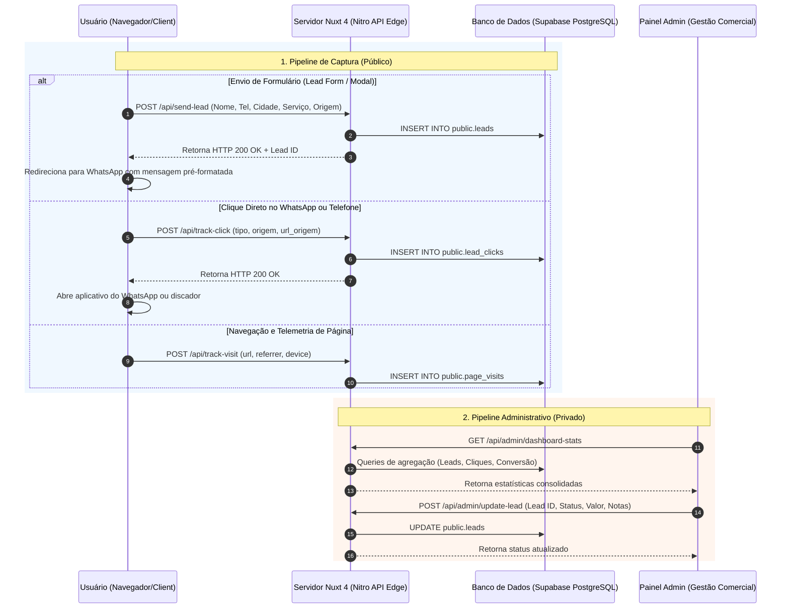
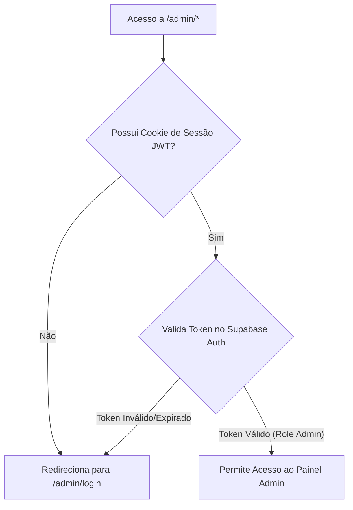

# PRD — PAINEL ADMIN E ARQUITETURA DE CAPTURA DE DADOS (LEADS & TELEMETRIA)

**Projeto:** AD Telas e Redes (`adtelasmosquiteiras.com.br`)  
**Documento:** Product Requirements Document (PRD) — Painel Administrativo & Pipeline de Captura  
**Versão:** 1.0  
**Data:** 2026-08-23  
**Status do Projeto:** `PRODUCTION LIVE` (Autenticação Admin: `DEFERRED_BY_USER`)

---

## 1. Visão Geral e Objetivos do Produto

### 1.1 Contexto e Justificativa
O sistema da **AD Telas e Redes** é uma plataforma web voltada para a comercialização e instalação sob medida de telas mosquiteiras e redes de proteção em São Paulo e Região Metropolitana. Para maximizar a taxa de conversão orgânica e fornecer visibilidade total das operações comerciais, o produto exige uma infraestrutura integrada de:
1. **Captura de Dados Omnichannel:** Registro em tempo real de contatos qualificados (formulários de orçamento), cliques rápidos de intenção (WhatsApp e Telefone) e telemetria de navegação (pageviews e CEPs consultados).
2. **Painel Administrativo (CRM & Dashboard):** Interface centralizada para acompanhamento de KPIs comerciais, gestão de pipeline de leads (status, valores de orçamento e observações), relatórios de origem de tráfego e telemetria operacional.

### 1.2 Objetivos Principais
- **Retenção Zero de Perda de Leads:** Garantir que 100% das tentativas de contato (formulário ou clique direto no WhatsApp) sejam salvas no banco de dados antes que o usuário saia da aplicação.
- **Rastreabilidade de Origem:** Atribuir cada lead e clique à sua URL exata de origem, componente visual (Hero, Sticky Modal, Card de Serviço, Footer) e canal de entrada.
- **Eficiência Operacional:** Prover à equipe comercial uma ferramenta leve para atualizar o status dos orçamentos (Novo ➔ Em Atendimento ➔ Orçado ➔ Fechado ➔ Perdido) e exportar relatórios em CSV.
- **Arquitetura Serverless & Resiliente:** Operar com baixa latência na borda (Vercel Edge / Nitro Server) integrada ao banco de dados relacional Supabase (PostgreSQL com RLS).

---

## 2. Visão Geral da Arquitetura de Dados e Componentes

O ecossistema de captura e gestão é dividido em 3 camadas integradas:



---

## 3. Especificação da Pipeline de Captura de Dados

### 3.1 Captura de Formulários de Lead (`POST /api/send-lead`)
- **Gatilhos de Captura:** Form de Orçamento Rápido (`LeadForm.vue`), Form do Hero Mobile (`MobileHeroOptimized.vue`), Modal Fixo de Orçamento (`StickyFormModal.vue`), formulário da página `/orcamento` e página `/contato`.
- **Payload de Entrada:**
  ```json
  {
    "nome": "João Silva",
    "telefone": "(11) 98765-4321",
    "cidade": "São Paulo",
    "bairro": "Moema",
    "servico": "Rede para Janela",
    "mensagem": "Orçamento para 3 janelas de apartamento",
    "origem": "hero_home",
    "email": "joao@exemplo.com"
  }
  ```
- **Processamento Server-Side (`server/api/send-lead.post.ts`):**
  1. Validação estrita de campos obrigatórios (`nome`, `telefone`, `cidade`).
  2. Sanitização contra injeção de scripts e limpeza de máscara de telefone.
  3. Gravação assíncrona no Supabase via `service_role_key`.
  4. Retorno de status e mensagem de sucesso para a interface.

### 3.2 Captura de Cliques de Conversão (`POST /api/track-click`)
- **Gatilhos de Captura:** Botão flutuante de WhatsApp (`WhatsappIcon.vue`), CTA unificado mobile (`MobileUnifiedCTA.vue`), links de telefone do header/footer e cards de serviço (`ServicesCards.vue`).
- **Payload de Entrada:**
  ```json
  {
    "tipo": "whatsapp",
    "origem": "floating_button_mobile",
    "url_origem": "https://www.adtelasmosquiteiras.com.br/servicos/telas/janelas"
  }
  ```
- **Processamento Server-Side (`server/api/track-click.post.ts`):**
  1. Captura automática dos headers `User-Agent` e IP do solicitante.
  2. Geração de hash unidirecional (SHA-256) do IP para deduplicação sem violar a LGPD.
  3. Inserção na tabela `lead_clicks`.

### 3.3 Rastreamento de Visitas e Telemetria (`POST /api/track-visit` e `/api/track-event`)
- **Gatilhos de Captura:** Navegação do usuário em rotas públicas (SSR e Client-Side) e consultas de CEP na ferramenta geográfica (`/api/cep/[cep]`).
- **Dados Coletados:** Rota acessada, referrer externo, categoria de dispositivo (Mobile, Tablet, Desktop) e cidade identificada no CEP.

---

## 4. Modelagem do Banco de Dados (Supabase PostgreSQL & RLS)

O schema relacional é estruturado em 3 tabelas fundamentais no Supabase com suporte a Row Level Security (RLS).

```sql
-- ============================================
-- 1. TABELA PRINCIPAL DE LEADS (FORMULÁRIOS)
-- ============================================
CREATE TABLE IF NOT EXISTS public.leads (
    id UUID DEFAULT gen_random_uuid() PRIMARY KEY,
    created_at TIMESTAMP WITH TIME ZONE DEFAULT timezone('utc'::text, now()) NOT NULL,
    nome VARCHAR(255) NOT NULL,
    cidade VARCHAR(100) NOT NULL,
    bairro VARCHAR(100),
    servico VARCHAR(100),
    telefone VARCHAR(30),
    email VARCHAR(255),
    mensagem TEXT,
    origem VARCHAR(100) DEFAULT 'formulario_geral',
    status VARCHAR(50) DEFAULT 'Novo', -- Valores: 'Novo', 'Em Atendimento', 'Orçado', 'Fechado', 'Perdido'
    valor_orcamento NUMERIC(10, 2) DEFAULT 0.00,
    observacoes TEXT
);

CREATE INDEX IF NOT EXISTS idx_leads_created_at ON public.leads(created_at DESC);
CREATE INDEX IF NOT EXISTS idx_leads_status ON public.leads(status);
CREATE INDEX IF NOT EXISTS idx_leads_cidade ON public.leads(cidade);

-- RLS para 'leads'
ALTER TABLE public.leads ENABLE ROW LEVEL SECURITY;

CREATE POLICY "Permitir inserções públicas de leads" 
ON public.leads FOR INSERT TO anon WITH CHECK (true);

CREATE POLICY "Permitir leitura apenas de admins autenticados" 
ON public.leads FOR SELECT TO authenticated USING (true);

CREATE POLICY "Permitir atualização apenas de admins autenticados" 
ON public.leads FOR UPDATE TO authenticated USING (true);

-- ============================================
-- 2. TABELA DE CLIQUES DE CONVERSÃO (WHATSAPP/TEL)
-- ============================================
CREATE TABLE IF NOT EXISTS public.lead_clicks (
    id UUID DEFAULT gen_random_uuid() PRIMARY KEY,
    created_at TIMESTAMP WITH TIME ZONE DEFAULT timezone('utc'::text, now()) NOT NULL,
    tipo VARCHAR(50) NOT NULL, -- 'whatsapp', 'telefone', 'ajuda_rapida'
    origem VARCHAR(100) NOT NULL, -- Ex: 'floating_button', 'header_mobile', 'card_janelas'
    url_origem TEXT,
    user_agent TEXT,
    ip_hash VARCHAR(64)
);

CREATE INDEX IF NOT EXISTS idx_clicks_created_at ON public.lead_clicks(created_at DESC);
CREATE INDEX IF NOT EXISTS idx_clicks_tipo ON public.lead_clicks(tipo);

-- RLS para 'lead_clicks'
ALTER TABLE public.lead_clicks ENABLE ROW LEVEL SECURITY;

CREATE POLICY "Permitir inserções públicas de cliques" 
ON public.lead_clicks FOR INSERT TO anon WITH CHECK (true);

CREATE POLICY "Permitir leitura de cliques apenas de admins autenticados" 
ON public.lead_clicks FOR SELECT TO authenticated USING (true);

-- ============================================
-- 3. TABELA DE REGISTRO DE VISITAS DE PÁGINAS
-- ============================================
CREATE TABLE IF NOT EXISTS public.page_visits (
    id UUID DEFAULT gen_random_uuid() PRIMARY KEY,
    created_at TIMESTAMP WITH TIME ZONE DEFAULT timezone('utc'::text, now()) NOT NULL,
    path VARCHAR(255) NOT NULL,
    referrer TEXT,
    user_agent TEXT,
    device_type VARCHAR(20) DEFAULT 'desktop' -- 'mobile', 'tablet', 'desktop'
);

CREATE INDEX IF NOT EXISTS idx_visits_created_at ON public.page_visits(created_at DESC);
CREATE INDEX IF NOT EXISTS idx_visits_path ON public.page_visits(path);

-- RLS para 'page_visits'
ALTER TABLE public.page_visits ENABLE ROW LEVEL SECURITY;

CREATE POLICY "Permitir inserções públicas de visitas" 
ON public.page_visits FOR INSERT TO anon WITH CHECK (true);

CREATE POLICY "Permitir leitura de visitas apenas de admins autenticados" 
ON public.page_visits FOR SELECT TO authenticated USING (true);
```

---

## 5. Especificação do Painel Administrativo (UI/UX)

A interface administrativa é construída em Vue 3 / Nuxt 4 sob o layout responsivo isolado `layouts/admin.vue`.

### 5.1 Visão 1: Dashboard Geral (`/admin/dashboard`)
- **Cartões de KPI no Topo:**
  1. **Total de Leads Capturados:** Total absoluto + variação percentual dos últimos 7 dias.
  2. **Cliques de WhatsApp/Telefone:** Total de intenções registradas via `lead_clicks`.
  3. **Taxa de Conversão Estima:** Razão de Leads Fechados / Total de Leads.
  4. **Faturamento Estimado:** Soma acumulada do campo `valor_orcamento` de leads com status `Fechado`.
- **Gráfico de Evolução Temporal:** Visualização diária de novos leads e cliques nos últimos 30 dias.
- **Distribuição por Origem (Pie Chart):** Gráfico mostrando proporção de contatos vindos de cada componente (`hero_home`, `modal_servico`, `card_janelas`, etc.).
- **Tabela de Atividade Recente:** Lista dos últimos 10 leads recebidos em tempo real com badge de status colorido.

### 5.2 Visão 2: Gestão Completa de Leads / CRM (`/admin/leads`)
- **Filtros e Busca Avançada:**
  - Busca por texto livre (nome, telefone, cidade, bairro, mensagem).
  - Filtro por Status (`Novo`, `Em Atendimento`, `Orçado`, `Fechado`, `Perdido`).
  - Filtro por Serviço (`Telas`, `Redes`, `Vidraçaria`).
  - Ordenação por Data de Criação ou Valor de Orçamento.
- **Modal de Detalhes e Edição de Lead:**
  - Exibição de todos os dados capturados (incluindo IP Hash e URL exata de origem).
  - Campo editável de Status do Atendimento.
  - Campo monetário `valor_orcamento` (R$).
  - Campo de texto para Observações Internas da equipe comercial.
- **Ações Rápidas:**
  - Botão *"Iniciar conversa no WhatsApp"*: abre o WhatsApp Web/App preenchendo o número do cliente.
  - Botão *"Exportar para CSV"*: download imediato do dataset filtrado para relatórios em Excel.

---

## 6. Endpoints de API Nitro Server-Side (`server/api/*`)

| Endpoint | Método | Função | Nível de Acesso |
|---|:---:|---|:---:|
| `/api/send-lead` | `POST` | Processa e grava o envio de formulários de leads | Público (`anon`) |
| `/api/track-click` | `POST` | Registra cliques no WhatsApp, Telefone ou CTAs | Público (`anon`) |
| `/api/track-visit` | `POST` | Registra visitas a páginas da aplicação | Público (`anon`) |
| `/api/track-event` | `POST` | Registra eventos customizados de telemetria | Público (`anon`) |
| `/api/cep/[cep]` | `GET` | Consulta dados de CEP com logger de requisição | Público (`anon`) |
| `/api/admin/dashboard-stats` | `GET` | Retorna métricas consolidadas e KPIs para o painel | Restrito (`admin`) |
| `/api/admin/leads` | `GET` | Lista leads cadastrados com suporte a paginação e busca | Restrito (`admin`) |
| `/api/admin/recent-activity` | `GET` | Retorna o feed em tempo real de atividade comercial | Restrito (`admin`) |
| `/api/admin/update-lead` | `POST` | Atualiza status, valor de orçamento e notas de um lead | Restrito (`admin`) |

---

## 7. Estratégia de Autenticação e Segurança (Auth Status & Strategy)

### 7.1 Status Atual do Repositório
- `ADMIN_AUTH_IMPLEMENTATION = DEFERRED_BY_USER` (A implementação de autenticação por login/senha foi formalmente adiada a pedido do proprietário nesta etapa de reestruturação SEO).

### 7.2 Especificação da Implementação Futura de Autenticação (Fase de Ativação)
Quando a autenticação for ativada pelo usuário, ela seguirá a arquitetura nativa do **Supabase Auth + Nitro Middleware**:



1. **Supabase Auth Integration:** Autenticação por e-mail e senha com suporte a MFA (Multi-Factor Authentication).
2. **Middleware SSR Nitro (`server/middleware/auth.ts`):** Validação do JWT Token no lado do servidor em todas as requisições para `/api/admin/*` e páginas `/admin/*`.
3. **Bloqueio no `robots.txt` e Meta Tags:**
   - Páginas `/admin/*` possuem meta tag `<meta name="robots" content="noindex, nofollow">`.
   - Rota `/admin` bloqueada no `robots.txt`.

---

## 8. Conformidade LGPD & Privacidade de Dados

1. **Dever de Transparência:** Todas as superfícies de captura possuem link visível para a `/politica-de-privacidade.html`.
2. **Minimização de Dados:** Coleta restrita estritamente aos dados necessários para orçamento (Nome, Telefone, Cidade e Descrição da Necessidade).
3. **Anonimização de IP:** Endereços IP dos usuários **não** são salvos em texto puro na tabela de cliques; utiliza-se o hash unidirecional `ip_hash` (SHA-256) para prevenção de ataques e contagem de cliques duplicados.

---

## 9. Matriz de Requisitos Não Funcionais (NFRs)

| ID | Requisito Não Funcional | Critério de Aceite |
|---|---|---|
| `NFR-01` | **Desempenho de Inserção** | O endpoint `/api/send-lead` deve responder em **< 300ms** na borda Vercel. |
| `NFR-02` | **Resiliência de Rede** | Em caso de falha de conexão com a API, o cliente deve abrir o WhatsApp com a mensagem pré-formatada sem bloquear a experiência do usuário. |
| `NFR-03` | **Segurança RLS** | Nenhuma requisição anônima pública pode ler registros da tabela `leads` no Supabase. |
| `NFR-04` | **Responsividade do Painel** | A interface do `/admin/dashboard` e `/admin/leads` deve ser 100% utilizável em dispositivos mobile (smartphones) e desktop. |
| `NFR-05` | **Exportação de Dados** | A exportação de leads em CSV deve processar até 5.000 registros em **< 2 segundos**. |

---

## 10. Status da Documentação e Arquivos Relacionados

- 👉 **Relatório da Arquitetura Existente:** [`docs/arquitetura-painel-admin.md`](file:///d:/sicons/ADT/docs/arquitetura-painel-admin.md)
- 👉 **SQL Schema do Supabase:** [`docs/schema.sql`](file:///d:/sicons/ADT/docs/schema.sql)
- 👉 **Código das Páginas do Admin:** [`app/pages/admin/dashboard.vue`](file:///d:/sicons/ADT/app/pages/admin/dashboard.vue) e [`app/pages/admin/leads.vue`](file:///d:/sicons/ADT/app/pages/admin/leads.vue)
- 👉 **Documento PRD Master:** [`docs/PRD_ADMIN_DATA_CAPTURE.md`](file:///d:/sicons/ADT/docs/PRD_ADMIN_DATA_CAPTURE.md)
