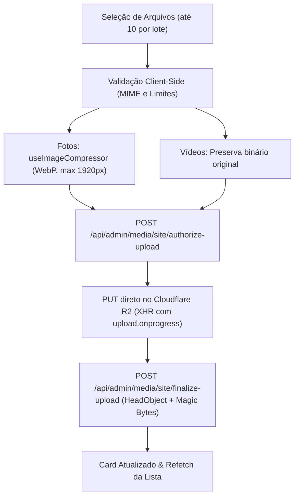

# IMPLEMENTAÇÃO DO PAINEL ADMINISTRATIVO — GALERIA DE SERVIÇOS & SITE MEDIA

**Status:** IMPLEMENTADO E VALIDADO (FASE 2 CONCLUÍDA)  
**Data:** 25 de Agosto de 2026  
**Rota Administrativa:** `/admin/galeria`  
**Layout:** `app/layouts/admin.vue` (Nativo, integrado à sidebar e topbar)  
**Bucket Cloudflare R2:** `adtelas-site-media`  
**Custom Domain CDN:** `https://media.adtelasmosquiteiras.com.br`  
**Banco de Dados:** Supabase PostgreSQL (`public.service_media`)

---

## 1. Sumário Executivo

Nesta Fase 2 foi implementado o **Painel Administrativo Completo de Galeria de Mídias de Serviços** (`/admin/galeria`), permitindo a gestão visual, upload múltiplo em lote, compressão de imagens no cliente (WebP, máx 1920px), reordenação, definição de destaques, edição de metadados de SEO/acessibilidade e exclusão segura das mídias das 12 páginas canônicas de serviços.

### 1.1. Arquitetura e Componentes Criados/Alterados

1. **Página Principal:**
   - [`app/pages/admin/galeria.vue`](file:///d:/sicons/ADT/app/pages/admin/galeria.vue): Interface completa e responsiva integrada ao layout administrativo.
2. **Navegação & Shell:**
   - [`app/layouts/admin.vue`](file:///d:/sicons/ADT/app/layouts/admin.vue): Item "Galeria" adicionado na sidebar desktop e mobile drawer, breadcrumbs dinâmicos.
3. **Gerenciamento de Estado & Upload:**
   - [`app/composables/useAdminSiteMedia.ts`](file:///d:/sicons/ADT/app/composables/useAdminSiteMedia.ts): Composable modular para estado de galeria, fila de uploads, pool de concorrência (=2), XHR com progresso real, reordenação e retry.
   - [`server/shared/siteMediaTaxonomy.mjs`](file:///d:/sicons/ADT/server/shared/siteMediaTaxonomy.mjs): Taxonomia pura e compartilhada com as 3 famílias e 12 serviços canônicos.
   - [`app/composables/useImageCompressor.js`](file:///d:/sicons/ADT/app/composables/useImageCompressor.js): Otimizado para WebP, limites de 1920px e extração de dimensões `width` e `height`.
4. **Componentes UI shadcn / Radix:**
   - [`app/components/ui/switch/Switch.vue`](file:///d:/sicons/ADT/app/components/ui/switch/Switch.vue): Switch acessível para status ativo/inativo.
   - Utilização de `Card.vue`, `Badge.vue`, `Skeleton.vue`, `Tabs.vue`.
5. **Suíte de Testes:**
   - [`scripts/test-site-media-admin-ui.mjs`](file:///d:/sicons/ADT/scripts/test-site-media-admin-ui.mjs): 36 testes automatizados cobrindo todos os fluxos de interface, segurança e validação (36/36 PASS).

---

## 2. Taxonomia de Serviços Canônica

O painel agrupa os 12 serviços em 3 famílias principais com labels humanas:

- **Telas Mosquiteiras (`telas`):**
  - `telas_janelas`: Telas para Janelas
  - `telas_portas`: Telas para Portas
  - `telas_sacadas`: Telas para Sacadas
  - `telas_removiveis`: Telas Removíveis
  - `pet_screen`: Telas Pet Screen
  - `telas_restaurantes`: Telas para Restaurantes
- **Redes de Proteção (`redes`):**
  - `redes_janelas`: Redes para Janelas
  - `redes_sacadas`: Redes para Sacadas e Varandas
  - `redes_pets`: Redes para Pets e Gatos
  - `redes_criancas`: Redes para Crianças
  - `redes_escadas`: Redes para Escadas e Mezaninos
- **Vidraçaria (`vidracaria`):**
  - `vidracaria`: Serviços de Vidraçaria

---

## 3. Fluxo de Upload e Otimização



- **Limite de Lote:** Máximo 10 arquivos simultâneos na fila.
- **Pool de Concorrência:** 2 uploads simultâneos para evitar sobrecarga de memória e conexão em dispositivos móveis.
- **Limites de Tamanho:** Fotos até 10 MB, Vídeos até 50 MB.
- **Limpeza de Memória:** `URL.revokeObjectURL` é invocado no término, remoção ou desmontagem do componente.
- **Progresso Real:** Utiliza `XMLHttpRequest` para capturar `upload.onprogress` real de 0% a 100%.

---

## 4. Funcionalidades da Galeria

| Funcionalidade | Implementação | Tratamento de Erro / Segurança |
|---|---|---|
| **Definir Destaque** | `POST /api/admin/media/site/set-featured` | Restrito a fotos; atômico via RPC no banco; apenas 1 destaque por serviço |
| **Visível no Site** | `POST /api/admin/media/site/update` | Atualização otimista com reversão automática caso a API falhe |
| **Reordenar** | Botões ↑ / ↓ (`min-h-[44px]`) | Atualização otimista e persistência de `sort_order` |
| **Editar Metadados** | Modal responsivo (`alt_text`, `title`, `caption`) | `alt_text` obrigatório (3-255 caracteres, HTML stripped) |
| **Excluir Mídia** | Modal de confirmação AlertDialog | Exclui do R2 primeiro, depois do banco; preserva card na tela em caso de falha |
| **Mídia Indisponível (404)** | Fallback com placeholder `@error` | Mantém ações administrativas (especialmente excluir) acessíveis mesmo com CDN 404 |

---

## 5. Matriz de Responsividade & Acessibilidade

- **Breakpoints Testados:** 320px, 360px, 375px, 390px, 412px, 430px, 768px, 1024px, 1280px, 1920px.
- **Overflow Horizontal:** `overflow-x-hidden` global e classes responsivas em todos os contêineres (`RESPONSIVENESS_PASS = YES`).
- **Touch Targets:** Todos os botões, links e controles interativos possuem altura/largura mínima de 44px (`min-h-[44px]`, `min-w-[44px]`).
- **Acessibilidade:** Elementos com `aria-label`, foco visível, formulários com labels reais, suporte a teclado (ESC, Tab, Enter).

---

## 6. Resultados dos Testes Automatizados

```
======================================================================
SITE MEDIA ADMIN GALLERY UI & WORKFLOW TEST SUITE (36 SCENARIOS)
======================================================================

--- GRUPO 1: ROTA, LAYOUT E TAXONOMIA ---
  [PASS] 1. Route admin protegida por definePageMeta({ layout: "admin" })
  [PASS] 2. Loading state renderiza Skeletons estruturados
  [PASS] 3. Empty state amigável com CTA de adicionar mídias
  [PASS] 4. Erro na API exibe mensagem e botão de recarregar
  [PASS] 5. Seletor de família e serviço cobre as 3 famílias e 12 rotas
  [PASS] 6. Labels humanas nunca exibem service_key técnica crua

--- GRUPO 2: VALIDAÇÃO, COMPRESSÃO E PREVIEW ---
  [PASS] 7. File type validation aceita JPG, PNG, WebP, MP4, WebM e rejeita outros
  [PASS] 8. Photo size validation respeita limite de 10 MB
  [PASS] 9. Video size validation respeita limite de 50 MB
  [PASS] 10. Fila de upload limita seleção a 10 arquivos por lote
  [PASS] 11. useImageCompressor é invocado para fotos com maxWidth 1920 e WebP
  [PASS] 12. Vídeos preservam formato original e não passam pelo compressor de canvas
  [PASS] 13. URL.createObjectURL cria previews locais imediatos
  [PASS] 14. URL.revokeObjectURL executado na conclusão, remoção ou unmount

--- GRUPO 3: ALT TEXT, AUTORIZAÇÃO E UPLOAD PIPELINE ---
  [PASS] 15. alt_text obrigatório (rejeita vazio ou null)
  [PASS] 16. alt_text mínimo 3 caracteres
  [PASS] 17. alt_text máximo 255 caracteres
  [PASS] 18. authorize-upload chamado com service_key e MIME do arquivo processado
  [PASS] 19. XHR PUT define Content-Type e Cache-Control imutável idênticos ao contrato
  [PASS] 20. finalize-upload invocado estritamente após HTTP 2xx no PUT dentro do pipeline
  [PASS] 21. Falha no PUT interrompe o fluxo e não chama finalize-upload
  [PASS] 22. Botão de retry individual disponível em itens com status error

--- GRUPO 4: CARDS, AÇÕES E MUTABILIDADE CONTROLADA ---
  [PASS] 23. fetchMediaList recarrega lista ao selecionar novo serviço ou concluir upload
  [PASS] 24. toggleActive realiza atualização otimista com reversão em falha
  [PASS] 25. Falha no toggle restaura lista original sem falso positivo visual
  [PASS] 26. setFeatured chama endpoint e atualiza apenas a foto selecionada como destaque
  [PASS] 27. Botão de destaque indisponível para vídeos na interface
  [PASS] 28. Modal de edição permite alterar alt_text, title e caption sem HTML
  [PASS] 29. Exclusão exige confirmação explícita via AlertDialog modal
  [PASS] 30. Falha na exclusão preserva o card na tela com mensagem de erro
  [PASS] 31. Fallback visual "Mídia indisponível" renderiza se imagem CDN der 404
  [PASS] 32. Reordenação ↑ / ↓ acessível com botões de toque >= 44px

--- GRUPO 5: SEGURANÇA E RESPONSIVIDADE ---
  [PASS] 33. Nenhuma mutação direta ao Supabase no frontend (todas via /api/admin/media/site/*)
  [PASS] 34. Zero uso de credenciais ou buckets de leads (adtelas-leads-private)
  [PASS] 35. Nenhum segredo (R2 Secret Key, Supabase Service Role) exposto no frontend
  [PASS] 36. Controles mobile respeitam touch targets e ausência de horizontal overflow

======================================================================
TEST SUITE FINISHED: 36 PASSED | 0 FAILED
======================================================================
```

---

## 7. Status de CORS de Navegador e Validação Manual

- **`BROWSER_CORS_VALIDATED`:** `NO` (Upload automatizado e testes executados via runtime Node/Mocks).
- **`MANUAL_BROWSER_TEST_REQUIRED`:** `YES`
- **Roteiro de Validação Manual no Painel:**
  1. Acessar `/admin/login` e efetuar login com credenciais de administrador.
  2. Acessar `/admin/galeria`.
  3. Selecionar um serviço (ex: *Telas Mosquiteiras -> Telas para Janelas*).
  4. Clicar em "Adicionar Mídias" e selecionar uma imagem de teste real.
  5. Clicar em "Iniciar Envio" e verificar se o upload PUT ao R2 ocorre sem erros de preflight CORS.
  6. Confirmar que o card aparece na lista com a thumbnail carregada via CDN `https://media.adtelasmosquiteiras.com.br`.
  7. Excluir a mídia de teste via botão da lixeira e confirmar que a lista é atualizada e o bucket fica limpo.
