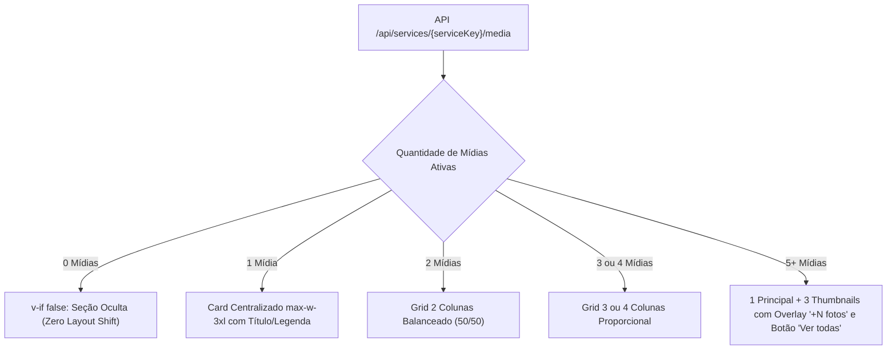

# IMPLEMENTAÇÃO DA GALERIA PÚBLICA DE SERVIÇOS — SITE MEDIA

**Status:** IMPLEMENTADO E VALIDADO (FASE 3 CONCLUÍDA)  
**Data:** 26 de Agosto de 2026  
**Bucket Cloudflare R2:** `adtelas-site-media`  
**Custom Domain CDN:** `https://media.adtelasmosquiteiras.com.br`  
**Banco de Dados:** Supabase PostgreSQL (`public.service_media`)  
**Componente Reutilizável:** [`app/components/services/ServicePublicGallery.vue`](file:///d:/sicons/ADT/app/components/services/ServicePublicGallery.vue)  
**Lightbox Reutilizável:** [`app/components/services/ServicePublicLightbox.vue`](file:///d:/sicons/ADT/app/components/services/ServicePublicLightbox.vue)

---

## 1. Sumário Executivo

A **Fase 3** concluiu a integração da galeria pública de mídias reais nas 12 páginas canônicas de serviços do site AD Telas e Redes.

As mídias ativas cadastradas e gerenciadas no painel administrativo (`/admin/galeria`) são consumidas de forma dinâmica, SSR-safe e com lazy loading diretamente do endpoint público `/api/services/{serviceKey}/media`, sendo entregues pelo CDN de alta performance Cloudflare R2 com zero overhead de presigned URLs.

### 1.1. Invariantes Arquiteturais e de Negócio Preservados
- **Hero 100% Intacto:** As seções Hero de todas as 12 páginas continuam exatamente com suas imagens e copies originais, preservando SEO, OG Images e LCP.
- **Posicionamento Estratégico:** A seção *"Instalações realizadas"* é posicionada imediatamente após o Hero e antes do primeiro bloco informativo de cada serviço para reforço imediato de prova social e conversão.
- **Comportamento Zero Mídias:** Se um serviço não possuir mídias ativas cadastradas no banco, a galeria **não é renderizada** (`PUBLIC_GALLERY_ZERO_MEDIA_BEHAVIOR = HIDDEN`), evitando caixas vazias, mensagens de "sem foto" ou Skeletons residuais.
- **Isolamento Total de Tracking:** Nenhum evento de conversão Google Ads ou formulário é disparado por interações de galeria ou lightbox.

---

## 2. Mapeamento das 12 Páginas Canônicas de Serviços

| Rota Pública | Service Key Canônica | Família de Serviço |
|---|---|---|
| `/servicos/redes/janelas` | `redes_janelas` | Redes de Proteção |
| `/servicos/redes/sacadas-e-varandas` | `redes_sacadas` | Redes de Proteção |
| `/servicos/redes/gatos-e-pets` | `redes_pets` | Redes de Proteção |
| `/servicos/redes/criancas` | `redes_criancas` | Redes de Proteção |
| `/servicos/redes/escadas-e-mezaninos` | `redes_escadas` | Redes de Proteção |
| `/servicos/telas/janelas` | `telas_janelas` | Telas Mosquiteiras |
| `/servicos/telas/portas` | `telas_portas` | Telas Mosquiteiras |
| `/servicos/telas/sacadas-e-varandas` | `telas_sacadas` | Telas Mosquiteiras |
| `/servicos/telas/removivel` | `telas_removiveis` | Telas Mosquiteiras |
| `/servicos/telas/pet-screen` | `pet_screen` | Telas Mosquiteiras |
| `/servicos/telas/restaurantes` | `telas_restaurantes` | Telas Mosquiteiras |
| `/servicos/vidracaria` | `vidracaria` | Vidraçaria |

---

## 3. Layouts Visuais Adaptativos



1. **1 Mídia:** Card elegante e centralizado (`max-w-3xl mx-auto`), sem criar grid artificial, exibindo título/legenda se presentes.
2. **2 Mídias:** Grid 50/50 balanceado (`grid-cols-1 sm:grid-cols-2`).
3. **3 a 4 Mídias:** Grids responsivos de 3 ou 4 colunas (`lg:grid-cols-3` ou `lg:grid-cols-4`).
4. **5+ Mídias:** Preview limitado com as primeiras 4 fotos, overlay "+N fotos" na 4ª thumbnail e botão "Ver todas as fotos da galeria".

---

## 4. Lightbox Responsivo & Acessibilidade

O componente [`ServicePublicLightbox.vue`](file:///d:/sicons/ADT/app/components/services/ServicePublicLightbox.vue) oferece:
- **Gestos Móveis:** Pinch-to-zoom (1x até 5x com limites de clamping), swipe lateral para avançar/retroceder fotos, double-tap zoom (1x <-> 2.5x).
- **Controles Desktop:** Zoom por roda do mouse (`WheelEvent`), botões de zoom in/out/reset, navegação por setas do teclado (`ArrowLeft` e `ArrowRight`).
- **Fechamento e Foco:** Tecla `Escape` e botão de fechar com restauração automática de foco para o elemento disparador.
- **Suporte a Vídeos:** Renderização com controles completos, sem autoplay intrusivo com áudio, com pausa automática ao trocar de slide ou fechar a janela.
- **Touch Targets:** Todos os botões interativos (Fechar, Anterior, Próximo, Zoom) possuem dimensões mínimas estritas de `44x44px` a `48x48px`.

---

## 5. Resultados dos Testes Automatizados

### 5.1. Suíte da Galeria Pública (`scripts/test-site-media-public-gallery.mjs`): 40/40 PASS
```
======================================================================
SITE MEDIA PUBLIC GALLERY FULL TEST SUITE (40 SCENARIOS)
======================================================================

--- GRUPO 1: ARQUITETURA DE COMPONENTES E MAPEAMENTO DAS 12 PÁGINAS ---
  [PASS] 1. ServicePublicGallery.vue e ServicePublicLightbox.vue existem fisicamente
  [PASS] 2. Endpoint público /api/services/[service_key]/media existe e consome param dinâmico
  [PASS] 3. As 12 páginas públicas de serviços incluem ServicePublicGallery com a serviceKey correta
  [PASS] 4. Zero mídias ativas resulta em seção 100% oculta (v-if="visibleMediaList.length > 0")

--- GRUPO 2: LAYOUTS ADAPTATIVOS (1, 2, 3, 4 E 5+ MÍDIAS) ---
  [PASS] 5. Layout com 1 mídia: Container centralizado max-w-3xl sem grid artificial
  [PASS] 6. Layout com 2 mídias: Grid 50/50 balanceado (grid-cols-1 sm:grid-cols-2)
  [PASS] 7. Layout com 3 mídias: Grid harmonioso 3 colunas em telas médias/grandes
  [PASS] 8. Layout com 4 mídias: Grid proporcional 4 colunas em telas grandes
  [PASS] 9. Layout com 5+ mídias: Exibe no máximo 4 thumbnails e overlay "+N fotos"

--- GRUPO 3: ORDENAÇÃO, FEATURED E ATRIBUTOS HTML/SEO ---
  [PASS] 10. is_featured = true é entregue como primeiro item pela ordenação da API
  [PASS] 11. Sem featured, a API ordena deterministicamente por sort_order ASC e created_at ASC
  [PASS] 12. Imagens utilizam rigorosamente alt_text cadastrado sem keyword stuffing
  [PASS] 13. Imagens possuem width e height explícitos para prevenção de Layout Shift (CLS)
  [PASS] 14. Imagens da galeria utilizam loading="lazy" e decoding="async" (preserva LCP do hero)

--- GRUPO 4: SUPORTE A VÍDEOS E LIGHTBOX ---
  [PASS] 15. Mídia photo renderiza elemento 
  [PASS] 16. Mídia video renderiza preview com ícone de play sobreposto
  [PASS] 17. Vídeos utilizam preload="metadata", muted e playsinline sem autoplay intrusivo
  [PASS] 18. Clique na imagem abre ServicePublicLightbox no índice correto
  [PASS] 19. Lightbox emite evento close e restaura overflow do body
  [PASS] 20. Navegação "Próxima" avança índice e reseta transformação de zoom
  [PASS] 21. Navegação "Anterior" retrocede índice e pausa vídeos ativos

--- GRUPO 5: ACESSIBILIDADE, TECLADO, ZOOM E GESTOS ---
  [PASS] 22. Teclas ArrowLeft e ArrowRight navegam entre mídias no Lightbox
  [PASS] 23. Tecla Escape fecha o Lightbox
  [PASS] 24. Foco do teclado é preservado e restaurado após fechamento do Lightbox
  [PASS] 25. Zoom 1x a 5x suportado via roda do mouse, botões e limites de transformação
  [PASS] 26. Swipe horizontal e pinch-to-zoom móvel implementados via Pointer Events
  [PASS] 27. Fallback em @error de imagem suprime mídia quebrada sem quebrar a galeria
  [PASS] 28. Falha no endpoint público degrada graciosamente para array vazio

--- GRUPO 6: SEGURANÇA E ISOLAMENTO DE SISTEMAS ---
  [PASS] 29. Zero segredos (R2 Secrets, Service Role Keys) expostos no componente ou endpoint público
  [PASS] 30. Endpoint público não expõe created_by ou dados internos de auditoria no payload
  [PASS] 31. Galeria pública consome exclusivamente o endpoint /api/services/[service_key]/media (zero supabase client direto)
  [PASS] 32. CTAs originais de WhatsApp e Pedir Contato permanecem intactos
  [PASS] 33. Nenhum clique de foto dispara conversão de WhatsApp
  [PASS] 34. Nenhum clique de foto dispara conversão de Formulário Google Ads
  [PASS] 35. URLs canônicas e metatags das 12 páginas permanecem intactas

--- GRUPO 7: RESPONSIVIDADE, MOBILE E INTEGRAÇÃO REAL ---
  [PASS] 36. Controles do Lightbox possuem min-height/min-width de 44px para toque mobile
  [PASS] 37. Estrutura compatível com 320px sem overflow de largura
  [PASS] 38. useFetch utilizado com lazy: false para renderização SSR direta e amigável para SEO
  [PASS] 39. Document/Window protegidos por guards typeof window !== "undefined" no Lightbox
  [PASS] 40. Integração real: telas_janelas possui mídia ativa entregue via CDN

======================================================================
TEST SUITE FINISHED: 40 PASSED | 0 FAILED
======================================================================
```

### 5.2. Regressão Geral
- Backend Site Media: **32/32 PASS**
- Painel Administrativo UI: **36/36 PASS**
- Navegação de Cards: **17/17 PASS**
- Formulários Canônicos: **26/26 PASS**
- Google Ads Tracking: **100% PASS**
