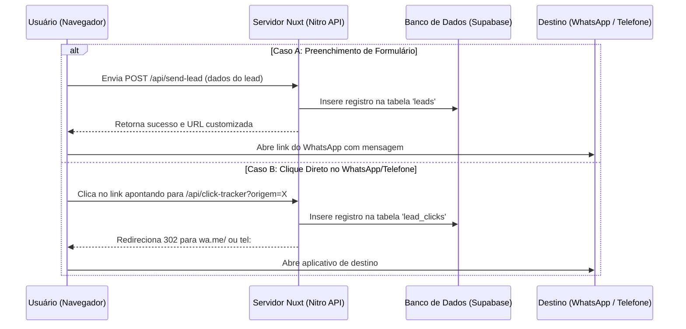

# Arquitetura e Especificação Técnica: Painel Admin & Captura de Leads
# AD Telas e Redes - Sistema de Rastreamento de Contatos e Leads

Este documento especifica o funcionamento de um sistema de captura de leads e cliques de conversão integrado a um **Painel Administrativo** desenvolvido na própria stack do Nuxt + Supabase.

---

## 📋 ÍNDICE
1. [Visão Geral da Arquitetura](#1-visão-geral-da-arquitetura)
2. [Modelagem de Dados (Supabase / PostgreSQL)](#2-modelagem-de-dados-supabase--postgresql)
3. [Estratégia de Captura de Conversão](#3-estratégia-de-captura-de-conversão)
4. [Endpoints de API (Server-Side Nitro)](#4-endpoints-de-api-server-side-nitro)
5. [Interface do Painel Admin (Nuxt)](#5-interface-do-painel-admin-nuxt)
6. [Autenticação e Segurança](#6-autenticação-e-segurança)

---

## 🏗️ 1. VISÃO GERAL DA ARQUITETURA

Para garantir que **toda e qualquer ação** de contato (preenchimento de formulário, clique no botão do WhatsApp ou chamada de telefone) seja registrada antes do usuário sair do site, o sistema utiliza o fluxo detalhado abaixo:



---

## 🗄️ 2. MODELAGEM DE DADOS (SUPABASE / POSTGRESQL)

O banco de dados utilizará duas tabelas principais para diferenciar contatos qualificados (formulários) de intenções de clique (cliques diretos).

### 2.1 Tabela `leads`
Armazena dados enviados por formulários ou preenchimentos manuais.

```sql
CREATE TABLE public.leads (
    id UUID DEFAULT gen_random_uuid() PRIMARY KEY,
    created_at TIMESTAMP WITH TIME ZONE DEFAULT timezone('utc'::text, now()) NOT NULL,
    nome VARCHAR(255) NOT NULL,
    cidade VARCHAR(100) NOT NULL,
    bairro VARCHAR(100),
    servico VARCHAR(100),
    telefone VARCHAR(30),
    email VARCHAR(255),
    mensagem TEXT,
    origem VARCHAR(100) DEFAULT 'formulario_geral', -- Ex: 'hero_home', 'modal_servico'
    status VARCHAR(50) DEFAULT 'Novo', -- 'Novo', 'Em Atendimento', 'Orçado', 'Fechado', 'Perdido'
    valor_orcamento NUMERIC(10, 2) DEFAULT 0.00,
    observacoes TEXT
);

-- Índices para otimização de busca no painel
CREATE INDEX idx_leads_created_at ON public.leads(created_at DESC);
CREATE INDEX idx_leads_status ON public.leads(status);
```

### 2.2 Tabela `lead_clicks`
Armazena interações de clique que não passam por digitação de formulário.

```sql
CREATE TABLE public.lead_clicks (
    id UUID DEFAULT gen_random_uuid() PRIMARY KEY,
    created_at TIMESTAMP WITH TIME ZONE DEFAULT timezone('utc'::text, now()) NOT NULL,
    tipo VARCHAR(50) NOT NULL, -- 'whatsapp', 'telefone', 'ajuda_rapida'
    origem VARCHAR(100) NOT NULL, -- Ex: 'floating_button', 'header_mobile', 'card_janelas'
    url_origem TEXT, -- URL exata da página onde ocorreu o clique
    user_agent TEXT,
    ip_hash VARCHAR(64) -- Hash MD5/SHA256 do IP para auditoria básica de cliques duplicados
);

CREATE INDEX idx_clicks_created_at ON public.lead_clicks(created_at DESC);
```

---

## 📈 3. ESTRATÉGIA DE CAPTURA DE CONVERSÃO

### 3.1 Interceptação de Formulários (LeadForm.vue)
Quando o formulário é enviado, ele faz uma chamada assíncrona ao servidor para gravar o lead no banco de dados e só depois redireciona o usuário para o WhatsApp.

```javascript
// Exemplo de integração no LeadForm.vue ou useFormSubmit.js
const submitForm = async (formData) => {
  try {
    // 1. Grava no banco de dados local via API Server
    const response = await $fetch('/api/send-lead', {
      method: 'POST',
      body: formData
    })
    
    // 2. Com a confirmação da gravação, gera o link e direciona o usuário
    if (response.success) {
      const whatsappUrl = `https://wa.me/5511983586611?text=${encodeURIComponent(response.whatsappMessage)}`
      window.location.href = whatsappUrl
    }
  } catch (error) {
    console.error('Falha ao salvar lead. Forçando abertura direta do WhatsApp para não perder o cliente.', error)
    // Fallback de segurança para não perder a venda
    window.location.href = `https://wa.me/5511983586611?text=Olá! Quero um orçamento.`
  }
}
```

### 3.2 Captura de Cliques Diretos em Botões (Sem Formulário)
Para os botões que não são formulários (como o botão flutuante e o header), em vez de usar `href="https://wa.me/..."` direto no HTML, o link aponta para uma **API interna de redirecionamento**.

*   **Antes:**
    ```html
    <a href="https://wa.me/5511983586611?text=Orçamento" target="_blank">WhatsApp</a>
    ```
*   **Depois (Com Rastreamento Garantido):**
    ```html
    <!-- A chamada passa pela nossa API que grava no DB e redireciona -->
    <a href="/api/click-tracker?tipo=whatsapp&origem=floating_button&servico=telas-mosquiteiras">WhatsApp</a>
    ```

---

## ⚙️ 4. ENDPOINTS DE API (SERVER-SIDE NITRO)

As rotas de servidor processam as chamadas usando as credenciais do Supabase já configuradas no `nuxt.config.ts`.

### 4.1 Modificação do `/api/send-lead.post.ts`
Estendemos a rota de criação de leads existente para persistir dados diretamente na tabela `leads` do Supabase:

```typescript
// server/api/send-lead.post.ts
import { createClient } from '@supabase/supabase-js'

export default defineEventHandler(async (event) => {
  const config = useRuntimeConfig()
  const body = await readBody(event)

  const { nome, cidade, bairro, servico, telefone, email, mensagem, origem } = body

  if (!nome || !cidade) {
    throw createError({ statusCode: 400, message: 'Nome e cidade são obrigatórios' })
  }

  // Inicializar cliente Supabase no Servidor
  const supabase = createClient(config.supabaseUrl, config.supabaseServiceRoleKey)

  // 1. Gravar dados na tabela 'leads'
  const { data, error } = await supabase
    .from('leads')
    .insert([
      {
        nome,
        cidade,
        bairro,
        servico,
        telefone,
        email,
        mensagem,
        origem: origem || 'formulario_geral',
        status: 'Novo'
      }
    ])
    .select()

  if (error) {
    console.error('Erro ao salvar lead no Supabase:', error.message)
  }

  // 2. Chamar a Edge Function de Email existente (Mantém redundancy)
  try {
    await $fetch(`${config.supabaseUrl}/functions/v1/send-email`, {
      method: 'POST',
      headers: {
        'Authorization': `Bearer ${config.supabaseServiceRoleKey}`,
        'Content-Type': 'application/json'
      },
      body: body
    })
  } catch (err) {
    console.error('Falha no disparo de email:', err)
  }

  return { 
    success: true, 
    leadId: data?.[0]?.id,
    whatsappMessage: `Olá! Meu nome é ${nome}, moro em ${cidade} (${bairro || 'Sem bairro'}). Gostaria de orçamento para ${servico || 'telas mosquiteiras'}.`
  }
})
```

### 4.2 Novo endpoint `/api/click-tracker.get.ts`
Captura os cliques rápidos e faz o redirecionamento instantâneo do cliente.

```typescript
// server/api/click-tracker.get.ts
import { createClient } from '@supabase/supabase-js'
import crypto from 'crypto'

export default defineEventHandler(async (event) => {
  const config = useRuntimeConfig()
  const query = getQuery(event)
  const headers = getHeaders(event)

  const tipo = (query.tipo as string) || 'whatsapp'
  const origem = (query.origem as string) || 'desconhecido'
  const servico = (query.servico as string) || 'geral'

  // Hash do IP para controle de spam/cliques repetidos sem armazenar IP puro (LGPD)
  const ip = headers['x-forwarded-for'] || event.node.req.socket.remoteAddress || ''
  const ipHash = crypto.createHash('sha256').update(ip).digest('hex')

  // Salvar clique de forma assíncrona (não bloqueia o redirecionamento do usuário)
  const supabase = createClient(config.supabaseUrl, config.supabaseServiceRoleKey)
  supabase
    .from('lead_clicks')
    .insert([
      {
        tipo,
        origem: `${origem}_${servico}`,
        url_origem: headers['referer'] || '',
        user_agent: headers['user-agent'] || '',
        ip_hash: ipHash
      }
    ])
    .then(({ error }) => {
      if (error) console.error('Erro ao gravar clique no BD:', error.message)
    })

  // Gerar URL de destino final
  let destino = 'https://wa.me/5511983586611'
  
  if (tipo === 'whatsapp') {
    const textoCustomizado = `Olá! Vim do site e gostaria de um orçamento sobre: ${servico.replace(/-/g, ' ')} (Origem: ${origem})`
    destino = `https://wa.me/5511983586611?text=${encodeURIComponent(textoCustomizado)}`
  } else if (tipo === 'telefone') {
    destino = 'tel:+5511983586611'
  }

  // Redireciona imediatamente
  return sendRedirect(event, destino, 302)
})
```

---

## 📊 5. INTERFACE DO PAINEL ADMIN (NUXT)

O painel de controle pode ser criado em um diretório protegido `/pages/admin/` e conter os seguintes módulos:

### 5.1 Dashboard principal (`/pages/admin/dashboard.vue`)
*   **Métricas em Cartão (KPIs):**
    *   Leads de formulários convertidos (mês/semana/dia).
    *   Total de cliques de atalho para o WhatsApp.
    *   Taxa de conversão de cliques vs formulários.
*   **Gráfico de Tendência (Evolução Diária):**
    *   Exibição em linha/barras (usando biblioteca leve como Chart.js ou Tailwind puro) da entrada de contatos por dia.
*   **Distribuição de Serviços e Localidades:**
    *   Classificação dos serviços mais solicitados (Ex: "Redes para Janelas", "Telas Pet Screen").
    *   Ranking das cidades e bairros com mais pedidos.

### 5.2 Tabela de Gestão de Leads (`/pages/admin/leads.vue`)
*   **Visualização:** Listagem estruturada exibindo data, nome, contato (telefone/whatsapp), cidade/bairro, serviço solicitado e status.
*   **Status de Processamento:** Cada lead possui um seletor colorido para gerenciar o funil de atendimento da empresa:
    *   🟢 `Novo`
    *   🟡 `Em Atendimento`
    *   🔵 `Orçado`
    *   🟣 `Fechado (Venda Concluída)`
    *   🔴 `Perdido`
*   **Campos de Negócio:**
    *   `Valor Fechado`: Campo para cadastrar o ticket final da instalação (permite gerar relatórios de faturamento gerados pelo site).
    *   `Notas`: Histórico de anotações internas (ex: "Necessita escada de 6 metros para instalação").

---

## 🔒 6. AUTENTICAÇÃO E SEGURANÇA

Para impedir o vazamento dos contatos e dados sensíveis dos clientes (LGPD):

### 6.1 Middleware de Rotas (`/middleware/auth.ts`)
Qualquer acesso a subpastas `/admin/` (exceto `/admin/login`) é interceptado pelo middleware de rotas do Nuxt.

```typescript
// middleware/auth.ts
export default defineNuxtRouteMiddleware(async (to, from) => {
  const user = useSupabaseUser() // Composable padrão do módulo do Supabase

  if (!user.value && to.path !== '/admin/login') {
    return navigateTo('/admin/login')
  }
})
```

### 6.2 Nível de Segurança no Banco de Dados (Row Level Security - RLS)
No painel do Supabase, as tabelas `leads` e `lead_events` recebem políticas rígidas:
*   `INSERT`: Permitido para qualquer usuário anônimo (cliente acessando o site).
*   `SELECT`, `UPDATE`, `DELETE`: Permitido apenas para usuários autenticados (administrador logado no painel).
