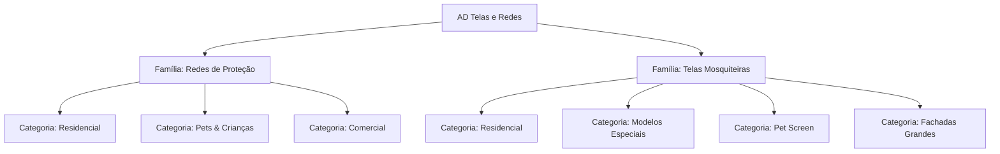

# PRD - Documento de Requisitos do Produto
# AD Telas e Redes - Especificação Completa do Sistema e Experiência do Usuário

**Versão:** 3.0  
**Data:** 20 de Julho de 2026  
**Empresa:** AD Telas e Redes  
**Contato:** (11) 98358-6611 | vendas.adtelaseredes@gmail.com  
**CNPJ:** 40.297.694/0001-95  
**Tecnologia Principal:** Nuxt 4.2.2 + Vue 3.5.26 + Tailwind CSS 6.14.0  

---

## 📋 ÍNDICE
1. [Visão Geral e Objetivos do Produto](#1-visão-geral-e-objetivos-do-produto)
2. [Stack Tecnológica e Arquitetura do Sistema](#2-stack-tecnológica-e-arquitetura-do-sistema)
3. [Catálogo de Serviços (35+ Serviços)](#3-catálogo-de-serviços-35-serviços)
4. [Sistema de Cobertura Geográfica e Bairros](#4-sistema-de-cobertura-geográfica-e-bairros)
5. [Arquitetura de URLs e Navegação](#5-arquitetura-de-urls-e-navegação)
6. [Componentes de Conversão e Fluxos do Usuário](#6-componentes-de-conversão-e-fluxos-do-usuário)
7. [Integração de Analytics e Rastreamento (GA4 & GTM)](#7-integração-de-analytics-e-rastreamento-ga4--gtm)
8. [Design System](#8-design-system)

---

## 🎯 1. VISÃO GERAL E OBJETIVOS DO PRODUTO

### 1.1 Propósito
O projeto consiste em um site institucional, comercial e catálogo digital altamente otimizado para a **AD Telas e Redes**, empresa especializada na venda e instalação de redes de proteção e telas mosquiteiras na Grande São Paulo e região. 

### 1.2 Objetivo Principal
Maximizar a geração de leads qualificados direcionando os usuários para conversão em múltiplos pontos de contato, tendo como destino principal o atendimento comercial via **WhatsApp** e secundário a realização de chamadas telefônicas ou envios rápidos de dados.

### 1.3 Público-Alvo
*   **Famílias com crianças pequenas (0 a 10 anos)** em busca de redes de proteção para janelas e sacadas.
*   **Tutores de animais de estimação (gatos e cães)** que necessitam de telas reforçadas anti-queda ou anti-fuga.
*   **Moradores de casas e apartamentos em São Paulo** sofrendo com a infestação de mosquitos e insetos vetores de doenças (dengue, zika, chikungunya).
*   **Clientes corporativos, indústrias, comércios e condomínios** que exigem soluções sob medida para grandes áreas.

### 1.4 Proposta de Valor
*   **Rapidez:** Instalação em até 24h a 48h após a medição.
*   **Confiança:** Garantia de 2 anos com materiais certificados de alta resistência.
*   **Conveniência:** Orçamento grátis e rápido pelo WhatsApp com preenchimento simplificado.

---

## ⚙️ 2. STACK TECNOLÓGICA E ARQUITETURA DO SISTEMA

### 2.1 Stack de Tecnologia
O sistema é estruturado na versão estável do Nuxt e Vue, usando utilitários modernos e integrações de email/analytics:
*   **Framework Principal:** Nuxt v4.2.2
*   **Biblioteca de UI:** Vue v3.5.26
*   **Roteamento:** Vue Router v4.6.4
*   **Estilização:** Tailwind CSS v6.14.0
*   **Biblioteca de Ícones:** `@nuxt/icon` v2.2.1 (com o pacote de ícones *Lucide*)
*   **Serviço de Email (Server-Side):** `resend` v6.9.4 e `@types/nodemailer` v7.0.11 (para envio/recebimento de contatos)
*   **Analytics Nativo:** `@vercel/analytics` v1.6.1

### 2.2 Estrutura de Diretórios
O código do projeto está totalmente centralizado no diretório `app/` para melhor organização, conforme o padrão do Nuxt:

```
d:\sicons\ADT\
├── app/
│   ├── assets/
│   │   └── css/
│   │       └── tailwind.css         # Configurações globais e imports de fontes
│   ├── components/
│   │   ├── Breadcrumb.vue           # Indicador de hierarquia da página
│   │   ├── CaseStudies.vue          # Depoimentos e estudos de caso
│   │   ├── CepSearch.vue            # Componente de busca por CEP e validador de área
│   │   ├── CtaSection.vue           # Seção de CTA de urgência na home e serviços
│   │   ├── FaqSection.vue           # Accordion de perguntas frequentes globais
│   │   ├── Footer.vue               # Rodapé com informações legais e links
│   │   ├── Header.vue               # Menu de navegação fixo responsivo
│   │   ├── HeroSection.vue          # Banner de entrada principal
│   │   ├── LeadForm.vue             # Formulário de captação de leads em 2 passos
│   │   ├── MobileUnifiedCTA.vue     # Barra de ações inferior expandida para mobile
│   │   ├── ProblemsSection.vue      # Seção com problemas resolvidos pelas telas/redes
│   │   ├── QuickHelpChat.vue        # Balão flutuante de suporte rápido no canto esquerdo
│   │   ├── ReviewsCarousel.vue      # Depoimentos importados do Google Reviews
│   │   ├── SegmentedSolutions.vue   # Soluções específicas divididas por segmento
│   │   ├── ServicesCards.vue        # Cards de acesso às duas famílias de produtos
│   │   ├── StickyFormModal.vue      # Modal de formulário que abre pelo CTA
│   │   ├── ValueProposition.vue     # Diferenciais da empresa (garantia, materiais)
│   │   └── WhatsappFloating.vue     # Botão flutuante do WhatsApp no canto direito
│   ├── composables/
│   │   ├── useFaq.js
│   │   ├── useScrollAnimation.js
│   │   ├── useScrollTo.js
│   │   ├── useSegments.js
│   │   ├── useServicoData.js
│   │   ├── useServicos.js           # Gerenciador estruturado dos 35+ serviços
│   │   └── useWhatsappModal.js      # Gerenciador de estado global do modal de leads
│   ├── data/
│   │   └── bairros.ts               # Base estática de 891+ bairros atendidos
│   ├── layouts/
│   │   └── default.vue              # Layout principal com Header, Footer e botões flutuantes
│   ├── pages/
│   │   ├── index.vue                # Página Inicial (Landing Page completa)
│   │   ├── test-ga.vue              # Página técnica para testar e validar o GA4
│   │   └── servicos/
│   │       ├── index.vue            # Hub principal dos Serviços
│   │       ├── redes.vue            # Página focada na Família de Redes de Proteção
│   │       ├── telas.vue            # Página focada na Família de Telas Mosquiteiras
│   │       ├── [familia]/
│   │       │   ├── index.vue        # Rota de navegação de Família
│   │       │   └── [categoria]/
│   │       │       ├── index.vue    # Rota de navegação de Categoria
│   │       │       └── [servico].vue # Página dinâmica detalhada de Serviço
│   │       └── [slug].vue           # Fallback para slugs dinâmicos legados
│   └── plugins/
│       └── gtag.client.js           # Plugin cliente para inicializar o Google Analytics 4
├── public/
│   ├── images/                      # Assets estáticos de imagens
│   ├── favicon.ico
│   ├── robots.txt
│   ├── politica-de-privacidade.html # Página HTML estática com rastreamento próprio
│   └── termos-de-uso.html           # Página HTML estática com rastreamento próprio
├── nuxt.config.ts                   # Arquivo de configuração de segurança, SEO e Nitro
├── package.json
└── tailwind.config.js
```

### 2.3 Variáveis de Ambiente (`.env.example`)
O sistema necessita das seguintes chaves configuradas em produção para o correto funcionamento das integrações:
*   `GA_API_SECRET` - Segredo da API do Google Analytics 4 para envio via Measurement Protocol.
*   `GA_MEASUREMENT_ID` - ID de Mensuração padrão do GA4 (`G-S0038L1Q6R`).
*   `GMAIL_EMAIL` / `GMAIL_APP_PASSWORD` - Credenciais seguras para envio de e-mails via Nodemailer.
*   `RESEND_API_KEY` - Token de autenticação do serviço Resend para e-mails transacionais.
*   `SUPABASE_URL` / `SUPABASE_SERVICE_ROLE_KEY` - URL e chave do banco de dados/backend Supabase.

### 2.4 Configurações de Segurança e Nitro no `nuxt.config.ts`

#### Redirecionamentos 301 de SEO
Para evitar perda de indexação e autoridade nas mudanças de rotas (migração de `/bairros/[slug]` para `/tela-mosquiteira-em/[slug]`), foram configurados redirecionamentos 301 explícitos na configuração `nitro.routeRules`, por exemplo:
*   `/bairros/pinheiros` ➡️ `/tela-mosquiteira-em/pinheiros`
*   `/bairros/itaim-bibi` ➡️ `/tela-mosquiteira-em/itaim-bibi`

#### Security Headers & Content Security Policy (CSP)
Para mitigar ataques XSS e garantir conformidade com políticas restritas de segurança, todas as rotas contêm cabeçalhos adicionais de segurança definidos em `nuxt.config.ts`:
*   `X-Content-Type-Options: nosniff`
*   `X-Frame-Options: DENY`
*   `X-XSS-Protection: 1; mode=block`
*   `Referrer-Policy: strict-origin-when-cross-origin`
*   `Content-Security-Policy`: Configuração detalhada permitindo carregamento seguro de recursos necessários do Google Tag Manager, Google Analytics, Google Ads, WhatsApp, Vercel e ViaCEP.

---

## 🛍️ 3. CATÁLOGO DE SERVIÇOS (35+ SERVIÇOS)

A arquitetura dos serviços está dividida de forma hierárquica em **2 Famílias**, contendo **4 Categorias cada** e totalizando **35 serviços específicos**. Os dados estão concentrados no composable `app/composables/useServicos.js`.



### 3.1 Família 1: Redes de Proteção (17 Serviços)
Destinada à segurança física e prevenção de quedas.

#### Categoria: Residencial
1.  **Janelas:** Proteção invisível de alta resistência. (*Destaque: Mais Vendido* | Imagem: `/images/redes_para_janelas.png`)
2.  **Portas:** Segurança completa sem interferir no trânsito diário. (*Destaque: Ventilação total*)
3.  **Sacadas:** Proteção certificada para sacadas e terraços. (*Destaque: Resiste 500kg*)
4.  **Varandas:** Cobertura de vãos externos e guarda-corpos. (*Destaque: Instalação 24h*)
5.  **Apartamentos:** Pacotes completos com telas para todo o apartamento. (*Destaque: Pacote completo*)
6.  **Escadas:** Proteção de mezaninos, vãos e degraus abertos. (*Destaque: Sob Medida*)
7.  **Basculantes:** Estruturas ajustadas a janelas pivotantes e basculantes de banheiro. (*Destaque: Fácil Abertura*)

#### Categoria: Pets & Crianças
8.  **Crianças:** Malhas testadas especificamente para proteção infantil. (*Destaque: Certificado INMETRO*)
9.  **Gatos:** Malhas reforçadas e de menor espaçamento para impedir a passagem de felinos. (*Destaque: Malha reforçada*)
10. **Cachorros:** Soluções de alta resistência contra mordidas e arranhões de cães de médio/grande porte. (*Destaque: Extra resistente*)
11. **Animais:** Versatilidade de proteção para múltiplos pets e pássaros. (*Destaque: Versátil*)
12. **Idosos:** Foco em prevenção de acidentes na terceira idade. (*Destaque: Cuidado especial*)

#### Categoria: Comercial
13. **Portões:** Fechamento de portões vazados para impedir fuga de pets ou invasões.
14. **Muros:** Redes estruturadas acima de muros como barreira secundária. (*Destaque: Anti-invasão*)
15. **Telhados:** Redes de proteção técnica para bloquear pombos e morcegos. (*Destaque: Anti-pombos*)
16. **Piscinas:** Cobertura de piscinas residenciais ou coletivas com ganchos antiferrugem. (*Destaque: Resistente à água*)
17. **Coberturas:** Proteção para terraços abertos de coberturas e áreas de lazer. (*Destaque: Sob medida*)

---

### 3.2 Família 2: Telas Mosquiteiras (18 Serviços)
Destinada ao bloqueio de mosquitos (como o *Aedes aegypti*), pernilongos e demais insetos.

#### Categoria: Residencial
18. **Janelas:** Transparência aliada a ventilação total. (*Destaque: 85% transparência* | Imagem: `/images/tela_mosquiteira.png`)
19. **Portas:** Telas de acesso livre para portas de cozinha e salas. (*Destaque: Fácil abertura*)
20. **Varandas:** Proteção contra insetos para varandas integradas. (*Destaque: Área completa*)
21. **Sacadas:** Soluções que acompanham a estrutura de envidraçamento de sacadas.
22. **Apartamentos:** Proteção integrada contra insetos voadores em andares altos e baixos.
23. **Banheiro:** Telas com resistência ao vapor d'água e umidade. (*Destaque: Anti-mofo*)

#### Categoria: Modelos Especiais
24. **Telas de Correr:** Sistemas práticos com trilhos de alumínio deslizantes. (*Destaque: Fácil uso*)
25. **Telas Pivotantes:** Modelos com dobradiças para abertura similar a uma porta convencional. (*Destaque: Moderna*)
26. **Telas Removíveis:** Fixadas por travas magnéticas ou velcro, ideais para higienização frequente. (*Destaque: Prática*)
27. **Telas para Basculantes:** Modelos construídos para janelas basculantes com passagem flexível de braço.
28. **Telas com Alumínio:** Perfis de alumínio anodizado nas cores branco, bronze, preto e cinza. (*Destaque: Durável*)
29. **Telas com Aço Inox:** Telas de metal duráveis, imunes a rasgos de unhas ou dentes de animais. (*Destaque: Premium*)

#### Categoria: Pet Screen
30. **Telas Pet Screen:** Fibra de vidro revestida com poliéster de altíssima tenacidade, resistindo a unhas de gatos e cães sem rasgar. (*Destaque: Anti-arranhão*)
31. **Telas Anti-Pernilongos:** Malha milimétrica microfina para bloquear até mosquitos minúsculos. (*Destaque: Malha micro*)

#### Categoria: Fachadas Grandes
32. **Telas para Fachadas:** Estruturas de grande dimensão para fechamento de vitrines ou fachadas prediais.
33. **Telas para Coberturas:** Projetadas sob medida para áreas externas amplas e telhados transparentes.
34. **Telas para Restaurantes:** Adequação à legislação sanitária (ANVISA), mantendo moscas e insetos fora das cozinhas profissionais. (*Destaque: Comercial*)
35. **Telas para Indústrias:** Proteção em grande escala para depósitos de alimentos, galpões e linhas de produção. (*Destaque: Alta resistência*)

---

### 3.3 Atributos por Página de Serviço
Cada página dinâmica de serviço individual (`[servico].vue`) renderiza a seguinte estrutura padrão de conteúdo:
1.  **Benefícios (Grid 2x2):** 4 cartões exibindo ícones com vantagens (Resistência UV, Fácil Limpeza, Garantia e Encaixe Perfeito).
2.  **Especificações Técnicas:** Tabela comparativa detalhando o tipo de material, método de limpeza, garantia de 2 anos e tempo de instalação rápida.
3.  **Tabela Comparativa (Nós vs Concorrentes):** Destaca os diferenciais da marca (certificado INMETRO, instalação em 24h e materiais de alta densidade).
4.  **FAQ de Dúvidas Comuns:** De 3 a 5 perguntas frequentes resolvidas por serviço com layout accordion.

---

## 🗺️ 4. SISTEMA DE COBERTURA GEOGRÁFICA E BAIRROS

O site é otimizado para o cenário geográfico de São Paulo e cidades vizinhas. Há uma base de dados interna robusta com mais de **891 bairros catalogados** no arquivo `app/data/bairros.ts` para um total de 19 cidades.

### 4.1 Cidades Cobertas pelo Atendimento
O sistema de dados e APIs valida a cobertura geográfica para as seguintes cidades:
1.  **São Paulo** (279 bairros - cobertura completa em todas as Zonas: Sul, Norte, Leste, Oeste e Centro)
2.  **Guarulhos** (47 bairros)
3.  **Osasco** (60 bairros)
4.  **São Bernardo do Campo** (34 bairros)
5.  **Barueri** (20 bairros)
6.  **Jundiaí** (60 bairros)
7.  **Mogi das Cruzes** (50 bairros)
8.  **Taboão da Serra** (47 bairros)
9.  **Suzano** (44 bairros)
10. **Itapevi** (40 bairros)
11. **Embu-Guaçu** (30 bairros)
12. **Sorocaba** (45 bairros)
13. **Cajamar** (20 bairros)
14. **Mairiporã** (15 bairros)
15. **Santana de Parnaíba** (15 bairros)
16. **Cotia** (30 bairros)
17. **Itapecerica da Serra** (20 bairros)
18. **Embu das Artes** (20 bairros)
19. **São Roque** (15 bairros)

### 4.2 Endpoints de API Server-Side

#### `GET /api/bairros`
Retorna a árvore hierárquica contendo todas as cidades atendidas com seus respectivos IDs (IBGE) e vetores de bairros cadastrados para montagem dinâmica de filtros.

#### `GET /api/cep/[cep]`
Integração via proxy local com a API pública *ViaCEP*. 
*   **Regra de Negócio:** Recebe um CEP de 8 dígitos numéricos, consulta os dados de endereço e valida o código IBGE retornado. Se o código IBGE pertencer à lista de cidades atendidas pela AD Telas e Redes, retorna o objeto JSON com o campo `"atendido": true`. Caso contrário, retorna `"atendido": false`.

### 4.3 Busca por CEP (`CepSearch.vue`)
Localizada estrategicamente nas páginas do site, a caixa de pesquisa aceita o CEP do cliente e exibe:
*   **Resultado Positivo (Atendido):** Exibe o nome do bairro e da cidade pesquisados, e um botão destacado para o WhatsApp com mensagem pré-formatada informando o endereço do cliente para agilizar o orçamento.
*   **Resultado Negativo (Não Atendido):** Exibe uma mensagem informando que o local está fora da área padrão de cobertura, oferecendo um botão com redirecionamento ao WhatsApp para consultar exceções com o time comercial.

---

## 🧭 5. ARQUITETURA DE URLS E NAVEGAÇÃO

Para atingir a melhor pontuação de SEO e facilidade de rastreamento pelos motores de busca, o sistema implementa uma estrutura estrita de navegação.

### 5.1 Estrutura de URLs (Sitemap de Páginas)
```
/ (Página Inicial - Landing Page de Conversão)
│
├── /servicos (Hub principal detalhando as duas grandes famílias de serviços)
│   ├── /servicos/redes (Landing focada na Família de Redes de Proteção)
│   ├── /servicos/telas (Landing focada na Família de Telas Mosquiteiras)
│   │
│   ├── /servicos/redes/residencial (Serviços de Redes na categoria Residencial)
│   ├── /servicos/redes/pets (Serviços de Redes na categoria Pets & Crianças)
│   ├── /servicos/redes/comercial (Serviços de Redes na categoria Comercial)
│   │
│   ├── /servicos/telas/residencial (Serviços de Telas na categoria Residencial)
│   ├── /servicos/telas/especiais (Serviços de Telas na categoria Modelos Especiais)
│   ├── /servicos/telas/pet (Serviços de Telas na categoria Pet Screen)
│   ├── /servicos/telas/comercial (Serviços de Telas na categoria Fachadas Grandes)
│   │
│   └── /servicos/{familia}/{categoria}/{servico} (Página individual de cada serviço)
│       Exemplos:
│       - /servicos/redes/residencial/janelas
│       - /servicos/redes/pets/gatos
│       - /servicos/telas/especiais/correr
│
└── /tela-mosquiteira-em/{bairro} (Landing pages de SEO locais focadas em bairros e cidades)
```

### 5.2 Elementos de Navegação Global

#### Header Desktop (`Header.vue`)
*   **Design:** Altura fixa de 112px (`h-28`), fundo branco translúcido com desfoque de fundo (`bg-white/70 backdrop-blur-md`) após o início da rolagem da página.
*   **Links de Scroll Suave:** Direciona de forma fluida para as respectivas seções da home usando o offset correto de 112px para não cobrir o conteúdo:
    1.  *Início* (`#hero`)
    2.  *Serviços* (`#problems`)
    3.  *Vantagens* (`#value`)
    4.  *Cases* (`#cases`)
    5.  *Avaliações* (`#reviews`)
    6.  *Soluções* (`#solutions`)
    7.  *FAQ* (`#faq`)
    8.  *Contato* (`#contact`)

#### Header Mobile
*   **Design:** Altura compacta de 64px (`h-16`).
*   **Acessibilidade:** Exibe um botão de atalho verde WhatsApp dinâmico no topo com animações discretas de pulso e o tradicional menu hambúrguer para navegação.

#### Breadcrumbs (`Breadcrumb.vue`)
Exibido em todas as páginas internas de serviços para sinalizar a localização e fornecer links de retorno estruturados:
*   *Exemplo:* `Início > Serviços > Redes de Proteção > Residencial > Redes para Janelas`

---

## 📈 6. COMPONENTES DE CONVERSÃO E FLUXOS DO USUÁRIO

O foco comercial do sistema é traduzido em mais de **12 pontos de conversão** espalhados estrategicamente por toda a jornada do usuário.

### 6.1 Principais Elementos de Conversão

#### 1. Botão Flutuante do WhatsApp (`WhatsappFloating.vue`)
*   **Visual:** Ícone verde oficial posicionado fixo no canto inferior direito (`bottom-6 right-6`), acima de todos os demais elementos.
*   **Animação:** Efeito contínuo de pulso nas bordas e leve balanço periódico para captar a atenção do olhar sem atrapalhar a leitura.

#### 2. Barra de Ações Mobile Unificada (`MobileUnifiedCTA.vue`)
Componente fundamental para conversões em dispositivos móveis, visível apenas em telas menores que 768px após um scroll inicial de 200px da página.
*   **Estado Compacto:** Exibido como uma barra fina e elegante na base do celular com o texto "Orçamento Grátis WhatsApp".
*   **Estado Expandido (Ao clicar ou arrastar):** Revela uma gaveta de opções rápidas contendo:
    *   *Botão Principal (WhatsApp):* Abre conversa direta com texto personalizado (100% de largura).
    *   *Botão Telefonar:* Disca direto para `(11) 98358-6611` (48% de largura).
    *   *Botão Formulário:* Abre o formulário digital integrado em modal (48% de largura).

#### 3. Formulário de Captação Simplificado em 2 Passos (`LeadForm.vue`)
Implementado na sidebar do desktop e como modal móvel (`StickyFormModal.vue`), reduzindo a fricção e aumentando a taxa de preenchimento.

```
[Passo 1: Dados Rápidos]
Campos: Nome (Obrigatório) + Cidade (Obrigatório)
Botão: "Continuar no WhatsApp" (Gera Lead e envia)
Link Opcional: "Adicionar detalhes para orçamento preciso"

[Passo 2: Detalhes Opcionais]
Campos: Bairro (Opcional) + Tipo de Serviço (Select Opcional)
Botões: "Voltar" + "Enviar no WhatsApp"
```

#### 4. Chat de Ajuda Rápida (`QuickHelpChat.vue`)
Localizado no canto inferior esquerdo do layout desktop, simula uma pequena janela de suporte ativa, oferecendo respostas rápidas a dúvidas e atalho para o WhatsApp.

### 6.2 Mensagens Pré-Configuradas no WhatsApp
Cada link que direciona para o WhatsApp comercial `5511983586611` carrega uma mensagem pré-preenchida contendo metadados do contexto da navegação do cliente para acelerar a triagem e o fechamento do orçamento:

> **Mensagem do Botão Flutuante (Fundo Geral):**
> `"Oi! Gostaria de um orçamento para instalar telas de segurança."`

> **Mensagem de Página de Serviço Dinâmica:**
> `"Olá! Gostaria de um orçamento para: Serviço: [Nome do Serviço] | Categoria: [Nome da Categoria]. Pode me ajudar?"`

> **Mensagem de Formulário (Preenchido até o Passo 2):**
> `"Olá! Meu nome é [Nome], moro em [Cidade], bairro [Bairro]. Gostaria de um orçamento para: [Serviço]. Pode me ajudar?"`

---

## 📊 7. INTEGRAÇÃO DE ANALYTICS E RASTREAMENTO (GA4 & GTM)

O rastreamento e atribuição de leads no sistema são totalmente monitorados pelo **Google Analytics 4** e **Google Tag Manager** com redundância client-side.

### 7.1 Detalhes de Instalação e IDs
*   **Measurement ID principal:** `G-S0038L1Q6R`
*   **Frequência:** Carregamento automático em rotas SPA e páginas HTML estáticas do diretório `public/`.

### 7.2 Implementação do Código
O rastreamento de navegação e conversões no Nuxt é feito de duas maneiras principais para garantir consistência de dados:

1.  **Plugin de Cliente (`app/plugins/gtag.client.js`):**
    Inicializa o objeto global `window.dataLayer` e monitora as mudanças de rota virtuais (`vue-router`), disparando eventos automáticos de Page View sem a necessidade de novos carregamentos de script.
2.  **Configuração de Head Global (`nuxt.config.ts` / `app.vue`):**
    Injeta a biblioteca oficial do Google Tag Manager diretamente no `<head>` do documento, cobrindo o carregamento inicial da página.
3.  **Tratamento nas Páginas Estáticas:**
    Os arquivos `politica-de-privacidade.html` e `termos-de-uso.html` contêm códigos de rastreamento puros injetados em HTML padrão para monitorar visitantes nas páginas legais.

### 7.3 Página de Diagnóstico (`test-ga.vue`)
Uma rota exclusiva de testes foi desenvolvida para auditoria e garantia do funcionamento correto do rastreamento:
*   Acessível localmente em `http://localhost:3001/test-ga` ou em produção sob a rota `/test-ga`.
*   Verifica visualmente na tela se a tag `gtag` está instanciada como uma função, se a biblioteca externa carregou com sucesso e se o array `dataLayer` está coletando informações.
*   Oferece um botão para o envio manual de eventos de teste diretamente para o dashboard do Google Analytics 4.

---

## 🎨 8. DESIGN SYSTEM

O design do site reflete confiança, segurança e cuidado doméstico. A paleta é altamente contrastante com cores pensadas para facilitar a navegação em qualquer tipo de tela.

### 8.1 Paleta de Cores

#### Cores Primárias (Identidade Institucional)
*   **Azul Escuro:** `#22345F` (Tonalidade de segurança. Utilizado em títulos, cabeçalhos principais e fontes pesadas)
*   **Azul Médio:** `#1D7BA6` (Tonalidade de ação. Utilizado em links de apoio e botões secundários)
*   **Azul Escuro Fundo:** `#0F4F7D` (Utilizado para degradês em banners e seções de conversão em tela cheia)
*   **Laranja:** `#F49A1A` (Tonalidade de atenção e urgência. Usado em badges de destaque, linhas decorativas de títulos e bordas de atração)

#### Elementos de Conversão (WhatsApp)
*   **Verde WhatsApp:** `#25D366` (Utilizado estritamente para o botão flutuante e botões de chamada primária)
*   **Verde WhatsApp Hover:** `#1DA851` (Tonalidade de hover para botões ativos de conversão)

#### Cores de Apoio e Status
*   **Cinza Escuro (Textos):** `#1F2937` (`gray-800` para legibilidade de textos corridos)
*   **Cinza Neutro:** `#4B5563` (`gray-600` para descrições secundárias)
*   **Cinza Claro:** `#F3F4F6` / `#F9FAFB` (`gray-100` e `gray-50` para seções e fundos alternados)
*   **Sucesso:** `#10B981` (Confirmações de envio de formulário)
*   **Erro:** `#EF4444` (Mensagens de validação e erros de CEP)

### 8.2 Tipografia e Escala de Fontes
Utiliza-se a pilha de fontes nativas do sistema com renderização otimizada para o Tailwind CSS para máxima velocidade de carregamento (sem dependência de fontes externas bloqueantes):

*   **Pilha de Fontes:** `-apple-system, BlinkMacSystemFont, "Segoe UI", Roboto, Helvetica, Arial, sans-serif`
*   **Tamanho de Títulos Hero:** `text-4xl` a `text-6xl` (36px a 60px) com espessura extra negrito (`font-bold` / `font-black`).
*   **Títulos de Seção:** `text-3xl` a `text-4xl` (30px a 36px) com espessura negrito (`font-bold`).
*   **Textos de Apoio / Parágrafos:** `text-base` (16px) com espessura regular (`font-normal`) e espaçamento entre linhas confortável (`leading-relaxed`).

### 8.3 Elementos Visuais e Sombras

#### Arredondamento de Bordas (Border Radius)
*   **Pequeno:** `rounded-lg` (8px) para botões compactos de ações ou selects de formulário.
*   **Médio:** `rounded-xl` (12px) para inputs, modais e containers menores.
*   **Grande:** `rounded-2xl` (16px) para cards de serviços e categorias.
*   **Extra Grande:** `rounded-3xl` (24px) para seções de destaque e banners da Home.

#### Sombras (Elevations)
*   **Suave (`shadow-md`):** Aplicada em cards de serviços e barras de navegação fixas.
*   **Forte (`shadow-xl`):** Aplicada em elementos flutuantes (botão WhatsApp e Mobile Unified CTA).
*   **Interativa (`hover:shadow-2xl`):** Transição suave na sombra para indicar clicabilidade ao passar o cursor sobre os cards de serviço.

### 8.4 Transições e Animações
*   **Transição Padrão:** Duração de 200ms (`duration-200`) e curva de suavidade `ease-in-out` aplicada globalmente a hovers de botões, links de navegação e aberturas de FAQ Accordions.
*   **Animação do WhatsApp Flutuante:** Uso combinado de `animate-ping` e `animate-pulse` em camadas transparentes externas e `animate-bounce` suave a cada 5 segundos no ícone interno para chamar atenção.
